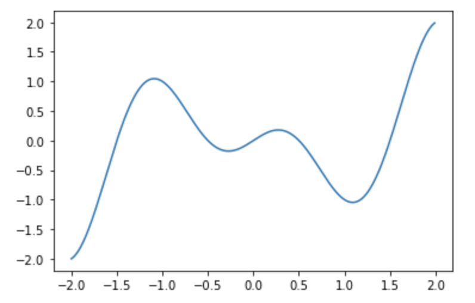
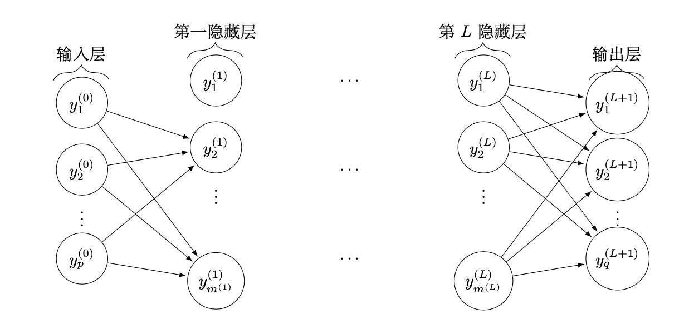
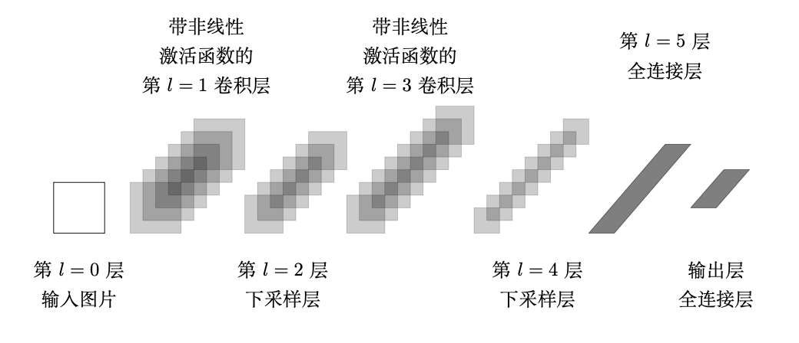

# 第一章 优化与深度学习

&emsp;&emsp;人工智能本质上是一个最优化过程，对于我们要实现的智能，也就是通过学习求得最优解，人工智能技术的最后几乎都是回到最优解问题上。机器学习、深度学习的核心是模型和算法，而最优化的任务就是告诉模型应该学什么、怎么学和如何才能学得更好。  
&emsp;&emsp;模型学习往往都归结为求一个带参数的映射函数，需要运用大量数据学到这些参数，并通过不断的测试运行，才能发现模型中参数的优劣。  
&emsp;&emsp;最优化的任务就是调整参数，向着好的方面调整，假如没有最优化，模型就不知道该怎么学习而导致停滞不前。模型的训练一般会给参数随机赋初始值，然后采用各种优化算法来寻找能让信息量损失或分类错误率更小的参数设置。常用的有一阶算法（如随机梯度下降法、共轭梯度法等）和二阶算法（如基于BFGS或L-BFGS，截断牛顿法(Hessian-free)、Newton-CG等）。

## 1.1 优化与深度学习的关系

&emsp;&emsp;在深度学习任务中，无论是ANN、CNN还是RNN，我们都会为模型定义一个损失函数，这样的损失函数通常被称作优化问题的目标函数，损失函数表征的是预测值和实际值之间的差距，再通过一定的优化算法减小这个差距。多数情况下，我们的损失函数十分复杂，不像我们解数学题能得到一个确定、唯一的解析解，而是通过数学的方法去逼近一个解，也称数值解。

## 1.2 优化与深度学习的差别

&emsp;&emsp;虽然优化为深度学习提供了最小化损失函数的方法，但本质上，优化与深度学习的目标是有区别的。通过对深度学习中部分内容的学习，我们区分了训练误差和泛化误差。由于优化算法的目标函数通常是一个基于训练数据集的损失函数，优化的目标在于降低训练误差。而深度学习的目标在于降低泛化误差。为了降低泛化误差，除了使用优化算法降低训练误差以外，还需要注意应对过拟合的现象。

**注意：**这里我们只关注优化算法在最小化目标函数上的表现，而不关注模型的泛化误差。

## 1.3 数学背景

&emsp;&emsp;我们先介绍一些最基本的优化中的概念，以便于后续内容的展开。

### 1.3.1 什么叫最优化？最优化的一般模型、无约束优化、约束优化

&emsp;&emsp;最优化是应用数学的一个分支，主要指在一定条件限制下，选取某种研究方案，使目标达到最优的一种方法。最优化问题在当今的军事、工程、管理等领域有着极其广泛的应用。随着科学技术的日益发展，许多学科的核心问题最终都归结为优化问题。因此，最优化已经成为学科研究和技术人员必不可少的计算工具。  

> **定义**：从若干可能的安排或方案中，寻求某种意义下的最优安排或方案，数学上称为之为最优化(Optimization)。  

&emsp;&emsp;**决策变量**，**目标函数**和**约束**是最优化问题的三个基本元素。没有约束的优化问题称为**无约束优化问题**，而其他情形称为**约束优化问题**。没有目标函数的问题称为**可行性问题**。有的问题可以有多个目标函数，这样的问题常常是把它们处理成单目标优化问题或一系列这样的问题来讨论。  
&emsp;&emsp;如果在优化问题中决策变量限制为整数，或者是可能性的离散集合，我们称为**组合优化问题**或者**离散优化问题**。如果对变量没有这样的限制，则是**连续优化问题**。当然，一些问题可能既有离散变量也有连续变量。

### 1.3.2 基本概念：可行解、整体最优解、局部最优解

&emsp;给定一个函数 $f(x):R^n \rightarrow R$ 和一个集合 $S \subset R^n$，求一个 $x^*$ 的解：

$$
\min \limits_{x \in R^{n}} f(x)
$$

称为一个最优化问题。称 $f$ 是目标函数，$S$ 是可行域。如果 $S$ 是空集，问题称为不可行的。如果能够找到点列 $x^k \in S$ 使得当 $k \rightarrow \infty$ 时， $f (x^k ) \rightarrow - \infty$ ，那么问题是无界的。

&emsp;&emsp;如果问题既不是不可行的也不是无界的，那么常常可以找到 $x^*\in S$ 满足

$$
f(x^*) \leqslant f(x), \forall x \in S
$$
这样的 $x^*$ 称为全局最小点。如果

$$
f(x^*) < f(x), \forall x \in S, x \neq x^{*},
$$
这样的 $x^*$ 称为严格的全局最小点。

&emsp;&emsp;在其他情形，我们可能只找到 $x^* \in S $ 满足

$$
f\left(x^{*}\right) \leq f(x), \forall x \in S \bigcap B_{x^{*}}(\varepsilon)
$$
其中 $ B_{x^*} (\varepsilon) = \{ x: \| x - x* \|< \varepsilon \} $。

&emsp;&emsp;这样的 $x^*$ 称为问题的局部最小点。类似地，可以定义严格局部最小点。在大多数情形，可行集 $S$ 是用函数约束（等式和不等式）显示的。其中 $E$ 和 $I$ 是等式和不等式约束的指标集。

&emsp;&emsp;那么通常的优化问题取下面的形式：
$$
\begin{array}{ll}
\min & f(x) \\
\text { s.t. } & g_i(x) \leqslant 0, i \in I=\{1,2, \cdots, m\} \\
& h_j(x) = 0, j \in E=\{1,2, \cdots, p\} \\
& x \in D \subset R^n
\end{array}
$$

&emsp;&emsp;有很多因素影响优化问题是否可以有效求解。例如，决策变量的个数 $n$，约束总数通常是判断求解一个优化问题的困难程度的好的预示条件。其他的因素与定义问题的函数有关，具有线性目标函数和线性约束的问题比较容易求解，具有凸的目标函数和凸的可行集的问题同样容易求解。

## 1.4 优化在深度学习中的难点

&emsp;&emsp;深度学习模型的目标函数可能有若干局部最优值。当一个优化问题的数值解在局部最优解附近时，由于目标函数相关解的梯度接近或变成零，最终迭代求得的数值解可能只令目标函数局部最小化而非全局最小化。  而且梯度接近或变成零可能是由于当前解在局部最优解附近造成的。事实上，另一种可能性是当前解在鞍点（saddle point）附近。

**局部最小值和全局最小值**

&emsp;&emsp;假设损失函数 $f(x) = x \cos(\pi x)$ 

```python
import matplotlib.pyplot as plt
import numpy as np
 
x = np.arange(-2, 2, 0.01)
f = x*np.cos(np.pi*x)
plt.plot(x, f)
plt.show()
```



&emsp;&emsp;只画出了区间 $(-2, 2)$ 的函数图像，通过观察图像，我们发现该函数有两个波谷，分别是局部最小值和全局最小值。到达局部最小值的时候，由损失函数求得的梯度接近于0，我们很难再跳出这个局部最小值，进而优化到全局最小值，即 $x=1$ 处。

## 1.5 优化在深度学习中的案例应用

&emsp;&emsp;近十年来，深度学习走入了人们的视野，深度学习问题和算法的研究也经历了一次新的浪潮。虽然卷积网络的设计受到了生物学和神经科学的启发，但深度学习目前的发展早已超越了机器学习模型中的神经科学观点。它用简单的表示来表达复杂的表示，从低层特征概括到更加抽象的高层特征，让计算机从经验中挖掘隐含的信息和价值。我们将通过介绍多层感知机和卷积神经网络来了解优化模型在深度学习中的应用。

### 1.5.1 多层感知机

&emsp;&emsp;**多层感知机（multi-layer perceptron, MLP）**也叫作深度前馈网络（deep feedforward network）或前馈神经网络（feedforward neural network）， 它通过已有的信息或者知识来对未知事物进行预测。  
&emsp;&emsp;在神经网络中，已知的信息通常用数据集来表示，数据集一般分为训练集和测试集：训练集是用来训练神经网络，从而使得神经网络能够掌握训练集上的信息；测试集是用来测试训练完的神经网络的预测准确性。一个常见的任务是分类问题，假设我们有一个猫和狗的图片集，将其划分成训练集和测试集。神经网络是想逼近一个从图片到 $\{0, 1\}$  的函数，这里 0 表示猫，1 表示狗。因为神经网络本身的结构和大量的训练集信息，训练得到的函数与真实结果具有非常高的吻合性。

&emsp;&emsp;具体的我们给定训练集 $D=\{(a_1, b_1),(a_2, b_2), \cdots,(a_m, b_m)\}, a_i \in R^p, b_i \in R^q$，如下图给出了一种由 $p$ 个输入单元和 $q$ 个输出单元构成的 $L+2$ 层感知机，其含有一个输入层，一个输出层，和 $L$ 个隐藏层。



&emsp;&emsp;在第 $l$ 隐藏层中，第 $i$ 个单元计算输出信息 $y_i^{(l)}$ 为
$$
y_i^{(l)} = t \left(z_i^{(l)} \right), \quad z_i^{(l)} = \sum_{k=1}^{m^{(l-1)}} x_{i, k}^{(l)} y_k^{(l-1)}
$$
其中，函数 $t(\cdot)$ 称为激活函数。

&emsp;&emsp;整个过程可以描述为：$ y^{(0)} \stackrel{x^{(1)}}{\rightarrow} z^{(1)} \stackrel{t}{\rightarrow} y^{(1)} \stackrel{x^{(2)}}{\rightarrow} \cdots \stackrel{t}{\rightarrow} y^{(L+1)}$.

&emsp;&emsp;若选择平方误差为损失函数，则我们得到多层感知机的优化模型：
$$
\min \limits_{x} \sum_{i=1}^m \left\| h(a_i ; x) -b_i \right\|_2^2 + \lambda r(x)
$$

其中 ，$r(x)$ 是正则项，用来刻画解的某些性质，如光滑性或稀疏性等；$\lambda$ 称为正则化参数，用来平衡模型的拟合程度和解的性质。如果 $\lambda$ 太小，那么对解的性质没有起到改善作用；如果 $\lambda$ 太大，则模型与原问题相差很大，可能是一个糟糕的逼近。

### 1.5.2 卷积神经网络

&emsp;&emsp;**卷积神经网络（convolutional neural network，CNN）**是一种深度前馈人工神经网络，专门用来处理时间序列数据或者图像等网格数据。CNN 在计算机视觉、视频分析、自然语言处理等诸多领域有大量成功的应用。  
&emsp;&emsp;与上图对应的全连接网络（相邻两层之间的节点都是相连的）不同，卷积神经网络的**思想**是通过局部连接以及共享参数的方式来大大减少参数量，从而减少对数据量的依赖以及提高训练的速度。典型的 CNN 网络结构通常由一个或多个卷积层、下采样层(subsampling)和全连接层组成。全连接层的结构与多层感知机的结构相同，卷积层是一种特殊的网络层，它首先对输入数据进行卷积操作产生多个特征映射，之后使用非线性激活函数（比如 ReLU）对每个特征进行变换。下采样层一般位于卷积层之后，它的作用是减小数据维数并提取数据的多尺度信息，其结果最终会输出到下一组变换。



&emsp;&emsp;与CNN对应的优化模型如下：
$$
\min \limits_{x} \sum_{i=1}^m \|h (a_i ; x) -b_i\|_2^2 + \lambda r(x)
$$
其中，函数 $ h(a_i; x) $ 由卷积神经网络构成，而 $x$ 是卷积神经网络的参数。