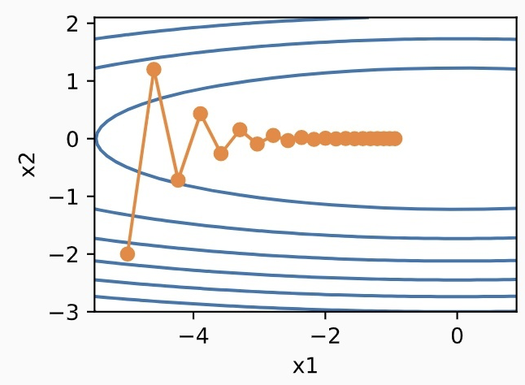
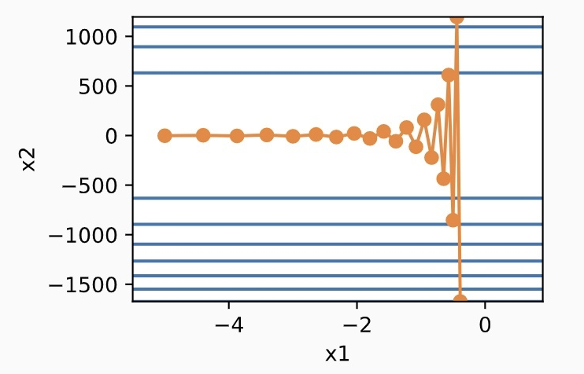

# 第二章 优化算法概述

&emsp;&emsp;本节主要介绍基于梯度的优化算法的基本分析框架，并讨论它如何应用于深度学习中。

## 2.1 梯度下降（Gradient descent ）

&emsp;&emsp;假设我们现在想要找出一个多元连续函数 $f(w)$ 的最小值 $\displaystyle \min \limits_{w \in R^d}f(w)$，其梯度下降算法如下：
$$
w_0 = \text{initialization} \\
w_{t+1} = w_t - \eta \nabla f(w_t)
$$
其中，$\eta$ 称为步长或学习率。

&emsp;&emsp;梯度下降算法的一个核心思想就是找出局部最陡的梯度下降方向 $-\nabla f(w_t)$。

&emsp;&emsp;我们来考虑该点的泰勒展开式：
$$
f(w) = f(w_t) + \underbrace {\left\langle \nabla f(w_t), w - w_t \right\rangle}_{\text{linear in } w} + \cdots
$$
 &emsp;&emsp;假设去掉高阶项，只在 $w_t$  的一个邻域内优化一阶近似式，即
$$
\begin{array}{cl}
\mathop{\arg\min} \limits_{w \in R^d} &  f(w_t) + \left\langle \nabla f(w_t), w - w_t \right\rangle \\
\text{s.t.} & \|w - w_t\|_2 \leqslant \epsilon
\end{array}
$$
该最优解是 $w + \delta$ ，其中 $\delta = -\alpha \nabla f(w_t)$。

### 2.1.1 泰勒展开的形式化

&emsp;&emsp;我们下面来陈述一个引理，它刻画了梯度下降算法下函数值的下降。先假设函数 $f(w)$ 的二阶梯度是有界的，即 $\nabla^2 f(w) \in [-L, L], \forall w$ ，称满足这个条件的函数为 L-光滑函数。

> Definition (L -smoothness). A function $f: R^n \rightarrow R$ called L- smooth if for all $x, y \in R^n$，the following inequality holds:
> $$
> \|\nabla f(x) - \nabla f(y)\| \leqslant L \|x - y \|.
> $$
> If the function $f$ is L-smooth, then for all $x, y \in R^n$
> $$
> f(y) \leqslant f(x) + \langle \nabla f(x), y - x \rangle + \frac{L}{2} \| y - x\|^2.
> $$
> Next, if $f$ is additionally convex and $x^*$ is its minimizer, then for all $x \in R^d$
> $$
> \| \nabla f(x)\|^2 \leqslant 2L (f(x) - f(x^*))
> $$

&emsp;&emsp;这使我们能够利用上述这个定义使用泰勒展开得到精确的近似函数：
$$
f(w) \leqslant f(w_t) + \langle \nabla f(w_t), w - w_t \rangle + \frac{L}{2} \| w - w_t\|^2_2
$$

### 2.1.2 梯度下降的下降引理

&emsp;&emsp;下面将说明在下降梯度和足够小的学习率下，函数值总是减小，除非迭代处的梯度为零。

> Lemma (Descent Lemma). Suppose $f$ is L-smooth. Then, if $\eta < 1/(2L)$, we have 
> $$
> f(w_{t+1}) \leqslant f(w_t) - \frac{\eta}{2} \cdot \| \nabla f(w_t)\|^2_2
> $$

**证明：**
$$
\begin{aligned}
f(w_{t+1}) 
& = f(w_t - \eta \nabla f(w_t)) \\
& \leqslant f(w_t) - \langle \nabla f(w_t), -\eta \nabla f(w_t) \rangle + \frac{L}{2} \| \eta^2 \nabla f(w_t)\|^2_2 \\
& = f(w_t) - (\eta - \eta^2 L / 2) \| \eta^2 \nabla f(w_t)\|^2_2 \\
& \leqslant \frac{\eta}{2} \cdot \| \eta^2 \nabla f(w_t)\|^2_2
\end{aligned}
$$

## 2.2 随机梯度下降（Stochastic gradient descent）

&emsp;&emsp;在深度学习中，目标函数通常是训练数据集中有关各个样本的损失函数求平均。设 $f_i(x)$ 是有关索引为 $i$ 的训练数据样本的损失函数，$n$ 是训练数据样本数， $x$ 是模型的参数向量，那么目标函数定义为
$$
f(x) = \frac{1}{n} \sum_{i=1}^n f_i(x)
$$
&emsp;&emsp;目标函数在 $x$ 处的梯度计算为
$$
\nabla f(x) = \frac{1}{n} \sum_{i=1}^n \nabla f_i(x)
$$
&emsp;&emsp;如果使用梯度下降，每次自变量迭代的计算开销为 $O(n)$ ，它随着 $n$ 线性增长。因此，当训练数据样本数很大时，梯度下降每次迭代的计算开销很高。

&emsp;&emsp;随机梯度下降（stochastic gradient descent，SGD）减少了每次迭代的计算开销。在随机梯度下降的每次迭代中，随机均匀采样的一个样本索引 $i \in \{1,2, \cdots, n\}$ ，并计算梯度 $\nabla f_i(x)$  来迭代 $x$ :
$$
x \leftarrow x - \eta \nabla f_i(x)   
$$
&emsp;&emsp;这里 $\eta$ 同样是学习率。可以看到，每次迭代的计算开销从梯度下降的 $O(x)$  降到了常数 $O(1)$ 。值得强调的是，随机梯度 $\nabla f_i(x)$ 是对梯度 $\nabla f(x)$ 的无偏估计：
$$
E_i \nabla f_i(x) = \frac{1}{n} \sum_{i=1}^n \nabla f_i(x) = \nabla f(x)
$$
&emsp;&emsp;这意味着，随机梯度是对梯度的一个良好的估计。

## 2.3 加速梯度下降（Accelerated Gradient Descent ）

&emsp;&emsp;让我们考虑一个输入和输出分别为二维向量 $ x = [x_1, x_2]^T$ 和标量的目标函数 $f(x) = 0.1 x_1^2 + 2 x_2^2$ 。

&emsp;&emsp;可以看到在同一位置上，目标函数在竖直方向（$x_2$轴方向）比在水平方向（$x_1$ 轴方向）的斜率的绝对值更大。因此，在给定学习率的情况下，梯度下降迭代自变量时，会使自变量在竖直方向比在水平方向移动幅度更大。那么，我们需要一个较小的学习率，从而避免自变量在竖直方向上越过目标函数最优解。但是，这会造成自变量在水平方向上朝最优解移动变慢。如果学习率调得稍大一点，将使得自变量在竖直方向不断越过最优解并逐渐发散。

&emsp;&emsp;动量法的提出是为了解决梯度下降的上述问题。设时间步 $t$ 的自变量为 $x_t$，学习率为 $\eta_t$。 在时间步为 0 时，速度变量为 $v_0$，并将其元素初始化成 0。在时间步 $t > 0$时，对每次迭代的步骤将做如下修改：
$$
\begin{array}{lll}
v_t \leftarrow \gamma v_{t-1} + \eta_t g_t \\
x_t \leftarrow x_{t-1} - v_t
\end{array}
$$
&emsp;&emsp;其中，动量超参数 $\gamma$  满足$0 \leqslant \gamma < 1$ 。当 $\gamma = 0$ 时，动量法等价于小批量随机梯度下降。

&emsp;&emsp;指数加权移动平均：为了从数学上理解动量法，让我们先解释一下指数加权移动平均（exponentially weighted moving average）。给定超参数 $0 \leqslant \gamma < 1$ ，当前时间步 $t$ 的变量 $y_t$ 是上一时间步 $t-1$ 的变量 $y_{t-1}$ 和当前时间步的另一变量 $x_t$ 的线性组合：
$$
y_t = \gamma y_{t-1} + (1 - \gamma) x_t
$$
&emsp;&emsp;对 $y_t$ 展开：
$$
\begin{aligned}
y_t
& = (1 - \gamma) x_t + \gamma y_{t-1} \\
& = (1 - \gamma) x_t + (1 - \gamma) \cdot \gamma x_{t-1} + \gamma^2 y_{t-2} \\
& = (1 - \gamma) x_t + (1 - \gamma) \cdot \gamma x_{t-1} + (1 - \gamma) \cdot \gamma^2 x_{t-2} + \gamma^3 y_{t-3} \\
& \cdots
\end{aligned}
$$
&emsp;&emsp;令$n = 1/(1 - \gamma)$ ，那么 $(1 - 1/n)^n = \gamma^{1/(1 - \gamma)}$，因为
$$
\lim _{n \rightarrow \infty} \left( 1 - \frac{1}{n} \right)^n = \exp (-1) \approx 0.3679
$$
&emsp;&emsp;所以当$\gamma \rightarrow 1$  时， $\gamma^{1/ (1 - \gamma)} = \exp(-1)$，如$0.95^{20} \approx \exp(-1)$ 。如果把 $\exp(-1)$ 当作一个比较小的数，可以在近似中忽略所有含 $\gamma^{1 / (1 - \gamma)}$ 和比 $\gamma ^ {1 / (1 - \gamma)}$ 更高阶的系数的项。例如，当$\gamma = 0.95$ 时，
$$
y_t \approx 0.05 \sum_{i=0}^{19} 0.95^i x_{t-i}
$$
&emsp;&emsp;因此，在实际过程中，我们常常将 $y_t$ 看作是对最近 $1 / (1 - \gamma)$个时间步的 $x_t$ 值的加权平均。例如，当 $\gamma = 0.95$ 时，$y_t$ 可以被看作对最近20个时间步的 $x_t$ 值的加权平均；当 $\gamma = 0.9$ 时， $y_t$ 可以看作是对最近10个时间步的 $x_t$ 值的加权平均。而且，离当前时间步 $t$ 越近的 $x_t$ 值获得的权重越大（越接近1)。

&emsp;&emsp;现在，我们对动量法的速度变量做变形：
$$
v_t \leftarrow \gamma v_{t-1} + (1 - \gamma) \left( \frac{\eta_t}{1 - \gamma} g_t \right)
$$
&emsp;&emsp;由指数加权移动平均的形式可得，速度变量 $v_t$  实际上对序列 $\displaystyle \left\{ \frac{\eta_{t-i} g_{t-i}}{(1 - \gamma)}: i = 0, \cdots, \frac{1}{1-\gamma} -1 \right\}$ 做了指数加权移动平均。换句话说，相比于小批量随机梯度下降，动量法在每个时间步的自变量更新量近似于将前者对应的最近 $1 / (1 - \gamma)$ 个时间步的更新量做了指数加权移动平均后再除以 $1 - \gamma$ 。所以在动量法中，自变量在各个方向上的移动幅度不仅取决于当前梯度，还取决于过去的各个梯度在各个方向上是否一致。

## 2.4 本地运行时间分析

&emsp;&emsp;当迭代接近局部极小值时，梯度下降行为更为明显，因为目标函数可以用二次函数进行局部逼近。这里为了简单起见，我们假设正在优化一个凸二次函数，并了解函数的曲率是如何影响算法的收敛性。

&emsp;&emsp;我们用梯度下降方法来优化如下函数：
$$
\min \limits_{w} \frac{1}{2} w^T A w
$$
其中 $w \in R^d$，$A \in R^{d \times d}$ 是半正定矩阵。

**注：**假设 $A$ 是对角矩阵（对角化是线性代数中的一个基本idea）。

&emsp;&emsp;假设$A$的SVD分解是 $A = U \Sigma U^T$ ，其中 $\Sigma$ 是个对角矩阵。我们可以简单的验证得到 $w^T A w = \hat{w}^T \Sigma \hat{w}$，其中 $\hat{w} = U^T w$ 。换句话说，在由 $U$ 定义的一个不同的坐标系中，处理的是一个以对角矩阵 $\Sigma$ 为系数的二次型。注意，这里的对角化技术仅用于分析。

&emsp;&emsp;因此，假设 $A = \text{diag} (\lambda_1, \lambda_2, \cdots, \lambda_d)$，其中 $\lambda_1 \geqslant \lambda_2 \geqslant \cdots \geqslant \lambda_d$，这样该函数就可以化简为 
$$
f(w) = \frac{1}{2} \sum_{i=1}^d \lambda_i w_i^2
$$
梯度下降更新可以写成 
$$
x \leftarrow w - \eta \nabla f(w) = w - \eta \Sigma w
$$

## 2.5 Pre-conditioners

&emsp;&emsp;从上面的二次型例子中，我们可以看到，如果在不同的坐标系中使用不同的学习率，这将会得到优化。换句话说，如果对每个坐标引入一个学习率 $\eta_i = 1/\lambda_i$ ，那么可以实现更快的收敛。

&emsp;&emsp;在 $A$ 不是对角阵这样的一般的情况下，并且不知道坐标系，算法对应的梯度下降更新为$w \leftarrow w - A^{-1} \nabla f(w)$

&emsp;&emsp;在更一般的情况下，$f$ 不是二次函数，这与牛顿算法相对应，梯度下降更新为$w \leftarrow w - \nabla^2 f(w)^{-1} \nabla f(w)$  

&emsp;&emsp;由于计算`Hessian`矩阵可能是非常困难的，因为它 `scale quadratically in d`（在实践中可能超过100万）。因此，使用`hessian`函数及其逆函数的近似值。