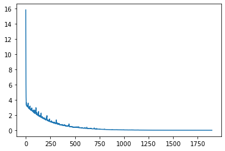

# 第四章 小批量随机梯度下降

## 4.1 背景

&emsp;&emsp;通过之前的学习，我们已经知道在机器学习与深度学习中面临的一个大挑战是：训练数据集的规模与泛化效果之间的矛盾——如果希望模型的泛化性能好，那么可以增加训练的数据量，但是需要选择合适的优化器解决数据量大带来的运算 成本问题以及模型的泛化性问题，接下来探讨在大数据集 情况下的优化器选择。

&emsp;&emsp;在深度学习的训练中，要想得到一个优良的深度网络，关键的一步就是选择合适的**优化器（Optimizer）**来优化模型参数。大部分神经网络的训练都采用了**梯度下降（Gradient Descent，GD）** 来优化模型的参数。然而，梯度下降算法存在的一个严重缺陷是当目标函数的`Hessian`矩阵条件数很大（即该问题比较病态）时，在靠近极小值时收敛速度会变得非常慢。此外，学习率的大小，也会影响问题的收敛性。

&emsp;&emsp;**随机梯度下降（Stochastic Gradient Descent, SGD）**的核心思想是：既然数据的规模非常大，能否每次仅随机采样得到一个样本点，每次迭代对模型参数进行优化，经过迭代达到一定条件后，得到一个较优的模型。这样就不需要利用全部样本，只通过随机选择部分样本来进行梯度下降了。需要注意的是，随机梯度下降算法并不能保证算法的收敛，一般通过动态调整学习率等技巧来避免这一缺陷。

&emsp;&emsp;比较上面两种方法，梯度下降法是把全部的数据放进去计算，所以速度会很慢；另一方面，梯度下降法无法处理超出内存容量限制的数据集；并且不能在线更新模型，即在运行的过程中，不能增加新的样本。而随机梯度下降一次仅放进去一个样本点，又没办法很好的利用内存，导致计算的低效；同时，由于随机梯度下降以高方差频繁更新，会导致目标函数值出现剧烈波动。与梯度下降法的收敛会陷入局部最小相比，由于随机梯度下降的目标值的波动，一方面，波动使得随机梯度下降可以得到新的和潜在更好的局部最优；另一方面，这使得最终收敛到特定最小值的过程变得复杂，因为随机梯度下降会一直持续波动。

&emsp;&emsp;一个自然的想法是：是否存在一个更好的优化算法，能否避免过多的数据，更好的利用向量化计算，提升计算效率；同时又能使得结果更加稳定呢？由于 SGD 每次仅抽一个样本太少了，可以尝试增加每次更新所使用的样本数，使得更新次数减少，从而减少参数更新的方差，这样就可以得到更加稳定的收敛结果。这就是本节介绍的**小批量随机梯度下降（Mini-batch Gradient Descent，MBGD）**。

## 4.2 小批量随机梯度下降原理

&emsp;&emsp;小批量，顾名思义就是使用一个以上的样本，但又不是全部的训练样本。通常小批量的数目在32\~256之间。具体来说，每一次的参数更新，从具有$N$个样本的数据集中，每次抽取批量大小为 $n(1 < n < N)$ 的一个小批量样本数据集，$n$一般是一个较小的数，一般介于50\~256。需要注意的是，无论训练集 $N$ 的规模如何增长，批量大小 $n$ 通常是固定的，所以在拟合很大样本（如几百万）的数据集时，**每个批次**仅仅只用到其中的一小部分样本。。

&emsp;&emsp;假设采用均方误差作为损失函数，对于一个样本 $(a_i,b_i)$ 而言：
$$
\frac{1}{2}\left\|h\left(a_{i} ; x\right)-b_{i}\right\|^{2}
$$
&emsp;&emsp;其中，$x$是模型 $h$ 待优化的参数。对于批量大小为 $n$ 的样本，其损失函数为
$$
J(x)=\frac{1}{2 n} \sum_{i=1}^{n}\left(h\left(a_{i} ; x\right)-b_{i}\right)^{2}
$$
&emsp;&emsp;计算 $J$ 对 $x$ 的梯度
$$
\nabla J(x)=\frac{1}{n} \sum_{i=1}^{n}\left(h\left(a_{i} ; x\right)-b_{i}\right) \cdot h_{x}\left(a_{i} ; x\right)
$$
&emsp;&emsp;参数更新为
$$
x:=x-\eta \cdot \nabla J(x)
$$
&emsp;&emsp;小批量随机梯度下降（MBGD）算法中一个关键的参数是学习率 $\eta$，在实际训练中，通常采用学习率衰减的方式来保证算法收敛。下面给出简单代码：

```python
# 设置初始学习率
learning_rate0 = learning_rate 
for i in range(epochs):
    np.random.shuffle(data)
    # 学习率衰减，beta为衰减率
    learning_rate = learning_rate0 / (1 + beta * i) 
    # batch_size控制在50~256
    for batch in get_batches(data, batch_size): 
        params_grad = evaluate_gradient(loss_function, batch, params)
        params = params - learning_rate * params_grad
```

## 4.3 小批量随机梯度下降能收敛吗？

#### 引理（梯度下降在凸函数上的收敛性）

> 假设函数$f(x)$为凸函数，且满足$L \text{-Lipschitz}$条件，$f (x^*)=\inf \limits_{x} f(x)$存在且可达。如果学习率$\alpha_k$满足$\displaystyle 0<\alpha_k<\frac{1}{L}$，那么由迭代
> $$
> x^{k+1}=x^{k}-\alpha_{k} \cdot \nabla f\left(x^{k}\right)
> $$
> 得到的点列$\{x^k\}$的函数值收敛到最优值$x^*$，且在函数值的意义下收敛速度为$\displaystyle \mathcal{O}(\frac{1}{k})$。

#### 定义（$\beta-\text{Smooth}$）

> 如果一个连续可微的函数 $f$ 的梯度$\nabla f$ 是$\beta-Lipschitz$ 的，即：
> $$
> ||\nabla f(x) - \nabla f(y)|| \leq \beta||x-y||
> $$
> 则称函数 $f$ 是 $\beta-Smooth$ 的。 

换句话说，$\beta-Smooth$ 就是给函数曲率设定一个边界。这等价于 $Hessian$ 矩阵的特征值小于$\beta$ 。注意，可以存在非二次可微的 $\beta-Smooth$ 函数。

#### 定理

> 若凸函数 $f$ 是$\beta\text{-Smooth}$的，那么由迭代
> $$
> x^{k+1}=x^{k}-\alpha_{k} \cdot \nabla f\left(x^{k}\right)
> $$
> 得到的点列$\{x^k\}$的函数值收敛到一个稳定点。

&emsp;&emsp;由定理我们可以知道，梯度下降对满足$\beta-\text{Smooth}$的凸函数是保证收敛的，但是最小值点不一定唯一。

&emsp;&emsp;对于小批量随机下降的收敛证明，可以参考随机梯度下降的证明方式，唯一的不同是，SGD是独立抽取一个样本进行更新，而小批量随机梯度下降的更新是一次独立抽取一个```batchsize```的小样本集。总的来说，小批量随机梯度下降法的收敛性依赖于步长的选取以及函数本身的性质，在不同条件下会有不同结果．具体可以参考文献\[3\]与随机梯度下降部分的讲解。

## 4.4 mini-Batch的```Batchsize```怎么选？

&emsp;&emsp;我们来回顾一下小批量的实现，如果我们选择```Batchsize```为64，则参数的更新为：
$$
w \rightarrow w^{\prime}=w-\eta \cdot \frac{1}{64} \cdot \sum_{i=1}^{64} \nabla J\left(x_{i}\right)
$$
&emsp;&emsp;当采用`mini-batch`时，我们可以将一个`batch`里的所有样本放在一个矩阵里，利用线性代数库来加速梯度的计算，这是工程实现中的一个优化方法。一个大的`batch`，可以充分利用矩阵、线性代数库来进行计算的加速，```Batchsize```越小，则加速效果可能越不明显，导致优化过程太漫长。当然```Batchsize```也不是越大越好，太大时权重的更新就会不那么频繁，可以理解为步长太大，最后收敛不到最优参数。

&emsp;&emsp;在实际训练中，可以先固定其他的超参数（不一定是最优），然后尝试一些```Batchsize```，然后打印出验证准确度-时间的关系，从而选择一个最合适的```Batchsize```，可以最快速地提高性能。选择```Batchsize```后，再继续优化其他超参数。

## 4.5 随机小批量梯度下降的实现

### 4.5.1 导入必要库，生成实验数据

```python
# 导入必要库
import numpy as np
import matplotlib.pyplot as plt

x0=np.random.randint(1,2,10000).reshape(10000,1) 
x1=np.random.randint(1,10,10000).reshape(10000,1)

X=np.hstack((x0,x1))
y=x0+x1
```

### 4.5.2 小批量随机梯度下降（MBGD）的实现

```python
def MBGD(X,y):
    ept=0.001 #精度（停机条件）
    loss=1000 #定义一个损失 方便进入循环体 后来表示两次迭代损失函数的差异
    alpha=0.05 #学习率
    max_iter=1000 #梯度更新次数
    batch_size = 20 #batch size
    theta=np.random.randint(1,10,(X.shape[1],1)) #参数初始化
    loss_list = []
    
    while max_iter<10000 and loss>ept:

        #这里的小批量梯度下降每次选取两个样本
        i = np.random.randint(0, batch_size-1)  # 随机抽取一个小批量
		
        #损失函数关于theta的偏导数 
        partial = (1/2)*X[i:i+2,:].T.dot(X[i:i+2,:].dot(theta)-y[i:i+2,:]) 		   
        #参数更新
        theta=theta-alpha*partial

        max_iter+=1
        
        #计算两次迭代之间的差异(损失函数) 无明显差异就说明算法收敛到了全局最优解
        loss=(1/(2*X.shape[0]))*np.sum((X.dot(theta)-y)**2) 
        
        loss_list.append(loss) # 保存训练损失	
    return max_iter,theta,loss_list

max_iter,theta,loss_list=MBGD(X,y)
```

### 4.5.3 画图

```python
plt.plot(loss_list)
```



&emsp;&emsp;由上图可知，小批量随机下降最终会趋于收敛，但在收敛过程中，由于随机算法抽样的不确定性，会导致训练过程中的损失会有波动现象。

## 参考文献

【1】刘浩洋, 户将, 李勇锋, 文再文. (2021). 最优化：建模、算法与理论. 北京: 高教出版社.  
【2】Ruder S. An overview of gradient descent optimization algorithms[J]. arXiv preprint arXiv:1609.04747, 2016.  
【3】Nocedal J. Optimization Methods for Large-Scale Machine Learning [J][J]. Siam Review, 2016, 60(2).  

【4】http://mitliagkas.github.io/ift6085-2019/ift-6085-lecture-3-notes.pdf

