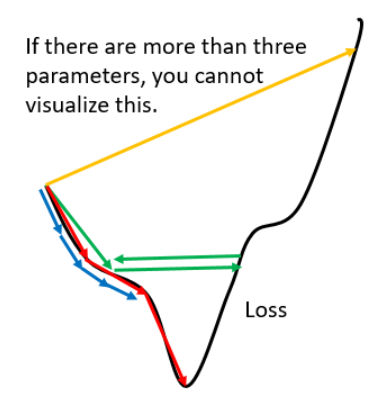
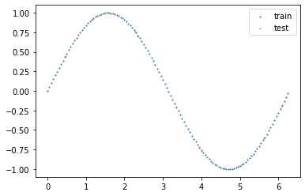
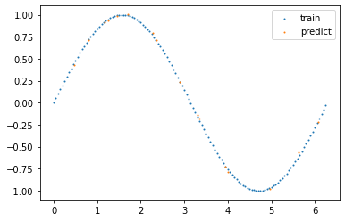

# 第六章 AdaGrad
## 6.1 vanilla gradient descent


&emsp;&emsp; 梯度下降法是最基础的优化算法，同时也存在如下问题。
- 学习率太小，损失函数下降过慢，迭代次数多。（蓝色的折线）
- 学习率过大，损失函数下降快，容易在局部极值点附近振荡。(绿色的折线)
- 学习率太大，会直接越过局部最优值。（黄色的折线）



&emsp;&emsp; 为此，我们是否可以设计一种算法会在根据梯度或者当前周期数就更新学习率呢？AdaGrad（Adaptive Subgradient Methods）正是出于这样思路进行设计的。

&emsp;&emsp;假设模型参数为$\theta$，$\theta^t$ 表示为第 $t$ 个周期的模型参数，同时损失函数为 $f(\theta^t)$。AdaGrad的迭代格式如下：
$$
\begin{array}{lll}
\displaystyle \eta^t = \frac{\eta}{\sqrt{t+1}} \\
\displaystyle  g^t = \frac{\partial f(\theta)}{\partial \theta}|_{\theta^t} \\
\displaystyle \sigma^t = \sqrt{\frac{1}{t+1}\sum_{i=1}^{t} g^i\odot g^i} \\ 
\displaystyle \theta^{t+1} =\theta^t - \frac{\eta^t}{\sigma^t}g^t=\theta^t - \frac{\eta}{\sqrt{\displaystyle \sum_{i=1}^{t} g^i\circ g^i}}g^t
\end{array}
$$

&emsp;&emsp;其中 $\circ$ 是哈达玛积，用于两个向量的对应元素相乘。由于 $g^i\circ  g^i$ 依旧是向量，实际上，AdaGrad算法中模型参数 $\theta$ 的分量都有其自己的学习率。接下来，我们将在假设条件下证明AdaGrad的收敛性。

## 6.2 收敛性
&emsp;&emsp; 在机器学习算法应用中，特别是商业落地项目，样本量往往都是上百万甚至上亿，这些数据是无法被一次性放入机器中去的，或者，有一些模型是线上部署的，服务器会实时地搜集用户数据并输入到模型中，这些数据由于时空限制都是无法一次性放入内存中，所以只能分批次去加载这些数据，根据每批次的数据进行优化模型，这就是在线学习。  
&emsp;&emsp;假设 $f_t(\theta)$ 是第 $t$ 个批次的损失函数，一共有 $T$ 个批次的数据，则
$$
\displaystyle f(\theta) = \sum_{t=1}^T f_t(\theta)
$$

&emsp;&emsp; 对于这种在线算法，我们从`regret`的角度去证明其收敛性。
### 6.2.1 基本假设和参数设置
&emsp;&emsp; 对于在线学习，我们追求一个`low regret`，定义如下： 
$$
R(T) = \sum_{t=1}^T f_t(\theta^t)-\min_{\theta}\sum_{t=1}^T f_t(\theta)
$$

&emsp;&emsp;其中 $f_t(\theta)$ 是`convex function`，$t$ 表示在第 $t$ 周期的损失函数。

&emsp;&emsp; 当 $T \rightarrow \infty $，$R(T)$的平均值$\displaystyle \frac{R(T)}{T}\rightarrow 0 $，该算法收敛，即 $\displaystyle \theta^* = arg \min_{\theta} \sum_{t=1}^T f_t(\theta)$。

&emsp;&emsp;在证明之前，我们先进行一些假设：

**假设一**

&emsp;&emsp; 假设 $\theta\in \mathbb{R}^d$ 是模型参数，并且可行域有界，即对于向量 $\theta$ 中分量 $\forall \theta_i,\hat{\theta_i}$，存在一个常数 $D_i>0$，使得下式成立
$$
|| \theta_i - \hat{\theta_i}|| \leqslant D_i
$$

**假设二**

&emsp;&emsp; 假设 $\displaystyle g^t := \frac{\partial f_t}{\partial \theta} |_{\theta^t}$（如果 $f_t$ 不可导，可以使用次梯度），另存在常数 $G_i >0$，对于梯度的每个分量对 $\forall t$ 满足

$$
g_i^T \leq G_i
$$

### 6.2.2 证明过程
&emsp;&emsp;假设 $\displaystyle \theta^* = arg \min_{\theta} \sum_{t=1}^T f_t(\theta)$，
$$
\begin{aligned}
R(T) 
&= \sum_{t=1}^T f_t(\theta^t)-\min_{\theta}\sum_{t=1}^T f_t(\theta) \\
&= \sum_{t=1}^T f_t(\theta^t)-\sum_{t=1}^T f_t(\theta^*) \\
&= \sum_{t=1}^T \{f_t(\theta^t) - f_t(\theta^*)\}
\end{aligned}
$$

&emsp;&emsp;由于$f_t(\theta)$ 是`convex`函数，所以
$$
f_t(\theta^*) \geqslant f_t(\theta^t) + <g^t,\theta^*- \theta^t>
$$

&emsp;&emsp;上式是`convex`函数的`First-order condition`，详细定义和证明可参考文献[3]的3.1.3小节。

&emsp;&emsp;然后，我们可以得到
$$
<g^t,  \theta^t - \theta^*> \geqslant  f_t(\theta^t) - f_t(\theta^*)
$$

&emsp;&emsp;代入到 $R(T)$，得
$$
R(T) \leqslant \sum_{t=1}^T <g^t,\theta^t -\theta^*>
$$

&emsp;&emsp;同时
$$
\begin{aligned}
\sum_{t=1}^T <g^t,\theta^t -\theta^*> 
&= \sum_{t=1}^T \sum_{i=1}^d g^t_i(\theta^t_i -\theta^*_i) \\
&= \sum_{i=1}^d \sum_{t=1}^T g^t_i(\theta^t_i -\theta^*_i)
\end{aligned}
$$

&emsp;&emsp;最后我们可以得到
$$
R(T) \leqslant \sum_{i=1}^d\sum_{t=1}^T g^t_i(\theta^t_i -\theta^*_i)
$$

&emsp;&emsp;同时，已知 $\theta^{t+1} = \theta^t - \alpha^t_i g^t_i$， 其中$\displaystyle \alpha^t_i = \frac{\eta}{\displaystyle \sum_{j=0}^t (g^j_i)^2}$.

&emsp;&emsp;因此可以得到
$$
g^t_i(\theta^t_i -\theta^*_i) =\frac{1}{2\alpha^t_i}[(\theta^t_i -\theta^*_i)^2-(\theta^{t+1}_i -\theta^*_i)^2] +\frac{\alpha^t_i}{2}(g^t_i)^2
$$

&emsp;&emsp;同时
$$
\sum_{t=1}^T\frac{1}{2\alpha^t_i} \left[ (\theta^t_i -\theta^*_i)^2-(\theta^{t+1}_i -\theta^*_i)^2 \right] +\frac{\alpha^t_i}{2}(g^t_i)^2 \leqslant D^2_i \frac{1}{2\alpha^T_i}
$$

&emsp;&emsp;那么
$$
R(T)\leqslant \sum_{i=1}^{d} \left[ D_i^2 \frac{1}{2\alpha_i^T} + \sum_{t=1}^T \frac{\alpha^t_i}{2}(g^t_i)^2 \right]
$$

&emsp;&emsp;代入$\alpha^t_i$的定义，最后可以得到
$$
R(T) \leqslant  \sum_{i=1}^{d} \left[ D_i^2 \frac{1}{2\alpha} \sqrt{\sum_{j=0}^t (g^j_i)^2}+\frac{\alpha}{2} \sum_{t=1}^T \frac{(g^t_i)^2}{\displaystyle \sum_{j=0}^t (g^j_i)^2} \right]
$$

&emsp;&emsp;又根据假设二，可以得到
$$
\displaystyle \sqrt{\sum_{j=0}^t (g^j_i)^2} \leqslant G_i \sqrt{T+1}
$$

&emsp;&emsp;所以
$$
\sum_{t=1}^T \frac{(g^t_i)^2}{\displaystyle \sum_{j=0}^t (g^j_i)^2} \leqslant 2G_i \sqrt{T+1}
$$
&emsp;&emsp;最后，证明得到 
$$
R(T) \leqslant \sum_{i=1}^d [\frac{D_i^2}{2\alpha}+\alpha]G_i\sqrt{T}
$$

### 6.2.3 总结
&emsp;&emsp; 显而易见的，随着时间的增长，$\displaystyle \sqrt{\sum_{i=0}^{t} g^i\odot g^i}$ 会导致越来越大，导致梯度下降法中的步长越来越小，很可能在未找到极小值之前就停止了。
## 6.3 代码
```python
import torch
import numpy as np
import matplotlib.pyplot as plt
import torch.nn as nn
torch.cuda.is_available()
# generate dataset for training and testing
test_nums = 16
interval = [0,2*np.pi]  # interval
x_train = np.arange(interval[0],interval[1],0.05)
y_train = np.sin(x_train)
x_test = np.random.random_sample(test_nums)*interval[1]  + interval[0]
y_test = np.sin(x_test)

# show dataset
plt.scatter(x_train,y_train,s=1, label="train")
plt.scatter(x_test,y_test,s=1, label="test")
plt.legend()
plt.show()
```



```python
from torch.utils import data
class Mydataset(data.Dataset):
    def __init__(self,x,y):
        self.x = x
        self.y =y
    def __len__(self):
        return self.x.shape[0]
    
    def __getitem__(self,idx):
        x = torch.tensor(self.x[idx]).unsqueeze(0).to(torch.float32)
        y = torch.tensor(self.y[idx]).unsqueeze(0).to(torch.float32)
        return x,y
Train_dataset = Mydataset(x_train,y_train)
Test_dataset = Mydataset(x_test,y_test)

# constructe the model
class Mymodel(nn.Module):
    def __init__(self):
        super(Mymodel,self).__init__()
        self.layer=nn.Sequential(
            nn.Linear(1,32),
            nn.ReLU(inplace=True),#do the operation in-place
            # nn.Sigmoid(),#do the operation in-place
            # nn.Linear(2,2),
            # nn.ReLU(inplace=True),
            nn.Linear(32,1),
        )
    def forward(self,x):
        y_hat  = self.layer(x)
        return y_hat

from torchvision import datasets,transforms
from torch.utils.data import DataLoader
from torch import  optim

# set the hyperparameters
batch_size = 16
epoch_num = int(1e5)
lr = 0.01 #learning rate

loss_func = nn.MSELoss()  # loss function

Train_loader = DataLoader(Train_dataset,batch_size=batch_size,shuffle=True)
Test_loader = DataLoader(Test_dataset,batch_size=batch_size,shuffle=False,drop_last=True)
device=torch.device("cuda:0" if torch.cuda.is_available() else "cpu")
model = Mymodel().to(device)

# 参数的具体可以参考官网
optimizer=optim.Adagrad(model.parameters(),lr=lr,lr_decay=0, weight_decay=0, initial_accumulator_value=0)
for epoch_item in range(epoch_num):
    temporary_loss = 0
    for i, (inputs,outputs) in enumerate(Train_loader):
        inputs,outputs=inputs.to(device),outputs.to(device)
        
        optimizer.zero_grad()
        outputs_hat = model(inputs)
        # print(inputs.size(),outputs.size(),outputs_hat.size())

        loss=loss_func(outputs,outputs_hat).to(device)
        temporary_loss += loss.item()
        # calculate the gradient which backpropagation needs
        loss.backward()
        # update the values by gradient descent
        optimizer.step()
    if epoch_item % 1000 ==0:
        print("epoch: %d,loss:%f"%(epoch_item,temporary_loss/(i+1)))

```
&emsp;&emsp;测试模型的效果
```python
Test_loss = 0
y_hat= []
with torch.no_grad():
    for i, (inputs,outputs) in enumerate(Test_loader):
        inputs,outputs=inputs.to(device),outputs.to(device)
        optimizer.zero_grad()
        outputs_hat = model(inputs)
        y_hat.append(outputs_hat.cpu().numpy())
        loss=loss_func(outputs,outputs_hat).to(device)
        Test_loss += loss.item()
        break
print("test loss:%f"%(Test_loss/test_nums))
plt.scatter(x_train,y_train,s=1, label="train")
plt.scatter(x_test,y_hat,s=1, label="predict")
plt.legend()
plt.show()
```


## 参考文献

【1】[李宏毅机器学习视频](https://www.bilibili.com/video/BV1JE411g7XF)  
【2】[收敛性证明](https://zhuanlan.zhihu.com/p/343080010)  
【3】[Convex Optimization](https://web.stanford.edu/~boyd/cvxbook/bv_cvxbook.pdf)  
【4】[FIRST-ORDER METHODS IN OPTIMIZATION](https://epubs.siam.org/doi/book/10.1137/1.9781611974997#:~:text=First-Order%20Methods%20in%20Optimization%20offers%20comprehensive%20study%20of,first-order%20methods%20used%20to%20solve%20large-scale%20problems%3B%20and)  
【5】[AdaGrad收敛性证明论文](https://arxiv.org/pdf/1002.4862.pdf)  