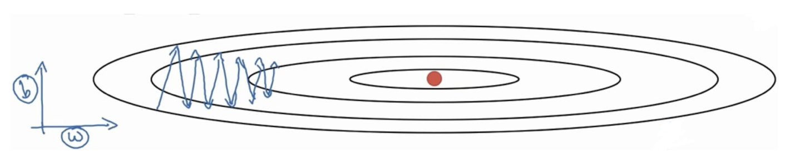
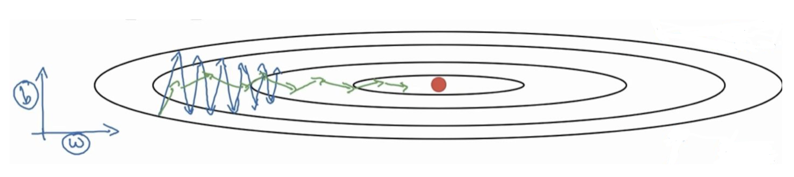

# 第7章 AdaGrad变种

## 7.1 RMSProp

&emsp;&emsp;首先要介绍的RMSProp优化算法是AdaGrad算法的一种改进。

&emsp;&emsp;我们先给出前面介绍的AdaGrad算法：

&emsp;&emsp;在时间步 $t$，首先将小批量随机梯度 $g_t$ 按元素平方后累加到变量 $s_t$，接着，我们将目标函数自变量中每个元素的学习率通过按元素运算重新调整一下
$$
\boldsymbol{s}_{t} \leftarrow \boldsymbol{s}_{t-1}+\boldsymbol{g}_{t} \circ\boldsymbol{g}_{t}
\\
\boldsymbol{x}_{t} \leftarrow \boldsymbol{x}_{t-1}-\frac{\eta}{\sqrt{s_{t}+\epsilon}} \circ \boldsymbol{g}_{t}
$$
&emsp;&emsp;再给出原始的RMSProp算法：

&emsp;&emsp;当学习率在迭代早期降得较快且当前解依然不佳时，AdaGrad算法在迭代后期由于学习率过小，可能较难找到一个有用的解。为了解决这一问题，RMSProp算法对AdaGrad算法做了一点小小的修改。该算法源自Coursera上的一门课程，即“机器学习的神经网络” 。

&emsp;&emsp;给定超参数 $0\leq \rho<1$，RMSProp算法在时间步 $t>0$ 计算：
$$
\boldsymbol{s}_{t} \leftarrow \rho \boldsymbol{s}_{t-1}+(1-\rho) \boldsymbol{g}_{t} \circ \boldsymbol{g}_{t}
\\
\boldsymbol{x}_{t} \leftarrow \boldsymbol{x}_{t-1}-\frac{\eta}{\sqrt{s_{t}+\epsilon}} \circ \boldsymbol{g}_{t}
$$
&emsp;&emsp;可以看出RMSProp优化算法和AdaGrad算法唯一的不同，就在于累积平方梯度的求法不同。RMSProp算法不像AdaGrad算法那样暴力直接的累加平方梯度，而是加了一个衰减系数来控制历史信息的获取量。即
$$
\boldsymbol{s}_{t} \leftarrow \rho \boldsymbol{s}_{t-1}+(1-\rho) \boldsymbol{g}_{t} \circ \boldsymbol{g}_{t}
$$
&emsp;&emsp;简单来讲，设置全局学习率之后，每个参数的全局学习率除以经过衰减系数控制的历史梯度平方和的平方根，使得每个参数的学习率不同。那么它产生的作用是什么呢？

&emsp;&emsp;产生的效果是在参数空间更为平缓的方向，会取得更大的进步（因为平缓，所以历史梯度平方和较小，对应学习下降的幅度较小），并且能够使得陡峭的方向变得平缓，从而加快训练速度。

**举例：**

&emsp;&emsp;假设现在采用的优化算法是最普通的梯度下降法`mini-batch`，它的移动方向如下面蓝色所示：

&emsp;&emsp;假设现在就只有两个参数 $w,b$，从图中可以看到在 $b$ 方向走得比较陡峭，这影响了优化速度。还可以看出在 $b$ 方向上的梯度 $g$ 要大于在 $w$ 方向上的梯度。

&emsp;&emsp;那么，在下次计算更新的时候，$s_t$ 是作为分母出现的，越大的反而更新越小，越小的值反而更新越大，那么后面的更新则会像下面绿色线更新一样，明显就会好于蓝色更新曲线。

&emsp;&emsp;在参数空间更为平缓的方向，会取得更大的进步（因为平缓，所以历史梯度平方和较小，对应学习下降的幅度较小），并且能够使得陡峭的方向变得平缓，从而加快训练速度。这就是RMSProp优化算法的直观好处。

## 7.2 AdaDelta

&emsp;&emsp;AdaDelta算法也像RMSProp算法一样，使用了小批量随机梯度 $g_t$ 按元素平方的指数加权移动平均变量 $s_t$。在时间步 $t>0$，同RMSProp算法一样计算：
$$
\boldsymbol{s}_{t} \leftarrow \rho \boldsymbol{s}_{t-1}+(1-\rho) \boldsymbol{g}_{t} \circ \boldsymbol{g}_{t}
$$

&emsp;&emsp;与RMSProp算法不同的是，AdaDelta算法还维护一个额外的状态变量 $\Delta x_t$，它在时间步 $0$ 时被初始化为 $0$。我们使用 $\Delta x_{t-1}$ 来计算自变量的变化量：

$$
\boldsymbol{g}_{t}^{\prime} \leftarrow \sqrt{\frac{\Delta \boldsymbol{x}_{t-1}+\epsilon}{s_{t}+\epsilon}} \odot \boldsymbol{g}_{t}
\\
\boldsymbol{x}_{t} \leftarrow \boldsymbol{x}_{t-1}-\boldsymbol{g}_{t}^{\prime}
$$

&emsp;&emsp;其中，$\epsilon$ 是为了维持数值稳定性而添加的常数，如不考虑 $\epsilon$ 的影响，AdaDelta算法跟RMSProp算法的不同之处在于使用 $\sqrt{\Delta x_{t-1}}$ 来替代学习率 $\eta$。

> **Algorithm 1** Computing ADADELTA update at time $t$  
> **Require:** Decay rate $\rho$, Constant $\epsilon$   
> **Require:** Initial parameter $x_1$  
>  1:  Initialize accumulation variables $E[g^2]_0 = 0, E[\Delta x^2]_0 = 0$  
>  2:  **for** $t=1$ : $T$ **do** %% Loop over # of updates  
>  3:  &emsp;Compute Gradient: $g_t$   
>  4:  &emsp;Accumulate Gradient: $E[g^2]_t = \rho E[g^2]_{t-1} + (1 - \rho) g^2_t$  
>  5:  &emsp;Compute Update: $\displaystyle \Delta x_t = - \frac{\text{RMS}[\Delta x]_{t-1}}{\text{RMS}[g]_t} g_t$    
>  6:  &emsp;Accumulate Updates: $E[\Delta x^2]_t = \rho E[\Delta x^2]_{t-1} + (1 - \rho) \Delta x_t^2$  
>  7:  &emsp;Apply Update: $x_{t+1} = x_t + \Delta x_t$  
>  8:  **end for**   

## 7.3 Adam

&emsp;&emsp;其实就是`Momentum`+`RMSProp`的结合，然后再修正其偏差，我们先给出原论文的算法框架（伪代码）：

> **Algorithm 1:** Adam, our proposed algorithm for stochastic optimization. See section 2 for details, and for a slightly more efficient (but less clear) order of computation. $g^2_t$ indicates the elementwise squart $g_t \odot  g_t$. Good default settings for the tested machine learning problems are $\alpha = 0.001, \beta_1=0.9, \beta_2=0.9999$ and $\epsilon = 10^{-8}$. All operations on vectors are element-wise. With $\beta_1^t$ and $\beta_2^t$ we denote $\beta_1$ and $\beta_2$ to the power $t$.  
> **Require:** $\alpha$ : Stepsize  
> **Require:** $\beta_1, \beta_2 \in [0,1)$ : Exponential decay rates for the moment estimates  
> **Require:** $f(\theta)$: Stochastic objective function with parameters $\theta$  
> **Require:** $\theta_0$: Initial parameter vector  
> &emsp;$m_0 \leftarrow 0$ (Initialize $1^{\text{st}}$ moment vector)  
> &emsp;$v_0 \leftarrow 0$ (Initialize $2^{\text{nd}}$ moment vector)  
> &emsp;$t \leftarrow 0$ (Initialize timestep)  
> &emsp;**while** $\theta_t$ not converged **do**  
> &emsp;&emsp;$t \leftarrow t +1$  
> &emsp;&emsp;$g_t \leftarrow \nabla_{\theta} f_t (\theta_{t-1})$ (Get gradients w.r.t. stochastic objective at timestep $t$)  
> &emsp;&emsp;$m_t \leftarrow \beta_1 \cdot m_{t-1} + (1 - \beta_1) \cdot g_t$ (Update biased first moment estimate)  
> &emsp;&emsp;$v_t \leftarrow \beta_2 \cdot v_{t-1} + (1 - \beta_2) \cdot g_t^2$ (Update biased second raw moment estimate)  
> &emsp;&emsp;$\hat{m}_t \leftarrow m_t / (1 - \beta_1^t)$ (Compute bias-corrected first moment estimate)  
> &emsp;&emsp;$\hat{v}_t \leftarrow v_t / (1 - \beta_2^t)$ (Compute bias-corrected second raw moment estimate)  
> &emsp;&emsp;$\theta_t \leftarrow \theta_{t-1} - \alpha \cdot \hat{m}_t / (\sqrt{\hat{v}_t} + \epsilon)$ (Update parameters)  
> &emsp;**end while**  
> &emsp;**return** $\theta_t$ (Resulting parameters)

&emsp;&emsp;基本的mini-batch SGD优化算法在深度学习取得很多不错的成绩，然而也存在一些**问题**需解决：

1. 选择恰当的初始学习率很困难
2. 学习率调整策略受限于预先指定的调整规则
3. 相同的学习率被应用于各个参数
4. 高度非凸的误差函数的优化过程，如何避免陷入大量的局部次优解或鞍点

&emsp;&emsp;2014年12月，Kingma和Lei Ba两位学者提出了Adam优化器，结合AdaGrad和RMSProp两种优化算法的优点。对梯度的一阶矩估计（First Moment Estimation，即梯度的均值）和二阶矩估计（Second Moment Estimation，即梯度的未中心化的方差）进行综合考虑，计算出更新步长。

&emsp;&emsp;主要包含以下几个显著的**优点**：

1. 实现简单，计算高效，对内存需求少
2. 参数的更新不受梯度的伸缩变换影响
3. 超参数具有很好的解释性，且通常无需调整或仅需很少的微调
4. 更新的步长能够被限制在大致的范围内（初始学习率）
5. 能自然地实现步长退火过程（自动调整学习率）
6. 很适合应用于大规模的数据及参数的场景
7. 适用于不稳定目标函数
8. 适用于梯度稀疏或梯度存在很大噪声的问题

### 7.3.1 Adam更新规则

&emsp;&emsp;计算 $t$ 时间步的梯度：
$$
g_{t}=\nabla_{x} J\left(x_{\mathrm{t}-1}\right)
$$

&emsp;&emsp;首先，计算梯度的指数移动平均数，$m_0$ 初始化为0。类似于Momentum算法，综合考虑之前时间步的梯度动量。$\beta_1$ 系数为指数衰减率，控制权重分配（动量与当前梯度），通常取接近于1的值（默认为0.9）。
$$
m_{t}=\beta_{1} m_{t-1}+\left(1-\beta_{1}\right) g_{t}
$$

&emsp;&emsp;其次，计算梯度平方的指数移动平均数，$v_0$ 初始化为0。$\beta_2$ 系数为指数衰减率，控制之前的梯度平方的影响情况。类似于RMSProp算法，对梯度平方进行加权均值，默认为0.999。
$$
v_{t}=\beta_{2} v_{t-1}+\left(1-\beta_{2}\right) g_{t}^{2}
$$

&emsp;&emsp;第三，由于 $m_0$ 初始化为0，会导致 $m_t$ 偏向于0，尤其在训练初期阶段。所以，此处需要对梯度均值 $m_t$ 进行偏差纠正，降低偏差对训练初期的影响。

&emsp;&emsp;与 $m_0$ 类似，因为 $v_0$ 初始化为0导致训练初始阶段 $v_t$ 偏向0，对其进行纠正。
$$
\hat{m}_{t}=m_{t} /\left(1-\beta_{1}^{t}\right) \\
\hat{v}_{t}=v_{t} /\left(1-\beta_{2}^{t}\right)
$$

&emsp;&emsp;最后，更新参数，初始的学习率 $\alpha$ 乘以梯度均值与梯度方差的平方根之比。其中默认学习率 $\alpha=0.001,\epsilon=10^{-8}$，避免除数变为0。
$$
x_{\mathrm{t}}=x_{t-1}-\alpha \hat{m}_{t} / \left( \sqrt{\hat{v}_{t}} + \varepsilon \right)
$$

&emsp;&emsp;由表达式可以看出，对更新的步长计算，能够从梯度均值及梯度平方两个角度进行自适应地调节，而不是直接由当前梯度决定。

### 7.3.2 Adam缺陷及改进

&emsp;&emsp;虽然Adam算法目前成为主流的优化算法，不过在很多领域里（如计算机视觉的对象识别、NLP中的机器翻译）的最佳成果仍然是使用带动量（Momentum）的SGD来获取到的。很多论文结果显示，在对象识别、字符级别建模、语法成分分析等方面，自适应学习率方法（包括AdaGrad、AdaDelta、RMSProp、Adam等）通常比Momentum算法效果更差。

参考链接：https://ruder.io/deep-learning-optimization-2017/index.html

针对Adam等自适应学习率方法的问题，主要两个方面的改进：

- 解耦权重衰减

&emsp;&emsp;在每次更新梯度时，同时对其进行衰减（衰减系数 $w$ 略小于1），避免产生过大的参数。在Adam优化过程中，增加参数权重衰减项。解耦学习率和权重衰减两个超参数，能单独调试优化两个参数。
$$
\begin{aligned}
m_t &= \beta_1 m_{t-1} + \left(1 - \beta_1 \right) g_t \\
v_t &= \beta_{2} v_{t-1} + \left(1 - \beta_2 \right) g_t^2 \\
\hat{m}_t &= \frac{m_t}{1-\beta_1^t} \\
\hat{v}_t &= \frac{v_t}{1-\beta_2^t} \\
\theta_{t+1} &= \theta_t - \frac{\eta}{\sqrt{\hat{v}_t} + \epsilon} \hat{m}_t - \eta w_t \theta_t
\end{aligned}
$$

- 修正指数移动均值

&emsp;&emsp;最近的几篇论文显示较低的指数衰减率（如0.99或0.9）能够获得比默认值0.999更佳的结果，暗示出指数移动均值本身可能也包含了缺陷。例如在训练过程中，某个mini-batch出现比较大信息量的梯度信息，但由于这类mini-batch出现频次很少，而指数移动均值会减弱他们的作用（因为当前梯度权重及当前梯度的平方的权重，权重都比较小），导致在这种场景下收敛比较差。
$$
\begin{aligned}
m_t &= \beta_1 m_{t-1} + \left( 1 - \beta_1 \right) g_t \\
v_t &= \beta_2 v_{t-1} + \left( 1 - \beta_2 \right) g_t^2 \\
\hat{v}_t &=\max \left( \hat{v}_{t-1}, v_t \right) \\
\theta_{t+1} &=\theta_t - \frac{\eta}{\sqrt{\hat{v}_t} + \epsilon} m_t
\end{aligned}
$$
&emsp;&emsp;参考谷歌在ICLR 2018年发的这篇论文《ON THE CONVERGENCE OF ADAM AND BEYOND》，论文作者提出了Adam的变形算法AMSGrad。AMSGrad 使用最大的来更新梯度，而不像Adam算法中采用历史的指数移动均值来实现。作者在小批量数据集及CIFAR-10上观察到比Adam更佳的效果。