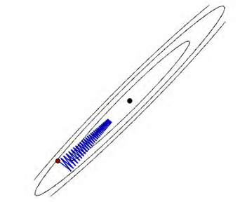
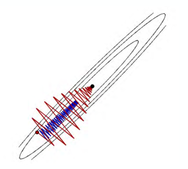
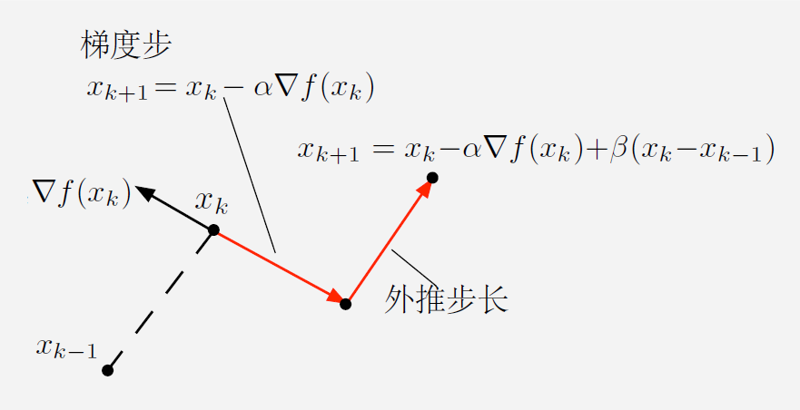

# 第8章 Nesterov 加速算法

&emsp;&emsp;Nesterov加速方法的基本迭代形式为：
$$
\begin{aligned}
v_{t} &=\mu_{t-1} v_{t-1}-\epsilon_{t-1} \nabla g\left(\theta_{t-1}+\mu_{t-1} v_{t-1}\right) \\
\theta_{t} &=\theta_{t-1}+v_{t}
\end{aligned}
$$
&emsp;&emsp;和动量方法的区别在于二者用到了不同点的梯度，动量方法采用的是上一步 $\theta_{t-1}$ 的梯度方向，而Nesterov加速方法则是从 $\theta_{t-1}$ 朝着 $v_{t-1}$ 往前一步。 一种解释是，反正要朝着 $v_{t-1}$ 方向走，不如先利用了这个信息。 接下来推导出第二种等价形式：
$$
\begin{aligned}
\theta_{t} &=\theta_{t-1}+v_{t} \\
&=\theta_{t-1}+\mu_{t-1} v_{t-1}-\epsilon_{t-1} \nabla g\left(\theta_{t-1}+\mu_{t-1} v_{t-1}\right) \\
&=\theta_{t-1}+\mu_{t-1}\left(\theta_{t-1}-\theta_{t-2}\right)-\epsilon_{t-1} \nabla g\left(\theta_{t-1}+\mu_{t-1}\left(\theta_{t-1}-\theta_{t-2}\right)\right)
\end{aligned}
$$
&emsp;&emsp;然后引入中间变量 $y_{t-1}$ ，使得它满足
$$
y_{t-1}=\theta_{t-1}+\mu_{t-1}\left(\theta_{t-1}-\theta_{t-2}\right)
$$
&emsp;&emsp;然后得到第二种等价形式
$$
\begin{aligned}
&\theta_{t}=y_{t-1}-\epsilon_{t-1} \nabla g\left(y_{t-1}\right) \\
&y_{t}=\theta_{t}+\mu_{t}\left(\theta_{t}-\theta_{t-1}\right)
\end{aligned}
$$
&emsp;&emsp;这可以理解为先进行梯度步，然后再进行加速步，这两种形式是完全等价的。
# 重球法
首先我们从梯度下降法出发：
$$
x_{k+1}=x_{k}-\alpha_{k} \nabla f\left(x_{k}\right)
$$
由于过度使用了局部的梯度信息，可能会导致震荡，导致迭代速度变慢：

想象一个球从山上滚下来，刚开始速度为0，就会滚得磕磕碰碰（震荡）。但是经过一段时间动量（Momentum）的累加，震荡就会减少，径直往山下滚。

因此我们引入第一种加速方法：重球法，其迭代形式为：
$$
x_{k+1}=x_{k}-\alpha_{k} \nabla f\left(x_{k}\right)+\beta_{k}\left(x_{k}-x_{k-1}\right)
$$
其中 $\beta_{k}(x_{k}-x_{k-1})$ 为动量项，是为了防止由于局部驱动（即梯度方向）引起的振荡。

## 重球法的收敛性
这里我们简单的介绍一下其收敛性：考虑m-强凸且L-Lipshitz光滑的函数，取$\kappa=\frac{L}{m}$我们有如下结论：

当取最优步长时，梯度下降法具有线性收敛速度，即

$$
\|x_{k}-x^{*}\| \leq\left(1-\frac{2}{\kappa+1}\right)^{k}\|x_{0}-x^{*}\|_2
$$
而取最优步长时的重球法具有超线性收敛速度，即
$$
\|x_{k}-x^{*}\| \leq\left(1-\frac{1}{\sqrt\kappa+1}\right)^{k}\|x_{0}-x^{*}\|_2
$$
格式上看起来很像，但是根号的区别导致了收敛速度的巨大差异。

为了保证$\|x_k-x^*\|_2\leq\epsilon \|x_0-x^*\|$
迭代次数只需要：
$$
\begin{aligned}
k> & \frac{\kappa}{2}\log \frac{1}{\epsilon}\quad&\text { 梯度下降法}\\
k> & \frac{\sqrt{\kappa}}{2}\log \frac{1}{\epsilon}\quad&\text { 重球法}
\end{aligned}
$$
这就意味着当$\kappa$很大时，重球法的收敛速度远远快于梯度下降法。例如$\kappa=100$时，重球法比梯度下降法快了10倍。

我们可以将其改写为下降方向的形式：
$$
\begin{aligned}
p_k&=-\nabla f(x_k)+\beta_k p_{k-1}\\
x_{k+1}&=x_k+\alpha_k p_k
\end{aligned}
$$
其中$\beta_k$为动量项通常取为0.9，$\alpha_k$为步长可以用线搜索来选择。

# Nesterov加速算法
1983年，Yurii Nesterov提出了一种新的加速算法，称为Nesterov加速算法。他改写了重球法的迭代格式：
$$
\begin{aligned}
p_k&=-\nabla f\left(x_k+\beta_k (x_k-x_{k-1})\right)+\beta_kp_{k-1}\\
x_{k+1}&=x_k+\alpha_k p_k
\end{aligned}
$$
对比重球法，Nesterov加速算法的不同之处在于，
它在计算梯度时，先进行了一个预测，然后再进行梯度下降。这种预测的好处在于，它可以更好地估计下一步的梯度，从而更好地指导下一步的迭代。同时我们也无需再保证强凸性，Nesterov加速算法也能保证收敛性，只需要保证函数是L-Lipshitz光滑的即可。

对于Nesterov加速算法的参数选择，通常取$\alpha_k=\frac{2}{L}$，$\beta_k=\frac{k-2}{k+1}$。

## Nesterov加速算法的收敛性
考虑L-Lipshitz光滑的函数，我们有如下结论：
取最优步长时梯度下降法的收敛速度：
$$
f(x_k)-f(x^*)\leq\frac{2L}{k+4}\|x_0-x^*\|_2^2
$$
Nesterov加速算法的收敛速度：
$$
f(x_k)-f(x^*)\leq\frac{2L}{(k+2)^2}\|x_0-x^*\|_2^2
$$

为了保证$f(x_k)-f(x^*)\leq\epsilon$,我们只需要保证迭代次数$k$满足：
$$
\begin{aligned}
k> & \frac{2L}{\epsilon}\|x_0-x^*\|_2^2-4\quad&\text { 梯度下降法}\\
k> & {\frac{2L}{\sqrt\epsilon}}\|x_0-x^*\|_2^2-2\quad&\text { Nesterov加速法}
\end{aligned}
$$
这也就意味着如果选择$\epsilon$很小时，Nesterov加速法的收敛速度远远快于梯度下降法。如果$\epsilon=10^{-2}$，Nesterov加速法比梯度下降法快了10倍。