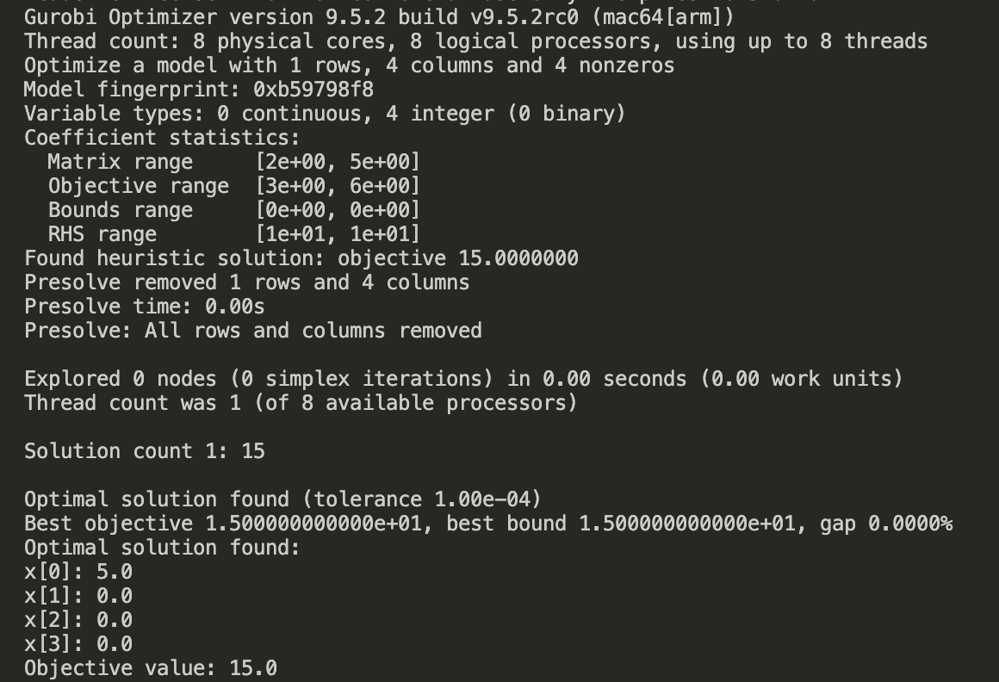
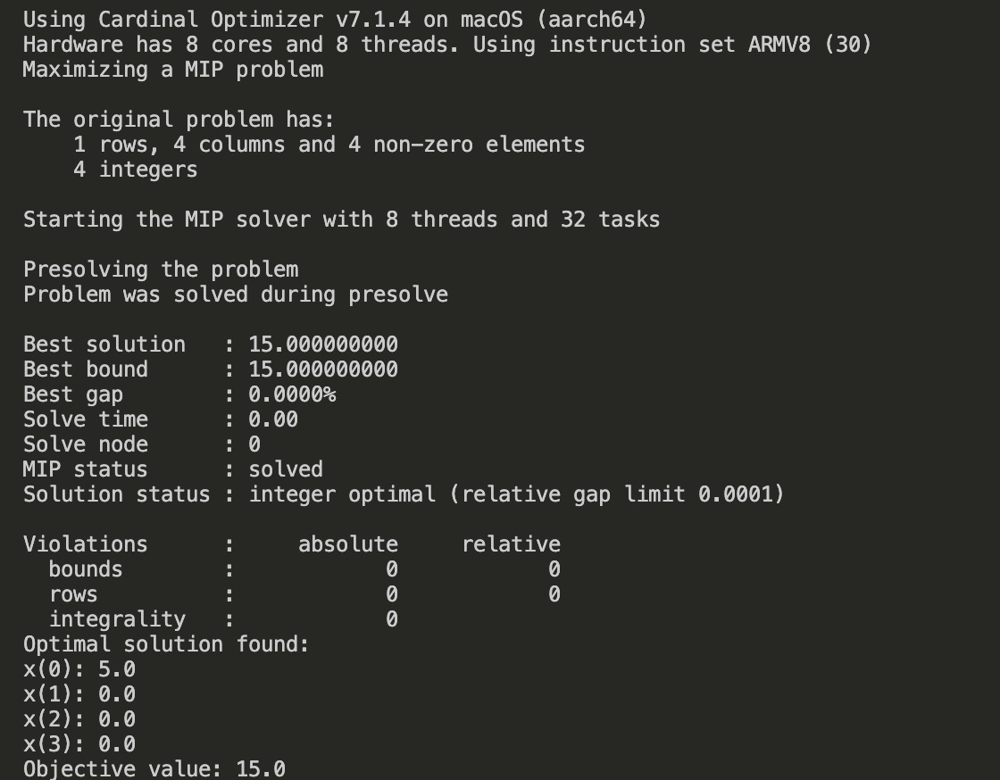

# 第三章 整数规划问题

整数规划是一种优化问题的特例，它要求优化**变量取值为整数**。相比线性规划，整数规划更为复杂，因为整数约束引入了离散性，这意味着优化算法不能简单地依赖于连续空间的性质。整数规划在实际应用中非常广泛，因为许多决策问题的自然解是整数。

本文目录：

- [第三章 整数规划问题](#第三章-整数规划问题)
  - [1. 基本概念](#1-基本概念)
    - [1.1 简介](#11-简介)
    - [1.2 问题类型](#12-问题类型)
    - [1.3 数学模型](#13-数学模型)
    - [1.4 常见的整数规划问题](#14-常见的整数规划问题)
  - [2. 求解方法](#2-求解方法)
  - [3. 代码实战](#3-代码实战)
    - [3.1 问题描述](#31-问题描述)
      - [具体问题](#具体问题)
      - [决策变量](#决策变量)
    - [3.2 数学模型](#32-数学模型)
      - [示例数据](#示例数据)
      - [模型构建](#模型构建)
    - [3.3 问题求解](#33-问题求解)
      - [Gurobi](#gurobi)
      - [Copt](#copt)

## 1. 基本概念

### 1.1 简介

整数规划（Integer Programming, IP）是一类优化问题，其中某些或所有决策变量被要求取整数值。整数规划问题在许多实际应用中都有广泛的应用，如生产计划、供应链管理、网络设计、资源分配等。

### 1.2 问题类型

1. **纯整数规划（Pure Integer Programming）**：所有决策变量都要求取整数值。
2. **混合整数规划（Mixed Integer Programming, MIP）**：部分决策变量要求取整数值，部分可以取连续值。
3. **0-1整数规划（Binary Integer Programming）**：所有决策变量只能取0或1值。

### 1.3 数学模型

一个一般的整数规划问题可以表示为：

$$\text{minimize} \quad c^T x$$

$$\text{subject to} \quad Ax \le b$$

$$x \in \mathbb{Z}^n$$

其中：
- $x$ 是决策变量向量。
- $c$ 是目标函数系数向量。
- $A$ 是约束系数矩阵。
- $b$ 是约束右端项向量。
- $\mathbb{Z}$ 表示整数集合。

### 1.4 常见的整数规划问题

1. **0-1背包问题**：在一组物品中选择若干件装入背包，使得背包的总价值最大，而重量不超过给定的限制。
2. **旅行商问题（TSP）**：给定若干城市和它们之间的距离，找到一个访问所有城市并回到起点的最短路径。
3. **集合覆盖问题**：给定一个元素集合和若干个子集，找到一个子集的组合，使得所有元素都被覆盖，并且所用子集的数量最小。
4. **工作调度问题**：在有限的资源下，安排一组作业的开始和结束时间，使得完成所有作业的总时间最短。

## 2. 求解方法

整数规划问题的求解方法主要包括以下几种：

1. **分支定界法（Branch and Bound）**：
   - 这是一种广泛使用的算法，通过系统地分割问题的可行解空间（分支）并评估每个子问题的上界和下界（定界）来找到最优解。
   - 算法通过递归地分割问题，并在每个分支上求解松弛问题（通常是线性规划问题），逐步缩小最优解的搜索范围。

2. **割平面法（Cutting Plane Method）**：
   - 这种方法通过在每次迭代中添加新的约束（割平面）来逐步收紧可行解空间，使其更接近整数解。
   - 割平面法通常与分支定界法结合使用，以提高求解效率。

3. **动态规划（Dynamic Programming）**：
   - 对于某些特定类型的整数规划问题，动态规划可以有效地找到最优解。
   - 动态规划通过将问题分解为一系列重叠的子问题，并利用子问题的解来构建原问题的解。

4. **启发式算法（Heuristic Algorithms）**：
   - 启发式算法如遗传算法、模拟退火、粒子群优化等，通过模拟自然界的进化或物理过程来寻找近似最优解。
   - 这些算法通常在问题的规模较大或精确求解困难时使用，以牺牲一定的精度换取更快的求解速度。

5. **混合整数线性规划（Mixed Integer Linear Programming, MILP）求解器**：
   - 现代优化软件如CPLEX、Gurobi、SCIP等提供了高效的MILP求解器，这些求解器结合了多种算法（如分支定界法、割平面法等）来求解混合整数线性规划问题。
   - 这些求解器通常能够处理大规模的实际问题，并提供高质量的解。


## 3. 代码实战

这一节我们来看一个经典的整数规划问题——背包问题。

### 3.1 问题描述

一个背包具有固定的容量，你有一组物品，每个物品有一定的重量和价值。目标是选择一组物品放入背包，使得在不超过背包容量的前提下，物品的总价值最大化。

#### 具体问题

- 背包的容量为 $C$。
- 有 $n$ 个物品，每个物品 $i$ 有重量 $w_i$ 和价值 $v_i$。

#### 决策变量

- $x_i$：物品 $i$的放入数量，每个变量都为非负整数。

### 3.2 数学模型

目标是最大化背包内物品的总价值：

$$\text{Maximize} \quad \sum_{i=1}^n v_i x_i$$

约束条件是所选物品的总重量不能超过背包的容量：

$$\text{Subject to} \quad \sum_{i=1}^n w_i x_i \leq C$$

并且，所有的 $x_i$ 都是非负整数变量：

$$x_i \geq 0$$

$$x_i \in \mathbb{Z}, \quad \forall i = 1, 2, \ldots, n$$

#### 示例数据

假设有如下物品和背包容量：

| 物品 $i$ | 重量 $w_i$ | 价值 $v_i$ |
|:-----------:|:-------------:|:-------------:|
| 1           | 2             | 3             |
| 2           | 3             | 4             |
| 3           | 4             | 5             |
| 4           | 5             | 6             |

背包容量 $C = 10$。

#### 模型构建

对于上述数据，数学模型如下：

目标函数：

$$\text{Maximize} \quad 3x_1 + 4x_2 + 5x_3 + 8x_4$$

约束条件：

$$2x_1 + 3x_2 + 4x_3 + 5x_4 \leq 5$$

$$x_i > = 0$$

$$x_i \in  \mathbb{Z}, \quad \forall i = 1, 2, \ldots, n$$

这个模型要求在不超过背包容量的前提下，最大化选入背包的物品的总价值。

### 3.3 问题求解

接下来只需将上面的数学模型翻译成计算机能够理解的编程代码，然后扔给求解器计算即可。

#### Gurobi
以下为使用 Gurobi 求解器求解的代码：

```python
import gurobipy as gp
from gurobipy import GRB

# 物品信息
weights = [2, 3, 4, 5] # 每件物品的重量
values  = [3, 4, 5, 6] # 每件物品的价值
capacity = 10 # 背包的容量

# 创建模型
model = gp.Model("knapsack_problem")

# 添加变量
x = model.addVars(len(weights), lb=0, vtype=GRB.INTEGER, name="x")

# 设置目标函数
model.setObjective(gp.quicksum(values[i] * x[i] for i in range(len(weights))), GRB.MAXIMIZE)

# 添加约束条件
model.addConstr(gp.quicksum(weights[i] * x[i] for i in range(len(weights))) <= capacity, "weight_limit")

# 模型求解
model.optimize()

# 输出结果
if model.status == GRB.OPTIMAL:
    print("Optimal solution found:")
    for v in model.getVars():
        print(f"{v.varName}: {v.x}")
    print(f"Objective value: {model.objVal}")
else:
    print("No optimal solution found.")

```
求解结果如下：



可以看到最优结果为放入物品一5件，最大价值为10。

#### Copt
以下为使用 Copt 求解器求解的代码：
```python
import coptpy as cp
from coptpy import COPT

# 物品信息
weights = [2, 3, 4, 5] # 每件物品的重量
values  = [3, 4, 5, 6] # 每件物品的价值
capacity = 10 # 背包的容量

# 创建 COPT 环境
env = cp.Envr()

# 创建模型
model = env.createModel("knapsack_problem")

# 添加变量
x = model.addVars(len(weights), lb=0, vtype=COPT.INTEGER, nameprefix="x")

# 设置目标函数
model.setObjective(cp.quicksum(values[i] * x[i] for i in range(len(weights))), COPT.MAXIMIZE)

# 添加约束条件
model.addConstr(cp.quicksum(weights[i] * x[i] for i in range(len(weights))) <= capacity, "weight_limit")

# 模型求解
model.solve()

# 输出结果
if model.status == COPT.OPTIMAL:
    print("Optimal solution found:")
    for v in model.getVars():
        print(f"{v.getName()}: {v.x}")
    print(f"Objective value: {model.objVal}")
else:
    print("No optimal solution found.")
```

求解结果如下：



COPT 的计算结果和 Gurobi 一致。