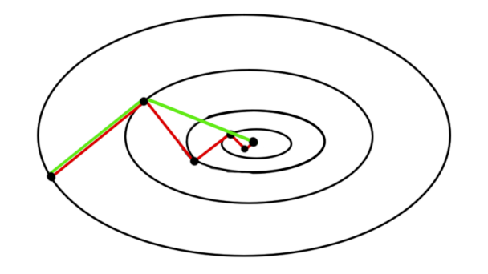
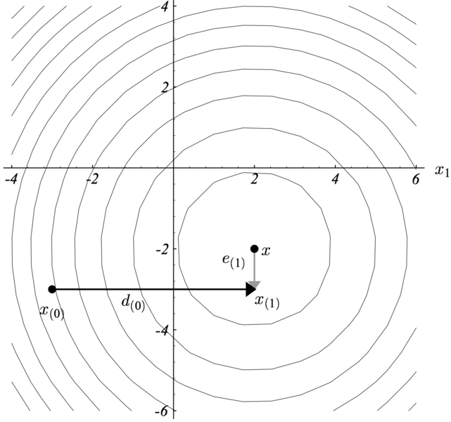
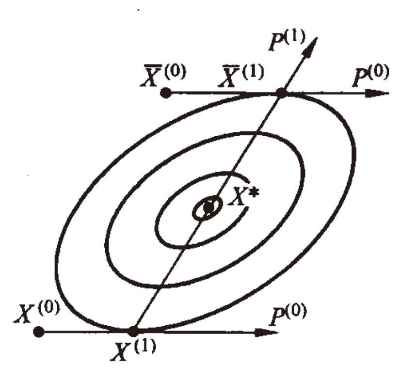
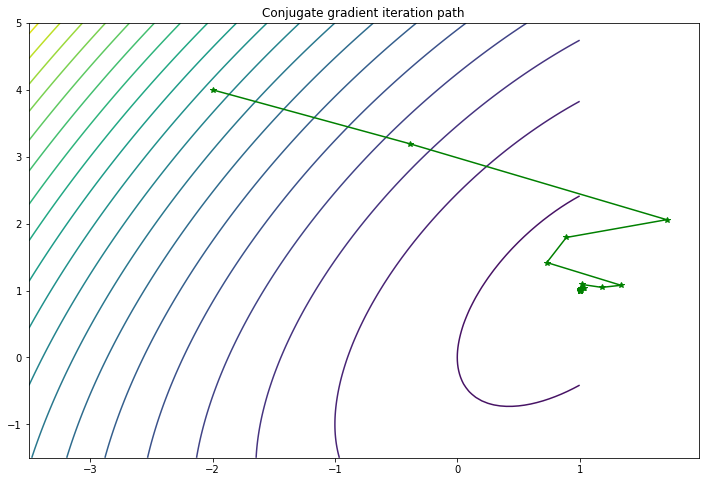

# 第四章 共轭梯度法 (Conjugate Gradient method)

## 4.1 背景

&emsp;&emsp;共轭梯度法（Conjugate Gradient method, CG）是求解稀疏对称正定线性方程组的最流行和最著名的迭代技术之一，最早由 Hestenes & Stiefel 于 1952 年提出，用于求解具有正定系数矩阵的线性方程组的迭代方法。

&emsp;&emsp;随后，Flecher & Reeves 于 1964 年引入了第一个非线性共轭梯度法，用与解决大规模非线性优化问题。经过几十年的发展，已经有了许多基于该初始方法的变体，其中一些在实践中被广泛使用。这些算法的特点是它们不需要矩阵存储并且比最速下降法更快。

&emsp;&emsp;在本章中，我们主要关注简单的线性共轭梯度方法， 同时为了简便，会把限定词”线性“进行弱化，如果对非线性共轭梯度法感兴趣，可以在学会线性共轭梯度方法的基础上自行查看相关资料进行拓展学习（见参考文献3）。

&emsp;&emsp; 共轭梯度法通常以迭代算法的形式实现，可以被认为介于牛顿法（一种结合了 Hessian 和梯度的二阶方法，后续会进行介绍）和最速下降法（一种使用梯度的一阶方法）之间。牛顿法通常会减少所需要的迭代次数，但计算 Hessian 矩阵及其逆矩阵会增加每次迭代所需要的计算量。最速下降沿与当前点的函数梯度相反的方向重复步骤，它通常采取与早期相同方向的步骤，导致收敛缓慢（如图1）。为了避免牛顿法的高计算成本并加快最速下降的收敛速度，因此提出了共轭梯度法。



<center>图1 最速下降法和共轭梯度下降法的比较</center>

&emsp;&emsp;上图是在二次函数最小化目标中，使用梯度下降法（红色）和共轭梯度下降法（绿色）的收敛路径之间的比较。理论上，共轭梯度法最多收敛于 $n$ 步，其中 $n$ 为系数矩阵的大小，这里由于是二次函数，$n$ 为 $2$ 。

## 4.2 动量法原理

### 4.2.1 原理与理论

&emsp;&emsp;CG 方法的思想是首先选择 $n$ 各正交搜索方向，并在每个搜索方向上准确地采取一个步骤，使得步长与建议的解决方案 $x$ 在同一方向。其最初是为了解决最小化二次函数而发明的：

$$
\min \phi(X) = \frac{1}{2} x^T A x - b x
$$
其中，$A$ 是 $n \times n$ 对称正定矩阵，$x$ 和 $b$ 是 $b \times 1$ 向量。上述问题可以等价地表述为解线性方程组，即当 $\grad \phi(X) = 0 $，有：
$$
Ax - b = 0
$$
>  **定义一**：共轭方向。设 $X$ 和 $Y$ 是 $n$ 维欧式空间 $E^n$ 中的两个向量，若有：
> $$
> X^T A Y = 0
> $$
> 则称 $X$ 和 $Y$ 关于 $A$ 共轭，或 $X$ 和 $Y$ 为 $A$ 共轭（$A$ 正交）。

&emsp;&emsp;一般地，设 $A$ 为 $n \times n$ 对称正定阵，若为非零向量组 $P^{(1)}, P^{(2)}, \cdots, P^{(n)} \in E^n$ 满足条件：
$$
(P^{(i)})^T  A P^{(i)} = 0 \qquad (i \neq j; \quad i,j = 1, 2, \cdots, n)
$$
则称该项两组为 $A$ 共轭。如果 $A = I$ （单位阵），则上述条件即为通常的正交条件。因此，$A$ 共轭概念实际上是通常正交概念的推广。

> **定理一**：设 $A$ 为 $n \times n$ 对称正定阵，$P^{(1)}, P^{(2)}, \cdots, P^{(n)}$ 为 $A$ 共轭的非零向量，则这一组向量线性独立。

> **定理二**：设向量 $P^{(i)}$，$i = 0, 1, 2, \cdots, n-1$，为 $A$ 共轭，则从任一点 $X^{(0)}$ 出发，相继以 $P^{(0)}, P^{(1)}, \cdots, P^{(n-1)}$ 为搜索方向的下述算法：
> $$
> \left\{
> \begin{align*}
> \min_\limits\lambda \ &f\left({X}^{(k)}+\lambda {P}^{(k)}\right) =f\left({X}^{(k)}+\lambda_{k} {P}^{(k)}\right) \\
> &X^{(k+1)}={X}^{(k)}+\lambda_{k} {P}^{(k)}
> \end{align*}\right.
> $$
> 经 $n$ 次一维搜索收敛于下述问题的极小点 $X^*$：
> $$
> \min \phi(X) = \frac{1}{2} X^T A X + B^T X + c
> $$

上述定理的证明此处不进行展开，感兴趣的读者可以查阅清华大学出版的《运筹学（第四版）》。

&emsp;&emsp;为了更好理解共轭的思想，可以将坐标轴指定为搜索方向，见图 2。第一步（$x_{(0)} \to x_{(1)}$）是解 $ X^*$ 达到正确的 $x$ 轴坐X标，第二步（$x_{(1)} \to x$）使解 $X^*$ 达到正确的 $y$ 轴并结束搜索过程。



<center>图2 共轭方向</center>

&emsp;&emsp;下面，我们就二维正定二次函数的情况加以说明，以便对上述定理有个直观认知。考虑一般的二次函数：
$$
\min \phi(X) = \frac{1}{2} X^T A X + B^T X + c
$$




<center>图3 二维正定二次函数的等值线</center>

&emsp;&emsp;二维正定二次函数的等值线，在极小点附近可用一维共心椭圆来表示，如图 3。我们指导，过椭圆簇中心 $X^*$ 引任意直线，必与诸椭圆相交，各交点处的切线互相平行。如果在两个互相平行的方向上进行最优以为搜索，则可得 $\phi(X)$ 在此方向上的极小点 $X^{(1)}$ 和 $\bar{X}^{(1)}$ ，此两点必为椭圆簇中某椭圆与该平行直线的切点，而且连接 $X^{(1)}$ 和 $\bar{X}^{(1)}$ 的直线必定过椭圆簇中心 $X^*$。

&emsp;&emsp;现在从任一点 $X^{(0)}$ 出发，沿射线 $P^{(0)}$ 作一维搜索，则可得 $\phi(X)$ 在射线 $X^{(0)} + \lambda P^{(0)}$ 上的极小点：
$$
X^{(1)} = X^{(0)} + \lambda_0 P^{(0)}
$$
其中，$\lambda_0$ 满足：
$$
\grad \phi(X^{(1)})^T P^{(0)} = 0
$$
&emsp;&emsp;同样，从另一点 $\bar{X} ^{(0)}$​ 出发也沿 $P^{(0)}$​ 方向作一维搜索，可得 $\phi(X)$​ 在射线 $\bar X^{(0)} + \lambda P^{(0)}$ 上的极小点：
$$
\bar X^{(1)} = \bar X^{(0)} + \lambda_0 P^{(0)}
$$
其中，$\lambda_0$ 满足：
$$
\grad \phi(\bar X^{(1)})^T P^{(0)} = 0
$$
从而：
$$
\left[\grad \phi (\bar X^{(1)}) - \grad \phi (X^{(1)})\right]^T P^{(0)} = 0
$$
&emsp;&emsp;由于 $\grad \phi(X) = A X + B$，若令 $P^{(1)} = \bar X^{(1)} - X^{(1)}$，则有：

$$
(P^{(1)})^T A P^{(0)} = 0
$$

即 $P^{(1)}$ 和 $P^{(0)}$ 为 $A$ 共轭。

&emsp;&emsp;上述分析说明，对于二维正定二次函数来说，从任一点 $X^{(0)}$ 出发，沿相互共轭的方向 $P^{(0)}￥ 和 $P^{(1)}$ 进行两次以为搜索，即可收敛到函数的极小点。

### 4.2.2 公式推导（选学）

&emsp;&emsp;对于正定二次函数来说，由于 $A$ 为对称正定阵，古存在唯一极小点 $X^*$，满足：
$$
\begin{aligned}
\min\ \phi(X) &= \frac{1}{2} X^T A X + B^T X + c \\
\grad \phi(X) &= AX + B =0
\end{aligned}
$$
因此，可以得到 $X^* = - A^{-1} B$。

&emsp;&emsp;如果已知某共轭向量组 $P^{(1)}, P^{(2)}, \cdots, P^{(n)}$ ，由定理二可知，上述问题的极小点算法可以通过下述算法得到：
$$
\left\{
\begin{aligned}
&X^{(k+1)} = X^{(k)} + \lambda_k P^{(k)}, \quad k = 0, 1, 2, \cdots, n-1\\
&\lambda_k: \min_\lambda \phi(X^{(k)} + \lambda P^{(k)}) \\
&X^{(n)} = X^*
\end{aligned}
\right.
$$
上式称为 **共轭方向法**。它要求搜索方向 $P^{(1)}, P^{(2)}, \cdots, P^{(n)}$ 必须共轭，确定各近似极小点时必须按最优一维搜索进行。**共轭梯度法** 是共轭方向法的一种，它的搜索方向利用一维搜索得到的最小点处函数的梯度生成，我们现在来构造正定二次函数的共轭梯度法。

&emsp;&emsp;由于 $\grad \phi(X) = AX + B$，所以有：
$$
\grad \phi(X^{(k+1)}) - \grad \phi(X^{(k)}) = A (X^{(k+1)} - X^{(k)})
$$
其中，$X^{(k+1)} = X^{(k)} + \lambda_k P^{(k)}$，所以有：
$$
\grad \phi\left({X}^{(k+1)}\right)-\grad \phi\left({X}^{(k)}\right)=\lambda_{k} {A} {P}^{(k)}, \quad k=0,1,2, \cdots, n-1
$$
&emsp;&emsp;任取初始近似点 $X^{(0)}$，并取初始搜索方向为此点的负梯度方向，即，${P}^{(0)}=-\grad \phi\left({X}^{(0)}\right)$，沿射线 $X^{(0)} + \lambda P^{(0)}$ 进行一维搜索，得到：
$$
\left\{\begin{array}{l}
{X}^{(1)}={X}^{(0)}+\lambda_{0} {P}^{(0)} \\
\lambda_{0}: \min _\limits{\lambda} \phi\left({X}^{(0)}+\lambda {P}^{(0)}\right)
\end{array}\right.
$$
可以算出  $\grad\phi ({X}^{(1)})$，由于在进行一维搜索时，为确定最佳步长 $\lambda_k$，令：
$$
\frac{{d} \phi \left({X}^{(k+1)}\right)}{{d} \lambda}=\frac{{d} \phi\left[{X}^{(k)}+\lambda {P}^{(k)}\right]}{{d} \lambda}=\grad \phi\left({X}^{(k+1)}\right)^{{T}} {P}^{(k)}=0
$$
假定 $\grad f\left({X}^{(k)}\right) \neq 0, k = 0, 1, 2, \cdots, n-1$，所以有：
$$
\grad \phi\left({X}^{(1)}\right)^{\mathrm{T}} {P}^{(0)}=-\nabla \phi\left({X}^{(1)}\right)^{{T}} \grad \phi\left({X}^{(0)}\right)=0
$$
从而可知 $\grad \phi(X^{(1)})$ 和 $\grad \phi(X^{(0)})$ 正交（这里假设  $\grad \phi(X^{(1)})$ 和  $\grad \phi(X^{(0)})$ 均不等于零）。 $\grad \phi(X^{(0)})$ 和  $\grad \phi(X^{(1)})$ 构成一正交系，我们可以在由它们生成的二维子空间中寻求  $P^{(1)}$。为此，可令：
$$
{P}^{(1)}=-\grad \phi \left({X}^{(1)}\right)+\alpha_{0} \grad \phi \left(\boldsymbol{X}^{(0)}\right)
$$
其中，$a_0$ 为待定系数。欲使  $P^{(1)}$ 和 $P^{(0)}$ 为 $A$ 共轭，必须满足：
$$
\begin{aligned}
P^{(1)} {A} {P}^{(0)} &= 0 \\
P^{(1)} \lambda_{k} {A} {P}^{(0)} &= 0 
\end{aligned}
$$
考虑到：
$$
\begin{aligned}
\lambda_{k} {A} {P}^{(k)} &= \grad \phi\left({X}^{(k+1)}\right)-\grad \phi\left({X}^{(k)}\right) \\
\rightarrow \quad \lambda_{0} {A} {P}^{(0)} &= \grad \phi\left({X}^{(1)}\right)-\grad \phi\left({X}^{(0)}\right)
\end{aligned}
$$
所以有：
$$
\left[-\grad \phi \left({X}^{(1)}\right)+\alpha_{0} \grad \phi \left({X}^{(0)}\right)\right]^{{T}}\left[\grad \phi \left({X}^{(1)}\right)-\grad \phi \left({X}^{(0)}\right)\right] =0
$$
解得：
$$
-\alpha_0 = \frac{\grad \phi(X^{(1)})^T \grad \phi(X^{(1)})}{\grad \phi(X^{(0)})^T \grad \phi(X^{(0)})}
$$
令 $\beta_0 = -\alpha_0$， 所以可得：
$$
P^{(1)} = -\grad \phi(X^{(1)}) + \beta_0 P^{(0)}
$$
&emsp;&emsp;以 $P^{(1)}$ 为搜索方向进行最优一维搜索，可得：
$$
\left\{\begin{array}{l}
{X}^{(2)}={X}^{(1)}+\lambda_{1} {P}^{(1)} \\
\lambda_{1}: \min _\limits{\lambda} \phi\left({X}^{(1)}+\lambda {P}^{(1)}\right)
\end{array}\right.
$$
算出 $\grad \phi(X^{(2)})$，假定 $\grad \phi(X^{(2)}) \neq 0$，因 $P^{(0)}$ 和 $P^{(1)}$ 共轭，所以：
$$
\grad \phi \left({X}^{(0)}\right)^T \left[\grad \phi \left({X}^{(2)}\right)-\grad \phi \left({X}^{(0)}\right)\right] =0
$$
化简得：
$$
\grad \phi \left({X}^{(0)}\right)^T \grad \phi \left({X}^{(2)}\right) =0
$$
又因为 $\displaystyle\grad \phi\left({X}^{(k+1)}\right)^{{T}} {P}^{(k)}=0$，故有：
$$
\begin{aligned}
\grad \phi\left({X}^{(2)}\right)^{{T}} {P}^{(1)} &= 0 \\
\grad \phi\left({X}^{(2)}\right)^{{T}}\left[ -\grad \phi(X^{(1)}) + \beta_0 P^{(0)} \right] &= 0 \\
\grad \phi\left({X}^{(2)}\right)^{{T}}\left[ -\grad \phi(X^{(1)}) + \alpha_0 \grad \phi(X^{(0)}) \right] &=0 \\
\grad \phi\left({X}^{(2)}\right)^{{T}}\grad \phi(X^{(1)})  &=0 \\
\end{aligned}
$$
即 $\grad \phi({X}^{(2)})$、$\grad \phi({X}^{(1)})$ 和 $\grad \phi({X}^{(0)})$ 构成一正交系，现由它们生成的三维子空间，寻求与 $P^{(0)}$ 和 $P^{(1)}$ 为 $A$ 共轭的搜索方向 $P^{(2)}$。令：
$$
{P}^{(2)}=-\grad \phi\left({X}^{(2)}\right)+\alpha_{1} \grad \phi\left({X}^{(1)}\right)+\alpha_{0} \grad \phi\left({X}^{(0)}\right)
$$
式中，$\alpha_0$ 和 $\alpha_1$ 均为待定系数。由于 $P^{(2)}$ 应与 $P^{(1)}$ 均为  $A$  共轭，故需：
$$
\begin{aligned}
&{\left[-\grad \phi\left({X}^{(2)}\right)+\alpha_{1} \nabla \phi\left({X}^{(1)}\right)+\alpha_{0} \grad \phi\left({X}^{(0)}\right)\right]^{{T}}\left[\grad \phi\left({X}^{(1)}\right)-\grad \phi\left({X}^{(0)}\right)\right]=0} \\
&{\left[-\grad \phi\left({X}^{(2)}\right)+\alpha_{1} \nabla \phi\left({X}^{(1)}\right)+\alpha_{0} \grad \phi\left({X}^{(0)}\right)\right]^{{T}}\left[\grad \phi\left({X}^{(2)}\right)-\grad \phi\left({X}^{(1)}\right)\right]=0}
\end{aligned}
$$
从而：
$$
\begin{gathered}
\alpha_{1} \grad \phi\left(\boldsymbol{X}^{(1)}\right)^{{T}} \grad \phi\left({X}^{(1)}\right)-\alpha_{0} \grad \phi\left({X}^{(0)}\right)^{{T}} \grad \phi\left({X}^{(0)}\right)=0 \\
-\grad\phi\left({X}^{(2)}\right)^{{T}} \grad \phi\left({X}^{(2)}\right)-\alpha_{1} \grad \phi\left(\boldsymbol{X}^{(1)}\right)^{{T}} \grad \phi\left({X}^{(1)}\right)=0
\end{gathered}
$$
解得：
$$
\begin{aligned}
&-\alpha_{1}=\frac{\grad \phi\left({X}^{(2)}\right)^{{T}} \grad \phi\left({X}^{(2)}\right)}{\grad \phi\left({X}^{(1)}\right)^{{T}} \grad \phi\left({X}^{(1)}\right)} \\
&\alpha_{0}=\alpha_{1} \frac{\grad \phi\left({X}^{(1)}\right)^{{T}} \grad \phi\left({X}^{(1)}\right)}{\grad \phi\left({X}^{(0)}\right)^{{T}} \grad \phi\left({X}^{(0)}\right)}
\end{aligned}
$$
令 $\beta_1 = -\alpha_1$，则 $\alpha_0 = -\beta_1 \beta_0$，于是：
$$
\begin{aligned}
{P}^{(2)} &=-\nabla \phi \left({X}^{(2)}\right)-\beta_{1} \grad \phi \left({X}^{(1)}\right)-\beta_{0} \beta_{1} \grad \phi \left({X}^{(0)}\right) \\
&=-\grad \phi \left({X}^{(2)}\right)+\beta_{1}\left[-\grad \phi \left({X}^{(1)}\right)-\beta_{0} \grad \phi \left({X}^{(0)}\right)\right] \\
&=-\grad \phi \left({X}^{(2)}\right)+\beta_{1}\left[-\grad \phi \left({X}^{(1)}\right)+\beta_{0} {P}^{(0)}\right] \\
&=-\grad \phi \left({X}^{(2)}\right)+\beta_{1} {P}^{(1)}
\end{aligned}
$$
重复上述步骤，可得一般公式如下:
$$
\displaystyle \left\{\begin{array}{l}
{X}^{(k+1)}={X}^{(k)}+\lambda_{k} {P}^{(k)} \\
\displaystyle \lambda_{k}=-\frac{\grad \phi \left({X}^{(k)}\right)^{{T}} {P}^{(k)}}{\left({P}^{(k)}\right)^{{T}} {A} {P}^{(k)}} \\
\displaystyle {P}^{(k+1)}=-\grad \phi \left({X}^{(k+1)}\right)+\beta_{k} {P}^{(k)} \\
\displaystyle \beta_{k}=\frac{\grad \phi \left({X}^{(k+1)}\right)^{{T}} \grad \phi \left({X}^{(k+1)}\right)}{\grad \phi \left({X}^{(k)}\right)^{{T}} \grad \phi \left({X}^{(k)}\right)} \\
k=0,1,2, \cdots, {n}-1
\end{array}\right.
$$
其中，$X^{(0)}$ 为初始近似，$P^{(0)} = -\grad \phi(X^{(0)})$。

&emsp;&emsp;现将共轭梯度法的计算步骤总结如下:

1. 选择初始近似 $X^{(0)}$ ，给出允许误差 $\epsilon > 0$;

2. 计算 $P^{(0)} = -\grad \phi(X^{(0)})$ ，并计算出 $X^{(1)}$，计算步长也可以使用一维搜索法。

3. 一般地，假定已得出 $X^{(k)}$ 和 $P^{(k)}$ ，则可以计算第 $k+1$ 次近似 $X^{(k+1)}$ 。
   $$
   \left\{\begin{array}{l}
   {X}^{(k+1)}={X}^{(k)}+\lambda_{k} {P}^{(k)} \\
   \lambda_{k}: \min _\limits{\lambda} \phi\left({X}^{(k)}+\lambda {P}^{(k)}\right)
   \end{array}\right.
   $$

4. 若 $\left\|\grad \phi \left(X^{(k+1)}\right)\right\|^{2} \leqslant \varepsilon$ 则停止计算，$X^{(k+1)}$ 即为要求的近似解。否则，若 $k<n-1$，则继续计算 $\beta_k$ 和 $P^{(k+1)}$ ，并转向第 3 步。

### 4.2.3 实例推导

&emsp;&emsp;接下来，我们以一个简单的例子来实践共轭梯度法，考虑一个简单的二次目标：

$$
\displaystyle \min f(X) = \frac{3}{2} x_1^2 + \frac{1}{2} x_2^2 -x_1 x_2 -2 x_1
$$

&emsp;&emsp;将上式转化为正定二次函数，得：
$$
A = \left(\begin{array}{rr}
3 & -1 \\
-1 & 1
\end{array}\right)
$$

&emsp;&emsp;现在从 $X^{(0)} = (-2,  4)^T$ 开始，由于：

$$
\grad f({X})=\left[\left(3 x_{1}-x_{2}-2\right),\left(x_{2}-x_{1}\right)\right]^{{T}}
$$

故：

$$
\begin{aligned}
&\grad f\left({X}^{(0)}\right)=(-12,6)^{{T}}\\
&{P}^{(0)}=-\grad f\left({X}^{(0)}\right)=(12,-6)^{\mathrm{T}}\\
&\lambda_{0}=-\frac{\grad f\left({X}^{(0)}\right)^{{T}} {P}^{(0)}}{\left({P}^{(0)}\right)^{{T}} {A} {P}^{(0)}}=-\frac{(-12,6)\left(\begin{array}{c}
12 \\
-6
\end{array}\right)}{(12,-6)\left(\begin{array}{rr}
3 & -1 \\
-1 & 1
\end{array}\right)\left(\begin{array}{c}
12 \\
-6
\end{array}\right)}=\frac{180}{612}=\frac{5}{17}
\end{aligned}
$$

于是：

$$
\begin{gathered}
\displaystyle {X}^{(1)}=\boldsymbol{X}^{(0)}+\lambda_{0} {P}^{(0)}=\left(\begin{array}{r}
-2 \\
4
\end{array}\right)+\frac{5}{17}\left(\begin{array}{c}
12 \\
-6
\end{array}\right)=\left(\frac{26}{17}, \frac{38}{17}\right)^{{T}} \\

\displaystyle \grad f\left({X}^{(1)}\right)=(6 / 17,12 / 17)^{{T}} \\

\beta_{0}=\frac{\grad f\left(\boldsymbol{X}^{(1)}\right)^{{T}} \nabla f\left({X}^{(1)}\right)}{\grad f\left({X}^{(0)}\right)^{{T}} \grad f\left({X}^{(0)}\right)}=\frac{\left(\displaystyle \frac{6}{17}, \frac{12}{17}\right)\left[\begin{array}{c}
6 / 17 \\
12 / 17
\end{array}\right]}{(-12,6)\left[\begin{array}{c}
-12 \\
6
\end{array}\right]}=\frac{1}{289} \\

{P}^{(1)}=-\grad f\left({X}^{(1)}\right)+\beta_{0} {P}^{(0)}=-\left[\begin{array}{l}
6 / 17 \\
12 / 17
\end{array}\right]+\frac{1}{289}\left(\begin{array}{c}
12 \\
-6
\end{array}\right)=\left(-\frac{90}{289},-\frac{210}{289}\right)^{{T}}

\end{gathered}
$$

&emsp;迭代可得：

$$
\begin{aligned}
\displaystyle \lambda_{1} &=-\frac{\nabla f\left({X}^{(1)}\right)^{{T}} {P}^{(1)}}{\left({P}^{(1)}\right)^{{T}} {A} {P}^{(1)}}\\
&=-\frac{\left(\displaystyle \frac{6}{17}, \frac{12}{17}\right)\left(\displaystyle -\frac{90}{289},-\frac{210}{289}\right)^{{T}}}{\left(\displaystyle -\frac{90}{289},-\frac{210}{289}\right)\left(\begin{array}{rr}
3 & -1 \\
-1 & 1
\end{array}\right)\left(\displaystyle -\frac{90}{289},-\frac{210}{289}\right)^{{T}}}\\
&=\frac{6 \times 17 \times 90+12 \times 17 \times 210}{(-60,-120)(-90,-210)^{{T}}}=\frac{17(6 \times 90+12 \times 210)}{60 \times 90+120 \times 210}\\
&=\frac{17}{10}
\end{aligned}
$$

故：
$$
{X}^{(2)}={X}^{(1)}+\lambda_{1} {P}^{(1)}=\left[\begin{array}{l}
26 / 17 \\
38 / 17
\end{array}\right]+\frac{17}{10}\left[\begin{array}{l}
-90 / 289 \\
-210 / 289
\end{array}\right]=\left(\begin{array}{l}
1 \\
1
\end{array}\right)
$$

## 4.3 共轭梯度法的实现

&emsp;&emsp;下面，我们手动实现一个动量法，实现上述例子的优化过程。

```python 
import random
import numpy as np
import matplotlib.pyplot as plt
 
def goldsteinsearch(f,df,d,x,alpham,rho,t):
    '''
    线性搜索子函数
    数f，导数df，当前迭代点x和当前搜索方向d，t试探系数>1，
    '''
    flag = 0

    a = 0
    b = alpham
    fk = f(x)
    gk = df(x)

    phi0 = fk
    dphi0 = np.dot(gk, d)
    alpha=b*random.uniform(0,1)

    while(flag==0):
        newfk = f(x + alpha * d)
        phi = newfk
#         print(phi,phi0,rho,alpha ,dphi0)
        if (phi - phi0 )<= (rho * alpha * dphi0):
          # if abs(np.dot(df(x + alpha * d),d))<=-sigma*dphi0:
            if (phi - phi0) >= ((1 - rho) * alpha * dphi0):
                flag = 1
            else:
                a = alpha
                b = b
                if (b < alpham):
                    alpha = (a + b) / 2
                else:
                    alpha = t * alpha
        else:
            a = a
            b = alpha
            alpha = (a + b) / 2
    return alpha
 
def frcg(fun,gfun,x0):
 
    # x0是初始点，fun和gfun分别是目标函数和梯度
    # x,val分别是近似最优点和最优值，k是迭代次数
    # dk是搜索方向，gk是梯度方向
    # epsilon是预设精度，np.linalg.norm(gk)求取向量的二范数
    maxk = 50
    rho = 0.6
    sigma = 0.4
    k = 0
    epsilon = 1e-5
    n = np.shape(x0)[0]
    itern = 0
    W = np.zeros((2, 20000))

    f = open("共轭.txt", 'w')

    while k < maxk:
        W[:, k] = x0
        gk = gfun(x0)
        itern += 1
        itern %= n
        if itern == 1:
            dk = -gk
        else:
            beta = 1.0 * np.dot(gk, gk) / np.dot(g0, g0)
            dk = -gk + beta * d0
            gd = np.dot(gk, dk)
            if gd >= 0.0:
                dk = -gk
        if np.linalg.norm(gk) < epsilon:
            break

        alpha=goldsteinsearch(fun, gfun, dk, x0, 1,0.1,2)
        # alpha=Wolfesearch(fun,gfun,dk,x0,1,0.1,2)
        x0+=alpha*dk

        f.write(str(k)+'  '+str(np.linalg.norm(gk))+"\n")
        #  print(k,alpha)
        g0 = gk
        d0 = dk
        k += 1

    W = W[:, 0:k+1] # 记录迭代点
    return [x0, fun(x0), k,W]
 
def fun(x):
    # 原函数 1.5 * (x1 ** 2) + 2* x2**2 - x1 * x2 - 2 * x1
    return 1.5 * (x[0] ** 2) + 0.5 * x[1]**2 - x[1] * x[0] - 2 * x[0]
def gfun(x):
    return np.array([3 * x[0]  - x[1] - 2, x[1] - x[0]])
    
if __name__=="__main__":
    random.seed(1)
    X1 = np.arange(-3.5, 1 + 0.05, 0.05)
    X2 = np.arange(-1.5, 5 + 0.05, 0.05)
    [x1, x2] = np.meshgrid(X1, X2)
    f = 1.5 * (x1 ** 2) + 0.5* x2**2 - x1 * x2 - 2 * x1 # 给定的函数
    plt.figure(figsize = (12, 8))
    plt.contour(x1, x2, f, 20) # 画出函数的20条轮廓线

    x0 = np.array([-2., 4.])
    x=frcg(fun,gfun,x0)
    print("迭代次数为:", x[0])
    print("近似最优解为:", x[2]) 
    # [1.00000226 1.00000369]
    W=x[3]
    # print(W[:, :])
    plt.title('Conjugate gradient iteration path')   
    plt.plot(W[0, :], W[1, :], 'g*-') # 画出迭代点收敛的轨迹)
              
    plt.show()
```

Results:

```
迭代次数为: 22
近似最优解为: [1.00000375 1.00000875]
```



## 参考文献

【1】M. R. HESTENES AND E. STIEFEL,Methods of conjugate gradients for solving linear systems, Journal of Research of the National Bureau of Standards, 49 (1952), pp. 409–436.  
【2】R. FLETCHER AND C. M.REEVES, Function minimization by conjugate radients,Computer Journal, 7 (1964), pp. 149–154.  
【3】《运筹学》教材编写组. (2012). 运筹学第四版. 北京: 清华大学出版社.  
【4】Python 实现的共轭梯度法. https://www.zhangshengrong.com/p/JKN8EkgmX6/.
【5】Conjugate gradient methods. https://optimization.cbe.cornell.edu/index.php?title=Conjugate_gradient_methods.