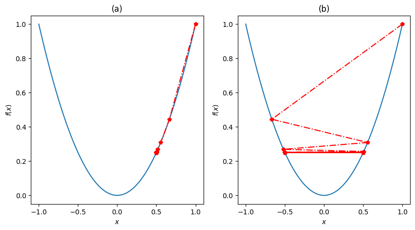
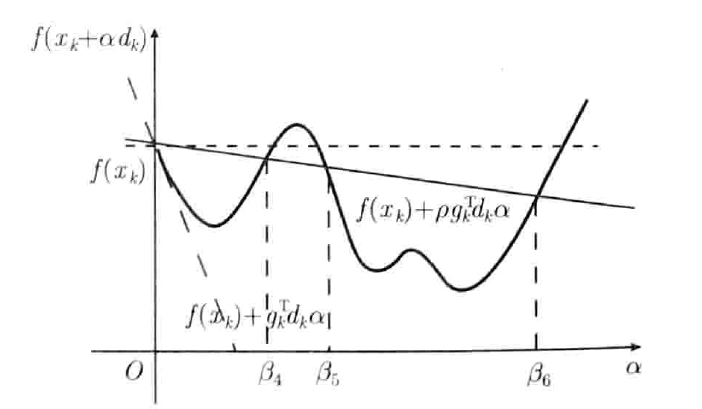
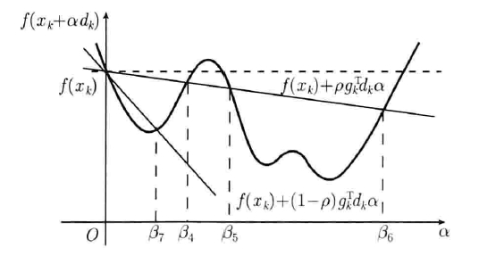

# chapter2 线搜索
&emsp;&emsp;最优化问题可以分为无约束最优化问题与约束最优化问题两大类。无约束最优化问题是求一个函数的极值问题，即
$$
\min f(x) \tag{1}
$$
其中$x \in \mathbb{R}^n$为决策变量，$f(x)\in \mathbb{R}$为目标函数。问题$(1)$的解称为最优解，记为$x^{*}$,该点的函数值$f(x^{*})$称为最优值。问题$(1)$的最优解分为全局最优解和局部最优解，本节介绍的线搜索算法是求局部最优解的算法。本节主要参考了《最优化:建模,算法与理论》和《数值最优化方法》两本书中的相关章节的内容。
## 2.1线搜索算法结构
&emsp;&emsp;求解最优化问题的基本方法是迭代算法，即采用逐步逼近的计算方法来逼近问题的精确解的方法。以最小化问题为例，在一个算法中，可先选定一个初始迭代点$x_{0}\in \mathbb{R}^n$，在该迭代点处，确定一个函数值下降的方向，再确定在这个方向上的步长，从而求得下一个迭代点，依次类推，产生一个迭代点列{$x_{k}$}，{$x_{k}$}或其子列应收敛于问题的最优解。当给定的某种终止准则满足时，或者表明$x_{k}$已满足要求的近似最优解的精度，或者表明算法已无力进一步改善迭代点，迭代结束。
线搜索算法的基本结构如下：
$$
\begin{array}{l}
（1） 给定初始点x_{0} \in \mathbb{R^{n}}, k:=0 \\
（2）若在x_{k}点终止准则满足，则输出有关信息，停止迭代  \\
（3）确定f(x)在x_{k}点的下降方向d_{k} \\
（4）计算步长\alpha_{k}，使f(x_{k}+\alpha_{k} d_{k})小于f(x_{k}) \\
（5）令x_{k+1}:=x_{k}+\alpha_{k} d_{k} ，k:=k+1,转（2） \\
\end{array}
$$
其中包含两个基本要素：一是下降的方向；二是步长。不同的下降方向和步长可构成不同的算法，具有以上结构的最优化方法称为线搜索方法。
## 2.2终止准则
&emsp;&emsp;因为局部极小点$x^{*}$是稳定点（假设目标函数$f(x)$的一阶导数存在），可以用$\lVert \nabla{f(x_{k})} \rVert \leqslant \epsilon$作为终止准则，$\epsilon$的大小决定所得迭代点$x_{k}$近似$x^{*}$的精度。但该准则也有一定的局限性，对于在极小点领域内比较陡峭的函数，即使该领域中的点已相当接近极小点，但其梯度值可能仍然较大，从而使迭代难以停止。

&emsp;&emsp;其他终止准则有$\lVert x_{k}-x_{k+1}\rVert \leqslant \epsilon$或$f_{k}-f_{k+1}\leqslant\epsilon$,但这些准则满足只能说明算法这时所进行的迭代对迭代点或迭代点处目标函数值的改善已经非常小，并不能保证$\lVert x_{k}-x_{k+1}\rVert$或$f_{k}-f_{k+1}$一定足够小。

## 2.3搜索方向
&emsp;&emsp;在迭代点$x_{k}$处，若存在$\overline{\alpha}_{k}$，使
$$
f\left(x_{k}+\alpha_{k} d\right)<f\left(x_{k}\right), \forall\alpha \in (0, \overline{\alpha}_{k}),
$$
则$d$为$f(x)$在$x_{k}$点的下降方向。

&emsp;&emsp;根据$f\left(x_{k}+\alpha_{k} d\right)$在$x_{k}$点的Taylor展开式，
$$
f\left(x_{k}+\alpha d\right)=f\left(x_{k}\right)+\alpha \nabla f\left(x_{k}\right)^{T}d +O(\lVert \alpha d \rVert^{2})
$$
知，下降方向$d$为满足$\nabla f\left(x_{k}\right)^{T}d < 0$的方向。

&emsp;&emsp;线搜索类算法根据搜索方向的不同可以分为梯度类算法、次梯度算法、牛顿算法、拟牛顿算法等．
## 2.4搜索步长
&emsp;&emsp;在线搜索方法中，搜索方向的选择有很多，但是步长选择的方法在不同算法中非常相似。设$\phi(\alpha)=f(x_{k}+\alpha d_{k})$，从当前迭代点$x_{k}$出发，沿搜索方向$d_{k}$，需要确定合适的步长$\alpha_{k}$，使$f(x_{k}+\alpha_{k} d_{k})<f(x_{k})$，即$\phi(\alpha_{k})<\phi(0)$。搜索步长的选择通常需要在目标函数下降量和确定$\alpha_{k}$的计算量之间进行平衡。

&emsp;&emsp;一个很自然的想法是取$\alpha_{k}$使目标函数$f(x_{k})$沿方向$d_{k}$达到极小，即使得
$$
 \phi( \alpha_{k} )=\operatorname* {m i n}\limits_{\alpha> 0} \phi( \alpha) ,
 $$
这种方法称为精确线搜索。由于在实际计算中，采用精确线搜索通常需要很大的计算量，且对一般问题而言，实现精确线搜索十分困难，因此在实际应用中较少使用。

&emsp;&emsp;另一个想法是不去求$
\phi( \alpha)$的最小值点，而是选取$\alpha_{k}$使目标函数得到可接受的下降量$f(x_{k})-f(x_{k}+\alpha_{k} d_{k})$，这种线搜索方法被称为非精确线搜索。非精确线搜索因需要的计算量相对较少，更受人们青睐。
### 2.4.1非精确线搜索准则
&emsp;&emsp;在非精确线搜索算法中，仅使$f(x_{k}+\alpha_{k} d_{k})<f(x_{k})$，是不足以确保生成的迭代序列$\{x_{k}\}$收敛到最优解的，选取$\alpha_{k}$需要满足一定的要求，这些要求被称为线搜索准则。线搜索准则的合适与否直接决定了算法的收敛性，若选取不合适的线搜索准则将会导致算法无法收敛至极小值点。例如考虑一维无约束优化问题
$$
\operatorname* {m i n}_{x} f(x)=x^{2}
$$
初始迭代点$x_{0}=1$。由于问题是一维的，下降方向只有{-1，+1}两种。我们选取$d_{k}=-sign(x_{k})$，且只要求选取的步长满足迭代点处函数值单调下降，即
$
f(x_{k}+\alpha d_{k})<f(x_{k})
$
考虑选取如下两种步长：

$$
\alpha_{k, 1}=\frac{1} {3^{k+1}}, \quad\alpha_{k, 2}=1+\frac{2} {3^{k+1}}, 
$$
通过计算可以得到

$$
x_{k}^{1}=\frac{1} {2} \left( 1+\frac{1} {3^{k}} \right), \quad x_{k}^{2}=\frac{(-1 )^{k}} {2} \left( 1+\frac{1} {3^{k}} \right). 
$$

显然，序列$\{f(x_{k}^{1})\}$和序列$\{f(x_{k}^{2})\}$均单调下降，但序列$\{x_{k}^{1}\}$收敛的点不是极小值点，序列$\{x_{k}^{2}\}$则在原点左右振荡，不存在极限，如下图所示。
出现上述情况的原因是在迭代过程中函数值$f(x)$的下降量不够充分以至于算法无法收敛到极小值点.为了避免这种情况发生，必须引入一些更合理的线搜索准则来确保迭代的收敛性。

#### 1. Armijo准则
&emsp;&emsp;Armijo 准则：

$$
f ( x_{k}+\alpha d_{k} ) \leqslant f ( x_{k} )+\rho \alpha\nabla f ( x_{k} )^{\mathsf{T}} d_{k},  \rho\in (0,1)
$$
是一个常用的线搜索准则，引人 Armiio准则的目的是保证每一步迭代充分下降。
Armijo 准则有非常直观的几何含义，它指的是点$(\alpha,\phi(\alpha))$必须在直线
$$l(\alpha)=f ( x_{k} )+\rho\alpha \nabla f(x_{k})^{\mathsf{T}}d_{k}$$
的下方。如下图所示(图中$g=\nabla f (x)$)，区间（0,$\beta_{4}$]和[$\beta_{5}$,$\beta_{6}$]中的点均满足 Armijo 准则。因为$\nabla f ( x_{k} )^{\mathsf{T}} d_{k}<0$，所以$l(\alpha)$的斜率为负，选取符合 Armiio准则的$\alpha$确实会使得函数值下降。在实际应用中，参数$c_{1}$通常选为一个很小的正数，例如$c_{1}=10^{-3}$，这使得 Armijo 准则非常容易得到满足。但是仅仅使用 Armijo 准则并不能保证迭代的收敛性，因为可行区域中包含了步长$\alpha$接近0的区域，当$\alpha$取值太小时，目标函数值的下降量可能过小，导致序列$\{f(x_{k})\}$的极限值不是极小值，为必须避免$\alpha$取值过小，Armijo准则需要配合其他准则共同使用。

#### 2.Goldstein准则
&emsp;&emsp;为了克服 Armijo 准则的缺陷，需要引入其他准则来保证每一步的 $\alpha$不会太小。既然 Armijo 准则只要求点($\alpha,\phi(\alpha)$)必须处在某直线下方，则也可使用相同的形式使得该点必须处在另一条直线的上方。这就是Armijo-Goldstein 准则，简称 Goldstein 准则：

$$
\begin{aligned} {{f ( x_{k}+\alpha d_{k} )}} & {{} {{} \leqslant f ( x_{k} )+\rho \alpha\nabla f ( x_{k} )^{\mathsf{T}} d_{k},}} \\ {{f ( x_{k}+\alpha d_{k} )}} & {{} {{} \geqslant f ( x_{k} )+( 1-\rho ) \alpha\nabla f ( x_{k} )^{\mathsf{T}} d_{k},}} \\ \end{aligned} 
$$
其中$\rho\in (0,1/2)$。
同样，Goldstein 准则也有非常直观的几何含义，它指的是点($\alpha,\phi(\alpha)$)必须在两条直线

$$
\begin{aligned} {{l_{1} ( \alpha)}} & {{} {{} {{}=f ( x_{k} )+\rho \alpha\nabla f ( x_{k} )^{\mathsf{T}} d_{k},}}} \\ {{l_{2} ( \alpha)}} & {{} {{} {{}=f ( x_{k} )+( 1-\rho ) \alpha\nabla f ( x_{k} )^{\mathsf{T}} d_{k}}}} \\ \end{aligned} 
$$
之间。如下图所示，区间[$\beta_{3}$,$\beta_{4}$]和[$\beta_{5}$,$\beta_{6}$]中的点均满足Goldsteimn准则，同时可注意到Goldstein准则确实去掉了过小的$\alpha$。

#### 3.Wolfe准则
&emsp;&emsp;Goldstein准则能够使得函数值充分下降，但是它可能会避开$\phi(\alpha)$取最小值的区域。为此引人Armijo-Wolfe准则，简称Wolfe准则：
$$
f ( x_{k}+\alpha d_{k} ) \leqslant f ( x_{k} )+\rho \alpha\nabla f ( x_{k} )^{\mathsf{T}} d_{k}, 
$$
$$
\nabla f ( x_{k}+\alpha d_{k} )^{\mathrm{T}} d_{k} \geqslant \sigma \nabla f ( x_{k} )^{\mathrm{T}} d_{k}, 
$$
其中$1>\sigma>\rho>0$为给定常数。在Wolfe准则中，第一个不等式即是 Armijo 准则，而第二个不等式则是 Wolfe 准则的本质要求。 注意到 $\nabla f ( x_{k}+\alpha d_{k} )^{\mathrm{T}} d_{k}$恰好就是$\phi(\alpha)$的导数，Wolfe准则实际要求$\phi(\alpha)$在点$\alpha$处切线的斜率不能小于$\phi(\alpha)$在零点斜率的$\sigma$倍。如下图所示，在区间[$\beta_{7}$,$\beta_{4}$]、[$\beta_{8}$,$\beta_{9}$]和[$\beta_{10}$,$\beta_{6}$]中的点均满足Wolfe 准则。注意到在$\phi(\alpha)$的极小値点$\alpha^{*}$处有$\phi'(\alpha^{*})=\nabla f ( x_{k}+\alpha^{*} d_{k} )^{\mathrm{T}} d_{k}=0$，因此$\alpha^{*}$永远满足第二个不等式。而选择较小的$\rho$可使得$\alpha^{*}$同时满足第一个不等式，即 Wolfe 准则在绝大多数情况下会包含线搜索子问题的精确解。在实际应用中，参数$\sigma$通常取为 0.9。

&emsp;&emsp;在Wolfe准则中，即使$\sigma$取为0，亦无法保证满足准则的点接近精确线搜索的结果。但若采用下面的强Wolfe准则，$\sigma$取得越小，满足准则的$\alpha$越接近精确线搜索的结果，
$$
f(x_{k}+\alpha d_{k})\leqslant f(x_{k})+\rho \alpha\nabla f ( x_{k} )^{\mathrm{T}}d_{k}\\|\nabla f(x_{k}+\alpha d_{k})^{\mathrm{T}}d_{k}|\leqslant-\sigma \nabla f( x_{k} )^{\mathrm{T}}d_{k}
$$
其中$1>\sigma>\rho>0$。
### 2.4.2收敛性
&emsp;&emsp;
这一节将以Wolfe准则为例，通过引入Zoutendijk定理说明非精确线搜索算法的收敛性。

 $\textbf{Zoutendijk定理:}$考虑一般的迭代格式$x_{k+1}=x_{k}+\alpha_{K}d_{k}$，其中$d_{k}$是搜索方向，$\alpha_{k}$是步长，且在迭代过程中Wolfe准则满足。假设目标函数$f$下有界、连续可微且梯度$L$-利普希茨连续，即
$$
\| \nabla f ( x )-\nabla f ( y ) \| \leqslant L \| x-y \|, \quad\forall\, x, y \in\mathbb{R}^{n}, 
$$
那么

$$
\sum_{k=0}^{\infty} \operatorname{cos}^{2} \theta_{k} \| \nabla f ( x^{k} ) \|^{2} <+\infty, \tag{2}
$$
其中$\operatorname{cos}_{\theta_{k}}$为负梯度$-\nabla f(x_{k})$和下降方向$d_{k}$夹角的余弦，即
$$
\operatorname{cos} \theta_{k}=\frac{-\nabla f ( x_{k} )^{\mathrm{T}} d_{k}} {\| \nabla f ( x_{k} ) \| \| d_{k} \|}. 
$$
不等式(2)也被称为$\textbf{Zoutendijk条件}$。

&emsp;&emsp;$\textbf{证明:}$

&emsp;&emsp;由wolfe条件
$$
\nabla f ( x_{k}+\alpha d_{k} )^{\mathrm{T}} d_{k} \geqslant \sigma \nabla f ( x_{k} )^{\mathrm{T}} d_{k}, 
$$
可得
$$
\Big( \nabla f ( x_{k+1} )-\nabla f ( x_{k} ) \Big)^{\mathsf{T}} d_{k} \geqslant( \sigma-1 ) \nabla f ( x_{k} )^{\mathsf{T}} d^{k}. 
$$
由柯西不等式和梯度L-利普希茨连续性质

$$
\left( \nabla f ( x_{k+1} )-\nabla f ( x_{k} ) \right)^{\mathrm{T}} \! d^{k} \leqslant\| \nabla f ( x_{k+1} )-\nabla f ( x_{k} ) \| \| d_{k} \| \leqslant\alpha_{k} L \| d_{k} \|^{2}. 
$$
结合上述两式可得

$$
\alpha_{k} \geqslant{\frac{\sigma-1} {L}} {\frac{\nabla f ( x_{k} )^{\mathrm{T}} d_{k}} {\| d_{k} \|^{2}}}. 
$$
注意到$\nabla f ( x_{k} )^{\mathrm{T}} d_{k}<0$，将上式代入wolfe准则中的第一个不等式$f ( x_{k}+\alpha d_{k} ) \leqslant f ( x_{k} )+\rho \alpha\nabla f ( x_{k} )^{\mathsf{T}} d_{k}$条件，则

$$
f ( x_{k+1} ) \leqslant f ( x_{k} )+\rho {\frac{\sigma-1} {L}} {\frac{\left( \nabla f ( x_{k} )^{\mathsf{T}} d_{k} \right)^{2}} {\| d_{k} \|^{2}}}. 
$$
根据$\theta_{k}$的定义，此不等式可等价表述为

$$
f ( x_{k+1} ) \leqslant f ( x_{k} )+\rho \frac{\sigma-1} {L} \operatorname{c o s}^{2} \theta_{k} \| \nabla f ( x_{k} ) \|^{2}. 
$$
再关于k求和，有
$$
f ( x_{k+1} ) \leqslant f ( x_{0} )-\rho \frac{1-\sigma} {L} \sum_{j=0}^{k} \operatorname{c o s}^{2} \theta_{j} \| \nabla f ( x_{j} ) \|^{2}. 
$$
又因为函数$f$是下有界的，且由$0<\rho<\sigma<1$可知$\rho(1-\sigma)>0$，因此当$k\rightarrow +\infty$时

$$
\sum_{j=0}^{\infty} \operatorname{cos}^{2} \theta_{j} \| \nabla f ( x_{j} ) \|^{2} <+\infty. 
$$

&emsp;&emsp;Zoutendik定理指出，只要迭代点满足 Wolfe 准则，对梯度利普希茨连续且下有界函数总能推出(2)式成立。实际上采用Goldstein准则也可推出类似的条件。Zoutendik定理刻画了线搜索准则的性质，配合下降方向$d_{k}$的选取方式可以得到线搜索算法最基本的收敛性。

$\textbf{线搜索算法的收敛性:}$

&emsp;&emsp;对于线搜索算法，设$\theta_{k}$为每一步负梯度 $-\nabla f(x_{k})$与下降方向$d_{k}$的夹角，并假设对任意的k，存在常数$\gamma>0$，使得
$$
\theta_{k} < \frac{\pi} {2}-\gamma, 
$$
则在Zoutendik定理成立的条件下，有
$$
\operatorname* {l i m}_{k \to\infty} \nabla f ( x^{k} )=0. 
$$
&emsp;&emsp;$\textbf{证明:}$

&emsp;&emsp;假设结论不成立，即存在子列$\{k_{l}\}$和正常数$\delta>0$，使得

$$
\| \nabla f ( x_{k_{l}} ) \| \geqslant\delta, \quad l=1, 2, \cdots. 
$$
根据$\theta_{k}$的假设，对任意的k,

$$
\operatorname{c o s} \theta_{k} > \operatorname{s i n} \gamma> 0. 
$$
我们仅考虑式(2)的第$k_{l}$项，有

$$
\begin{aligned} {{\sum_{k=0}^{\infty} \operatorname{c o s}^{2} \theta_{k} \| \nabla f ( x_{k} ) \|^{2}}} & {{} \geqslant\sum_{l=1}^{\infty} \operatorname{cos}^{2} \theta_{k_{l}} \| \nabla f ( x_{k_{l}} ) \|^{2}} \\ {} & {{} \geqslant\sum_{l=1}^{\infty} ( \operatorname{sin}^{2} \gamma) \cdot\delta^{2} \to+\infty,} \\ \end{aligned} 
$$
这显然和Zoutendijk定理矛盾。因此必有

$$
\operatorname* {l i m}_{k \to\infty} \nabla f ( x^{k} )=0. 
$$
该证明建立在 Zoutendik 条件之上，它的本质要求是每一步的下降方向$d_{k}$和负梯度方向不能趋于正交。这个条件的几何直观明显:当下降方向$d_{k}$和梯度正交时，根据泰勒展开的一阶近似，目标函数值$f(x)$几乎不发生改变，因此要求$d_{k}$与梯度正交方向夹角有一致的下界。线搜索算法的收敛速度极大地取决于$d$的选取和目标函数的性质等，具体可参考《Numerical Optimization》书中的相关内容。
### 2.4.3搜索算法
&emsp;&emsp;这节主要介绍如何求满足线搜索准则的步长。
#### 1 回退算法
&emsp;&emsp;回退法是通过不断以指数方式缩小试探步长，找到第一个满足终止条件的点,是最常用的线搜索算法之一。以寻找一个满足Armijo准则的步长为例:
>1. 选择初始步长
$\overline{\alpha}$，参数$\gamma,c\in(0,1)$。初始化$\alpha\leftarrow\overline{\alpha}$。
>
>2. while$f(x_{k} + \alpha d_{k}) > f(x_{k}) + c\alpha \nabla f(x_{k})^{\mathbb{T}}d_{k}$ do
>
>3. &emsp;&emsp;令$\alpha \leftarrow \gamma \alpha$
>
>4. end while
>5. 输出$\alpha_{k}=\alpha$

&emsp;&emsp;回退法中$\alpha$的试验值是由大至小的，因此可以确保输出的$\alpha$能尽量的大。同时因为$d$是一个下降方向，当$\alpha$充分小时，Armijo准则总是成立的,回退法不会限进行下去，在实际应用中我们通常也会给$\alpha$设置一个下界，防止步长过小。然而，回退法的缺点也很明显：第一，它无法保证找到满足 Wolfe 准则的步长，但对一些优化算法而言，找到满足 Wolfe 准则的步长是十分必要的；第二，回退法以指数的方式缩小步长，因此对初值$\overline{\alpha}$和参数$\gamma$的选取比较敏感，当$\gamma$过大时每一步试探步长改变量很小，此时回退法效率比较低，当$\gamma$过小时回退法过于激进，导致最终找到的步长太小，错过了选取大步长的机会。
#### 2 多项式插值法
&emsp;&emsp;为了提高回退法的效率，有基于多项式插值的线搜索算法，其原理是用己有的函数信息，构造近似$\phi(\alpha)$的多项式函数，求出该多项式函数的极小点并检验它是否满足非精确线搜索准则；若不满足，则根据新的函数信息去构造新的多项式函数；如此反复，直至满足非精确线搜索准则。

&emsp;&emsp;以二次插值法和Armijo准则为例，假设初始步长$\alpha_{0}$已给定，如果经过验证，$\alpha_{0}$不满足Armijo准则，下一步就需要减小试探步长，基于$\phi(0),\phi'(0),\phi(\alpha_{0})$这三个信息构造一个二次插值函数$p_{2}(\alpha)$满足
$$
p_2(0)=\phi(0),\quad p_2'(0)=\phi'(0),\quad p_2({\alpha}_0)=\phi({\alpha}_0).
$$
由于二次函数只有三个参数，以上三个条件可以唯一决定$p_{2}(\alpha)$，而且不难验证$p_{2}(\alpha)$的最小值点恰好位于(0,$\alpha_{0}$)内；此时取$p_{2}(\alpha)$的最小值点$\alpha_{1}$作为下一个试探点，利用同样的方式不断递归下去直至找到满足Armijo准则的点。
## 参考文献

【1】刘浩洋, 户将, 李勇锋, 文再文. 最优化:建模,算法与理论[M].高等教育出版社,2020.  
【2】高立.数值最优化方法[M].北京大学出版社,2014. 
【3】Nocedal, Jorge & Wright, Stephen. Numerical Optimization.2006.  
【4】袁亚湘,孙文瑜.最优化理论与方法[M].科学出版社,1997.

