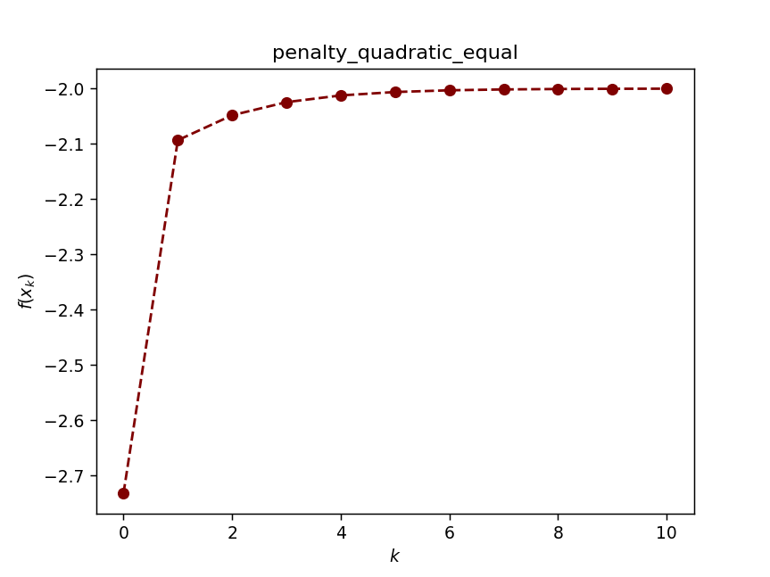

# 罚函数法

`pip install optimtool`来使用优化算法

[optimtool源码](https://github.com/linjing-lab/optimtool)

&emsp;&emsp;本章考虑约束优化问题：

$$
\min f(x), \\ s.t. x \in \chi \\ \tag {1}
$$

这里 $\chi \subset R^n$ 为问题的可行域。 与无约束问题不同，约束优化问题中自变量 $x$ 不能任意取值，这导致许多无约束优化算法不能使用。例如梯度法中沿着负梯度方向下降所得的点未必是可行点，要寻找的最优解处目标函数的梯度也不是零向量。这使得约束优化问题比无约束优化问题要复杂许多。本章将介绍一些罚函数法，它们将约束作为惩罚项加到目标函数中，从而转化为我们熟悉的无约束优化问题求解。此外我们还针对线性规划这一特殊的约束优化问题介绍内点法，它的思想可以被应用到很多一般问题的求解，例如Lasso问题。

```python
# 本章需要的包
%matplotlib widget
import optimtool as oo
import matplotlib.pyplot as plt
import sympy as sp
import numpy as np
```

```python
# 可视化函数：传参接口（颜色列表，函数值列表，标题列表）
def test(colorlist, f_list, title):
    handle = []
    for j, z in zip(colorlist, f_list):
        ln, = plt.plot([i for i in range(len(z))], z, c=j, marker='o', linestyle='dashed')
        handle.append(ln)
    plt.xlabel("$Iteration \ times \ (k)$")
    plt.ylabel("$Objective \ function \ value: \ f(x_k)$")
    plt.legend(handle, title)
    plt.title("Performance Comparison")
    plt.show()
    return None
```

## 1. 等式约束的二次罚函数法

&emsp;&emsp;各种各样的求解无约束优化问题的方法，那么，我们能否将问题 $(1)$ 变形为无约束优化问题来求解呢？为此考虑一种简单的情况，假设问题约束中仅含等式约束，即考虑问题：

$$
\min_x f(x) \\ s.t. c_i(x)=0, i\in \epsilon \\ \tag {1.1}
$$

其中变量 $x \in R^n$ ， $\epsilon$ 为等式约束的指标集， $c_i(x)$ 为连续函数。在某些特殊场合下，可以通过直接求解（非线性）方程组 $c_i(x)=0$ 消去部分变量，将其转化为无约束问题。但对一般的函数 $c_i(x)$ 来说，变量消去这一操作是不可实现的，我们必须采用其他方法来处理这种问题。
&emsp;&emsp;罚函数法的思想是将约束优化问题 $(1.1)$ 转化为无约束优化问题来进行求解。为了保证解的逼近质量，无约束优化问题的目标函数为原约束优化问题的目标函数加上与约束函数有关的惩罚项。对于可行域外的点，惩罚项为正，即对该点进行惩罚。对于可行域外的点，惩罚项为0，即不做任何惩罚。因此，惩罚项会促使无约束优化问题的解落在可行域内。

&emsp;&emsp;对于等于约束问题，惩罚项的选取方式有很多，结构最简单的是二次函数。

&emsp;&emsp;`定义1.1`（等式约束的二次罚函数）对等式约束最优化问题 $(1.1)$ ，定义**二次罚函数**：

$$
P_E(x, \sigma)=f(x)+\dfrac{1}{2} \sigma \sum_{i \in \epsilon} c_i^2(x) \tag {1.2}
$$

其中等式右端第二项称为惩罚项， $\sigma > 0$ 称为罚因子。

&emsp;&emsp;由于这种罚函数对不满足约束的点进行惩罚，在迭代过程中点列一般处于可行域之外，因此它也被称为**外点罚函数**。二次罚函数的特点如下：对于非可行点而言，当 $\sigma$ 变大时，惩罚项在发函数中的权重加大，对罚函数求极小，相当于迫使其极小点向可行域靠近；在可行域中， $P_E(x, \sigma)$ 的全局极小点与约束最优化问题的最优解相同。

> 例1：考虑优化问题：
> 
> $$
> \min x+\sqrt{3}y, \\ s.t. x^2 + y^2 = 1. \\ \tag {1.3}
> $$
> 
> 考虑二次罚函数：
> 
> $$
> P_E(x, y, \sigma)=x+\sqrt{3}y+\dfrac{\sigma}{2}(x^2+y^2-1)^2 \tag {1.4}
> $$

```python
def dataSet1():
    f, x1, x2 = sp.symbols("f x1 x2")
    f = x1 + np.sqrt(3) * x2
    c1 = x1**2 + x2**2 - 1
    funcs = sp.Matrix([f])
    cons = sp.Matrix([c1])
    args = sp.Matrix([x1, x2])
    x_0 = (-1, -1)
    return funcs, args, cons, x_0
```

```python
funcs, args, cons, x_0 = dataSet1()
oo.constrain.equal.penalty_quadratic(funcs, args, cons, x_0)
```



&emsp;&emsp;从上述例子可知，给定罚因子 $\sigma$ ，我们可通过求解 $P_E(x, \sigma)$ 的最小值点作为原问题的近似解，但实际情况并不总是这样，下面这个例子表明，当 $\sigma$ 选取过小时罚函数可能无下界。

> 例2：考虑优化问题：
> 
> $$
> \min -x^2+2y^2, \\ s.t. x=1. \\ \tag {1.5}
> $$
> 
> 通过消去变量容易得知最优解就是$(1,0)^T$，但考虑罚函数：
> 
> $$
> P_E(x,y,\sigma)=-x^2+2y^2+\dfrac{\sigma}{2}(x-1)^2 \tag {1.6}
> $$
> 
> 对任意的 $\sigma \leq 2$ ，该罚函数是无界的。

&emsp;&emsp;出现以上现象的原因是当罚因子过小的，不可行点处的函数下降抵消了罚函数对约束违反的惩罚。实际上所有外点罚函数法均存在这个问题，因此 $\sigma$ 的初值选取不应该`太小`。

`二次罚函数法`:

> 给定 $\sigma_1 > 0$，$x^0$，$k \leftarrow 1$. 罚因子增长系数 $\rho > 1$.
> 
> **while** 未达到收敛准则 **do**
> 
> &emsp;以 $x^k$ 为初始点，求解 $x^{k+1}={\arg\min}_x P_E(x,\sigma_k)$.
> 
> &emsp;选取 $\sigma_{k+1}=\rho \sigma_k$.
> 
> &emsp;$k \leftarrow k + 1$.
> 
> **end while**

&emsp;&emsp;算法的执行过程比较直观：即先选取一系列指数增长的罚因子 $\sigma_k$ ，然后针对每个罚因子求解二次罚函数 $P_E(x,\sigma_k)$ 的最小值点（或局部极小值点）

&emsp;&emsp;算法第三行中 $\arg\min$ 的含义是如下情况之一：

1. $x^{k+1}$ 是罚函数 $P_E(x,\sigma_k)$ 的全局极小解；
2. $x^{k+1}$ 是罚函数 $P_E(x,\sigma_k)$ 的局部极小解；
3. $x^{k+1}$ 不是罚函数 $P_E(x,\sigma_k)$ 的严格的极小解，但近似满足一阶最优性条件 $\nabla_x P_E(x^{k+1}, \sigma_k) \approx 0$

&emsp;&emsp;第一，对参数 $\sigma_k$ 的选取需要非常小心，若 $\sigma_k$ 增长太快，则子问题不易求解。若增长太慢，则算法需要的外迭代数（算法中while循环）会增多。一个比较合理的取法是根据当前 $P_E(x,\sigma_k)$ 的求解难度来确定 $\sigma_k$ 的增幅，若当前子问题收敛很快，可以在下一步选取较大的 $\sigma_{k+1}$ ，否则就不宜过分增大 $\sigma_k$ 。第二， $P_E(x,\sigma)$ 在 $\sigma$ 较小时可能无界，此时迭代就会发散。当求解子问题时，一旦检测到迭代点发散就应该立即终止迭代并增大罚因子。第三，子问题求解的精度必须足够精确，为保证收敛，子问题求解误差需要趋于零。

## 2. 一般约束问题

&emsp;&emsp;仅仅考虑了等式约束优化问题，那么不等式约束的问题应该如何设计二次罚函数呢？不等式约束优化问题有如下形式：

$$
\min f(x), \\ s.t. c_i(x) \leq 0 , i \in I \\ \tag {2.1}
$$

显然，它和等式约束优化问题最大的不同就是允许 $c_i(x) < 0$ 发生，而若采用原来的方式定义罚函数为 $||c(x)||^2$ ，它也会惩罚 $c_i(x) < 0$ 的可行点，这显然不是我们需求的。针对**问题**，我们必须对原有二次罚函数进行改造来得到新的二次罚函数，它应该具有如下特点：仅仅惩罚 $c_i(x) > 0$ 的那些，而对可行点不作惩罚。

&emsp;&emsp;`定义2.1`（不等式约束的二次罚函数）对于不等式约束最优化问题$(2.1)$，定义**二次罚函数**：

$$
P_I(x,\sigma)=f(x)+\frac{\sigma}{2} \sum_{i \in I} \overline{c}_i(x)^2 \tag {2.2}
$$

其中等式右端第二项称为惩罚项，$\overline{c}_i(x)$的定义为：

$$
\overline{c}_i(x)=\max\{c_i(x), 0\} \tag {2.3}
$$

常数 $\sigma > 0$ 称为罚因子。

&emsp;&emsp;注意到函数 $h(t)=(\min\{t, 0\})^2$ 关于 $t$ 是可导的，因此 $P_I(x,\sigma)$ 的梯度也存在，可以使用梯度类算法来求解子问题。然而一般来讲 $P_I(x,\sigma)$ 不是二阶可导的，因此不能直接利用二阶算法（如牛顿法）求解子问题，这也是不等式约束问题二次罚函数的不足之处。

&emsp;&emsp;一般的约束优化问题可能既含等式约束又含不等式约束，它的形式为：

$$
\min f(x), \\ s.t. c_i(x)=0, i \in \epsilon, \\ c_i(x) \leq 0, i \in I \\ \tag {2.4}
$$

&emsp;&emsp;`定义2.2`（一般约束的二次罚函数）对一般约束最优化问题 $(2.4)$ ，定义**二次罚函数**：

$$
P(x,\sigma)=f(x)+\frac{\sigma}{2} [\sum_{i \in \epsilon} c_i(x)^2 + \sum_{i \in I} \overline{c}_i(x)^2] \tag {2.5}
$$

## 3. 其他类型的罚函数法

### 3.1 内点罚函数法

&emsp;&emsp;前面介绍的二次罚函数均属于外点罚函数，即在求解过程中允许自变量 $x$ 位于原问题可行域之外，当罚因子趋于无穷时，子问题最优解序列从可行域外部逼近最优解．自然地，如果我们想要使得子问题最优解序列从可行域内部逼近最优解，则需要构造内点罚函数．顾名思义，内点罚函数在迭代时始终要求自变量 $x$ 不能违反约束，因此它主要用于不等式约束优化问题．

&emsp;&emsp;考虑含不等式约束的优化问题 $(2.1)$ ，为了使得迭代点始终在可行域内，当迭代点趋于可行域边界时，我们需要罚函数趋于正无穷，常用的罚函数是**分式罚函数**，**对数罚函数**等。

&emsp;&emsp;`定义3.1.1`（分式罚函数）对不等式约束最优化问题$(2.1)$，定义**分式罚函数**：

$$
P_I(x,\sigma)=f(x)-\sigma \sum_{i \in I} \dfrac{1}{c_i(x)} \tag {3.1}
$$

&emsp;&emsp;`定义3.1.2`（对数罚函数）对不等式约束最优化问题 $(2.1)$ ，定义**对数罚函数**：

$$
P_I(x,\sigma)=f(x)-\sigma \sum_{i \in I} \ln(-c_i(x)) \tag {3.2}
$$

`对数罚函数法`：

> 给定 $\sigma_0 > 0$，可行解 $x^0$，$k \leftarrow 0$. 罚因子缩小系数 $\rho \in (0,1)$.
> 
> **while** 未达到收敛准则 **do**
> 
> &emsp;以 $x^k$ 为初始点，求解 $x^{k+1}= \arg \min_x P_I(x,\sigma_k)$.
> 
> &emsp;选取 $\sigma_{k+1}=\rho \sigma_k$.
> 
> &emsp;$k \leftarrow k + 1$.
> 
> **end while**

&emsp;&emsp;容易看到， $P_I(x,\sigma)$ 的定义域为 $\{x|c_i(x) < 0\}$ ，因此在迭代过程中自变量$x$严格位于可行域内部．当 $x$ 趋于可行域边界时，由于对数罚函数的特点， $P_I(x,\sigma)$ 会趋于正无穷，这说明对数罚函数的极小值严格位于可行域内部．然而，对原问题 $(2.1)$ ，它的最优解通常位于可行域边界，即 $c_i(x) \leq 0$ 中至少有一个取到等号，此时我们需要调整罚因子 $\sigma$ 使其趋于0，这会减弱对数罚函数在边界附近的惩罚效果。

> 考虑优化问题：
> 
> $$
> \min x^2+2xy+y^2+2x-2y, \\ s.t. x \geq 0, y \geq 0 \\ \tag {3.3}
> $$
> 
> 容易求出该问题的最优解为$x=0$，$y=1$。我们考虑对数罚函数
> 
> $$
> P_I(x,y,\sigma)=x^2+2xy+y^2+2x-2y-\sigma (\ln x+\ln y) \tag {3.4}
> $$
> 
> 对数罚函数$P_I(x,y,\sigma)$的最小值点和原问题最小值点越来越接近，但当$x$和$y$趋于可行域边界时，对数罚函数趋于正无穷。

### 3.2 精确罚函数法

&emsp;&emsp;我们已经介绍了二次罚函数和对数罚函数，它们的一个共同特点就是在求解的时候必须令罚因子趋于正无穷或零，这会带来一定的数值困难．而对于有些罚函数，在问题求解时不需要令罚因子趋于正无穷（或零），这种罚函数称为精确罚函数．换句话说，若罚因子选取适当，对罚函数进行极小化得到的解恰好就原问题的精确解．这个性质在设计算法时非常有用，使用精确罚函数的算法通常会有比较好的性质。

&emsp;&emsp;`定义3.2`（L1罚函数）对一般约束最优化问题，定义L1**罚函数**：

$$
P(x,\sigma)=f(x)+\sigma[\sum_{i \in \epsilon}|c_i(x)|+\sum_{i \in I} \overline{c}_i(x)] \tag {3.5}
$$

其中等式右端第二项称为惩罚项，$\overline{c}_i(x)$ 的定义，常数 $\sigma > 0$ 称为罚因子。

## 4. 不等式约束优化算法性能测试

采用两种方法：

1. 二次罚函数法
2. 分式罚函数法（内点）

测试函数：

$$
f = x_1^2 + (x_2 - 2)^2, \\ s.t. c_1 = 1 - x_1, \\ c_2 = 2 - x_2 \\ \tag {4.1}
$$

```python
def dataSet2():
    f, x1, x2 = sp.symbols("f x1 x2")
    f = x1**2 + (x2 - 2)**2
    c1 = 1 - x1
    c2 = 2 - x2
    funcs = sp.Matrix([f])
    cons = sp.Matrix([c1, c2])
    args = sp.Matrix([x1, x2])
    x_0 = (2, 3)
    return funcs, args, cons, x_0
```

```python
def train1():
    funcs, args, cons, x_0 = dataSet2()
    f_list = []
    title = ["penalty_quadratic", "penalty_interior_fraction"]
    colorlist = ["maroon", "teal"]
    _, _, f = oo.constrain.unequal.penalty_quadratic(funcs, args, cons, x_0, False, True, method="newton", sigma=10, epsilon=1e-6)
    f_list.append(f)
    _, _, f = oo.constrain.unequal.penalty_interior_fraction(funcs, args, cons, x_0, False, True, method="newton")
    f_list.append(f)
    return colorlist, f_list, title
```

```python
colorlist, f_list, title = train1()
# test(colorlist, f_list, title)
```


## 5. 混合等式约束优化算法性能测试

采用两种方法：

1. 二次罚函数法
2. L1罚函数法
3. 增广拉格朗日法(*)

测试函数：

$$
f = (x_1 - 2)^2 + (x_2 - 1)^2, \\ s.t. x_1 - 2x_2=0, \\ 0.25x_1^2 - x_2^2 - 1 \leq 0, \\ \tag {5.1}
$$

```python
def dataSet3():
    f, x1, x2 = sp.symbols("f x1 x2")
    f = (x1 - 2)**2 + (x2 - 1)**2
    c1 = x1 - 2*x2
    c2 = 0.25*x1**2 - x2**2 - 1
    funcs = sp.Matrix([f])
    cons_equal = sp.Matrix([c1])
    cons_unequal = sp.Matrix([c2])
    args = sp.Matrix([x1, x2])
    x_0 = (0.5, 1)
    return funcs, args, cons_equal, cons_unequal, x_0
```

```python
def train2():
    funcs, args, cons_equal, cons_unequal, x_0 = dataSet3()
    f_list = []
    title = ["penalty_quadratic", "penalty_L1", "lagrange_augmented"]
    colorlist = ["maroon", "teal", "orange"]
    _, _, f = oo.constrain.mixequal.penalty_quadratic(funcs, args, cons_equal, cons_unequal, x_0, False, True)
    f_list.append(f)
    _, _, f = oo.constrain.mixequal.penalty_L1(funcs, args, cons_equal, cons_unequal, x_0, False, True)
    f_list.append(f)
    _, _, f = oo.constrain.mixequal.lagrange_augmented(funcs, args, cons_equal, cons_unequal, x_0, False, True)
    f_list.append(f)
    return colorlist, f_list, title
```

```python
colorlist, f_list, title = train2()
test(colorlist, f_list, title)
```


## 参考文献

【1】刘浩洋, 户将, 李勇锋, 文再文. (2021). 最优化：建模、算法与理论. 北京: 高教出版社.

【2】Ruder S. An overview of gradient descent optimization algorithms[J]. arXiv preprint arXiv:1609.04747, 2016.

【3】Nocedal J. Optimization Methods for Large-Scale Machine Learning [J][J]. Siam Review, 2016, 60(2).