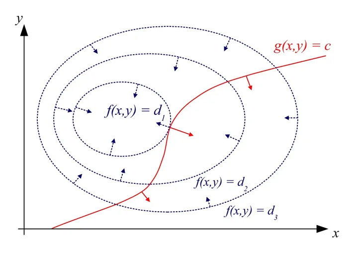

# 拉格朗日函数法
本文目录：
[TOC]

## 1. 带约束优化问题
在实际应用中，我们经常面对的优化问题涉及到一定的约束条件。例如，背包问题要求在不超过背包容量的限制下，使得装入背包的物品价值最大化。这些约束可以是等式约束，也可以是不等式约束，可以通过如下形式的数学表达来表示：


$$
\begin{aligned}
    \min \quad & f(x)\\
    \text{s.t.} \quad & g_i(x) = 0; \quad i=1, \dots, n\\
    & h_j(x) \leq 0; \quad j=1, \dots, m
\end{aligned}
$$

其中，$f(x)$ 是目标函数，$g_i(x)$ 是等式约束条件，$h_j(x)$ 是不等式约束条件。为了解决这种带约束优化的问题，可以采用罚函数、内点法、启发式算法等，但这些算法相对复杂。因此，本文介绍一种常见且易于理解的方法——拉格朗日函数法。

## 2. 拉格朗日函数法
通过引入拉格朗日乘子构建拉格朗日函数，拉格朗日函数法巧妙地**将带约束的优化问题转化为无约束的优化问题**，进而求解。

### 2.1 基本步骤：

1. **建立拉格朗日函数**：
   假设有一个带有约束条件的优化问题：
   $$
   \begin{aligned}
    \min \quad & f(x) \\
    \text{s.t.} \quad & g_i(x) = 0; \quad  i = 1, 2, \ldots, m\\
   \end{aligned}
   $$

   其中，\( f(x) \) 是目标函数，\( g_i(x) \) 是约束条件。首先，引入拉格朗日乘子 \( \lambda_i \) ，定义拉格朗日函数：
   \[
   L(x, \lambda) = f(x) + \sum_{i=1}^{m} \lambda_i g_i(x)
   \]

2. **求解拉格朗日函数的梯度**：
   对拉格朗日函数 \( L(x, \lambda) \) 关于变量 \( x \) 和拉格朗日乘子 \( \lambda \) 求偏导数，并令其为零，得到方程组：
   \[
   \frac{\partial L}{\partial x} = 0, \\
   \quad \frac{\partial L}{\partial \lambda_i} = 0, \quad i = 1, 2, \ldots, m
   \]
   解这个方程组，即可得到最优解 \( x^* \) 和拉格朗日乘子 \( \lambda^* \)。

3. **求解原始问题的最优解**：
   将得到的最优解 \( x^* \) 代入原始问题的目标函数中，即可得到原始问题的最优解。

### 2.2 示例
下面举一个简单的例子来说明拉格朗日法的应用：

假设有一个优化问题：
$$
\begin{aligned}
\min_{x} &\quad x^2 \quad \\
\text{s.t.} &\quad x-2 = 0
\end{aligned}
$$
其中，目标函数 \( f(x) = x^2 \)，约束条件 \( g(x) = x - 2 = 0 \)。

首先，构建拉格朗日函数：
\[
L(x, \lambda) = f(x) + \lambda g(x) = x^2 + \lambda (x - 2)
\]

然后，求解拉格朗日函数的梯度，并令其为零：
$$
\begin{aligned}
\frac{\partial L}{\partial x} &= 2x + \lambda = 0, \\
\frac{\partial L}{\partial \lambda} &= x - 2 = 0
\end{aligned}
$$

解这个方程组，可以得到最优解 \( x^* = 2 \) 和拉格朗日乘子 \( \lambda^* = -4 \)。

最后，将最优解 \( x^* = 2 \) 代入原始问题的目标函数中，得到原始问题的最优解为 \( f(x^*) = 2^2 = 4 \)。

### 2.3 理解
拉格朗日函数法到底在做什么？我们先来看下图：



图中的椭圆虚线为目标函数$f(x,y)$ 的等高线，红色实线为约束条件$g(x,y)=c$。我们可以发现，**当约束曲线$g(x,y)=c$和等高线$f(x,y)=d_1$相切时，目标函数$f(x,y)$取得极值**。两条曲线相切，意味着他们在这点的法线平行，只差一个常数倍（设为$-\lambda$）。

联立方程：

$$
\begin{aligned}
    \nabla f(x,y) &= -\lambda \nabla g \\
    g(x, y) &= c \\
\end{aligned}
$$

代入$2.2$例子：
$$
\begin{aligned}
    2x &= -\lambda \\
    x &= 2 \\
\end{aligned}
$$
求解可知$x^* = 2$。可以发现这个方程组和$2.2$中的求解拉格朗日函数的梯度的方程组是等价的。

因此，拉格朗日法其实就是在**找目标函数与约束条件相切的那个极值点**，同时也是拉格朗日函数的驻点、原始优化问题的解。

### 2.4 优缺点
拉格朗日法**将带约束优化问题转换为一个不带约束的问题**，从而简化了问题的求解，且适用于各种类型的约束条件，包括等式约束和不等式约束。

然而，拉格朗日法得到的解也可能陷入局部最优，而不是全局最优；且随着约束条件的数量增加，拉格朗日函数的导数方程组可能会变得非常复杂，导致计算量增加。

## 3. 增广拉格朗日函数法

增广拉格朗日函数法在拉格朗日函数法的基础上**增加了一个二次惩罚项**，融合了拉格朗日函数法和二次罚函数法的优势。增广拉格朗日函数法可以将约束优化问题转化为一个无约束优化问题，简化了问题的求解；罚项的引入强化了对约束条件的满足，有助于算法**更快地收敛到可行解**。相较于二次罚函数法，增广拉格朗日函数法具有**更小的约束违反度**，求解更为稳定。

### 3.1 等式约束
$$
\begin{aligned}
    min \quad &f(x) \\
    \text{s.t.} \quad & c_i(x) = 0, i \in \mathcal{E} \tag{3.1}
\end{aligned}
$$

增广拉格朗日函数为：

$$
L_\sigma (x, \lambda) = f(x) + \sum\limits_{i\in \mathcal{E}} \lambda_i c_i (x) + \frac{\sigma}{2} \sum\limits_{i\in \mathcal{E}} (c_i (x))^2
$$

式中，$\sigma$ 为罚因子，$\lambda$ 为拉格朗日乘子。求解时可以先固定一项，更新另一项，如此循环迭代。算法步骤为：
- 固定$\lambda$，更新$x$:
  $$
    x^{k+1} = \underset{x}{\text{argmin}} \, L_{\sigma}(x, \lambda^k)
  $$
  即：
  $$
    \nabla_x L_{\sigma_k}(x^{k+1}, \lambda_k) = \nabla f(x^{k+1}) + \sum\limits_{i\in \mathcal{E}} (\lambda_{i}^{k} + \sigma_k c_i (x^{k+1})) \nabla c_i (x^{k+1}) = 0
  $$
  

- 更新$\lambda$：
$$
    \lambda_i^{k+1}=\lambda^k + \sigma_k c_i (x^{k+1})
$$

### 3.2 不等式约束
对于含有不等式约束的一般优化问题：
$$
\begin{aligned}
    min \quad &f(x) \\
    \text{s.t.} \quad & c_i(x) = 0, i \in \mathcal{E}, \\
    & c_i(x) \leq 0, i\in \mathcal{I}  \tag{3.2}
\end{aligned}
$$
可以引入松弛变量将不等式约束转化为等式约束和简单的非负约束：
$$
\begin{aligned}
    min \quad &f(x) \\
    \text{s.t.} \quad & c_i(x) = 0, i \in \mathcal{E}, \\
    & c_i(x) + s_i=  0, i\in \mathcal{I}, \\
    & s_i \geq 0, i\in \mathcal{I}. \tag{3.3}
\end{aligned}
$$
保留非负约束，可以构造拉格朗日函数：
$$
\begin{aligned}
    L(x, s, \lambda, \mu) &= f(x) + \sum\limits_{i\in \mathcal{E}} \lambda_i c_i (x) + \sum\limits_{i\in \mathcal{I}} \mu_i (c_i(x) + s_i), \\
    & s_i \geq 0, i\in \mathcal{I}.
\end{aligned}
$$

记问题$(3,3)$的二次罚函数为$p(x,s)$，则
$$
p(x,s) = \sum\limits_{i\in\mathcal{E}} c^2_i (x) + \sum\limits_{i \in \mathcal{I}} \mu_i (c_i(x) + s_i)^2
$$

于是，增广拉格朗日函数为：
$$
\begin{aligned}
L_\sigma (x, s, \lambda, \mu) &= f(x) + \sum\limits_{i\in \mathcal{E}} \lambda_i c_i (x) + \sum\limits_{i\in \mathcal{I}} \mu_i (c_i(x) + s_i) + \frac{\sigma}{2}p(x,s), \\
& s_i \geq 0, i\in \mathcal{I}
\end{aligned}
$$

其中$\sigma$为罚因子。

于是，我们可以将问题$(3.3)$转换为如下问题：
$$
\begin{aligned}
\underset{x,s}{min} \quad & L_{\sigma_k}(x,s,\lambda^k, \mu^k), \\
\text{s.t.} \quad & s \geq 0
\end{aligned}  \tag{3.4}
$$

需要求解$x^{k+1}, s^{k+1}$。这个求解可以用投影梯度法，也可以先消去$s$，求解只关于$x$的优化问题。首先，固定$x$，关于$s$的子问题可以表示为：

$$
\underset{s\geq 0}{min} \quad \sum\limits_{i\in \mathcal{I}} \mu_i (c_i(x) + s_i) + \frac{\sigma_k}{2} \sum\limits_{i\in \mathcal{I}} (c_i(x) + s_i)^2
$$

对其求导为0计算可知，当且仅当
$$
s_i = max \{- \frac{\mu_i}{\sigma_k}-c_i(x), 0\}, i\in \mathcal{I}
$$

时，$s$为以上问题的一个全局最优解。将$s_i$的表达式代入$L_{\sigma_k}$，有：

$$
\begin{aligned}
L_\sigma (x, \lambda^k, \mu^k) &= f(x) + \sum\limits_{i\in \mathcal{E}} \lambda_i c_i (x) + \frac{\sigma_k}{2}\sum\limits_{i\in \mathcal{E}}c^2_i (x) +  \\
& \frac{\sigma_k}{2} \sum\limits_{i\in \mathcal{I}} (max\{\frac{\mu_i}{\sigma_k}+ c_i(x), 0\}^2 - \frac{\mu^2_i}{\sigma^2_k})
\end{aligned}
$$

于是，问题$(3.4)$ 等价于

$$
\underset{x\in \mathbb{R^n}}{min} \quad L_{\sigma_k}(x, \lambda^k, \mu^k)
$$

这样我们就消去了变量$s$，可以在低维空间$\mathbb{R^n}$中求解极小点。

问题$(3.3)$的KKT条件为：

$$
\begin{aligned}
0 &= \nabla f(x^*) + \sum\limits_{i\in \mathcal{E}}\lambda^*_i \nabla c_i(x^*) + \sum\limits_{i\in \mathcal{I}} \mu_i^* \nabla c_i (x^*), \\
\mu^*_i & \geq 0, i\in \mathcal{I}, \\
s^*_i & \geq 0, i\in \mathcal{I}.
\end{aligned}
$$

问题$(3.4)$的KKT条件为：

$$
\begin{aligned}
0 = & \nabla f(x^{k+1}) + \sum\limits_{i\in \mathcal{E}} (\lambda^k_i + \sigma_k c_i (x^{k+1})) \nabla c_i (x^{k+1}) + \\ 
& \sum\limits_{i\in \mathcal{I}} (\mu_i^k + \sigma_k (c_i (x^{k+1}) + s_i^{k+1})) \nabla c_i (x^{k+1}), \\
s_i^{k+1} = & max \{ -\frac{\mu_i^k}{\sigma_k} - c_i (x^{k+1}), 0\}, i\in \mathcal{I}.
\end{aligned}
$$

对比两个问题的KKT条件，易知乘子的更新形式为：
$$
\begin{aligned}
\lambda_i^{k+1} &= \lambda_i^k + \sigma_k c_i (x^{k+1}), &i\in \mathcal{E}, \\
\mu_i^{k+1} &= max\{\mu_i^k + \sigma_k c_i(x^{k+1}), 0\}, &i\in \mathcal{I}.
\end{aligned}
$$

### 3.3 代码示例
以$2.2$节的示例为例：

$$
\begin{aligned}
\min_{x} &\quad x^2 \quad \\
\text{s.t.} &\quad x-2 = 0
\end{aligned}
$$

构建增广拉格朗日函数：

$$
\begin{aligned}
L(x, \lambda) &= f(x) + \lambda g(x) + \frac{\sigma}{2} g^2(x) \\
&= x^2 + \lambda (x - 2) + \frac{\sigma}{2} (x-2)^2
\end{aligned}
$$

编写代码求解：

```python
import numpy as np
from scipy.optimize import minimize

# 目标函数
def objective(x):
    return x**2

# 约束函数
def constraint(x):
    return x - 1

# 增广拉格朗日函数
def augmented_lagrangian(x, lambda_, sigma):
    return objective(x) + lambda_ * constraint(x) + (sigma / 2) * constraint(x)**2

# 带约束优化问题求解
def solve_constrained_optimization():
    # 初始化参数
    x0 = np.array([0.0])  # 初始点
    lambda_ = 0.0  # 初始拉格朗日乘子
    sigma = 1.0  # 初始惩罚参数

    # 定义优化问题
    def objective_with_constraints(x):
        return augmented_lagrangian(x, lambda_, sigma)

    # 求解优化问题
    result = minimize(objective_with_constraints, x0, constraints={'type': 'ineq', 'fun': constraint})
    return result

# 求解并输出结果
result = solve_constrained_optimization()
print("最优解 x:", result.x)
print("目标函数值:", result.fun)
```

运行结果：
```
最优解 x: [1.]
目标函数值: 1.0
```


## 4. 参考资料
[1] [【知乎】如何理解拉格朗日乘子法？](https://www.zhihu.com/question/38586401) 
[2] [刘浩洋, 户将, 李勇锋, 文再文. (2021). 最优化：建模、算法与理论. 北京: 高教出版社](https://bicmr.pku.edu.cn/~wenzw/optbook/opt1.pdf)
