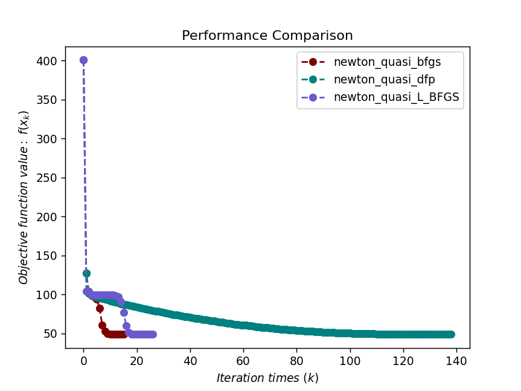
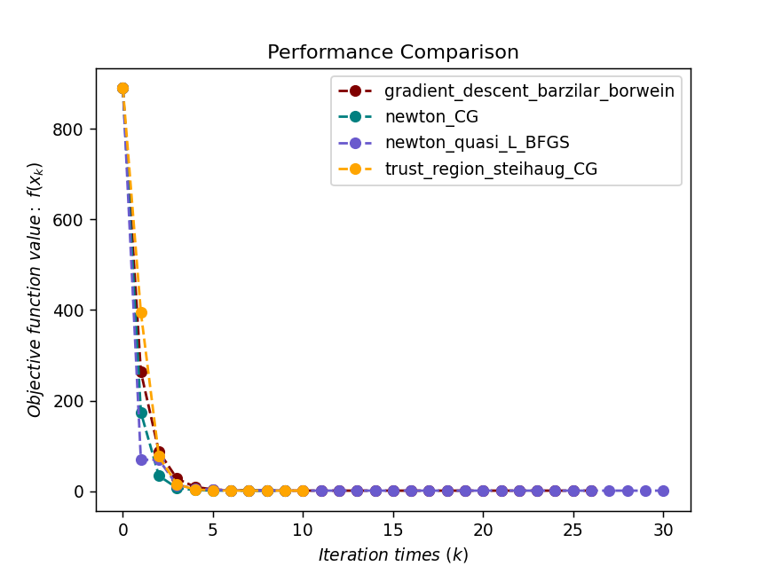

# 拟牛顿法

`pip install optimtool`来使用优化算法

[optimtool源码](https://github.com/linjing-lab/optimtool)

```python
# 导包
import sympy as sp
import matplotlib.pyplot as plt
import optimtool as oo
```

```python
# 可视化函数：传参接口（颜色列表，函数值列表，标题列表）
def test(colorlist, f_list, title):
    handle = []
    for j, z in zip(colorlist, f_list):
        ln, = plt.plot([i for i in range(len(z))], z, c=j, marker='o', linestyle='dashed')
        handle.append(ln)
    plt.xlabel("$Iteration \ times \ (k)$")
    plt.ylabel("$Objective \ function \ value: \ f(x_k)$")
    plt.legend(handle, title)
    plt.title("Performance Comparison")
    plt.show()
    return None
```

## 1. 牛顿法

&emsp;&emsp;牛顿法在理论上和实践中均中均取得很好的效果。对于二次连续可微函数 $f(x)$ ，考虑 $f(x)$ 在迭代点 $x^k$ 处的二阶泰勒展开：

$$
f(x^k+d^k)=f(x^k)+\nabla f(x^k)^T d^k + \dfrac{1}{2}(d^k)^T \nabla^2 f(x^k)d^k + o(||d^k||^2) \tag {1.1}
$$

我们的目的是根据这个二阶近似来选取合适的下降方向 $d^k$ 。如果忽略上式中的高阶项，并将等式右边看成关于 $d^k$ 的函数求其稳定点，可以得到：

$$
\nabla^2 f(x^k)d^k = -\nabla f(x^k) \tag {1.2}
$$

该方程也被称为**牛顿方程**，容易得出当 $\nabla^2 f(x^k)$ 非奇异时，更新方向为 $d^k=-\nabla f^2(x^k)^{-1} \nabla f(x^k)$ 。 一般称满足该方程的 $d^k$ 为牛顿方向。 因此经典牛顿法的更新格式为：

$$
x^{k+1}=x^k-\nabla^2 f(x^k)^{-1} \nabla f(x^k) \tag {1.3}
$$

步长 $\alpha_k$ 恒为1，即可以不额外考虑步长的选取。我们也称步长为1的牛顿法为经典牛顿法。

牛顿法测试函数：

$$
f(x) = (1-x_1)^2 + (x_2-x_1^2)^2, x_0=[2, 2]
$$

```python
def dataSet1():
    f = sp.symbols("f")
    x1, x2 = sp.symbols("x1 x2")
    f = (1 - x1)**2 + (x2 - x1**2)**2
    funcs = sp.Matrix([f])
    args = sp.Matrix([x1, x2])
    x_0 = (2, 2)
    return funcs, args, x_0
```

&emsp;&emsp;修正牛顿法主要修正了牛顿方程中的海瑟矩阵 $\nabla^2 f(x^k)$ ，使其变成正定矩阵；同时引入线搜索以改善算法稳定性。

&emsp;&emsp;在经典牛顿法中，计算牛顿方向$d^k$依赖于求解线性方程组。当 $n$ 较大但 $\nabla^2 f(x^k)$ 有稀疏结构时，需要通过迭代法来求解牛顿方程。以下是非精确牛顿法的函数程序。

```python
def train1():
    funcs, args, x_0 = dataSet1()
    f_list = []
    title = ["newton_classic", "newton_modified", "newton_CG"]
    colorlist = ["maroon", "teal", "slateblue"]
    _, _, f = oo.unconstrain.newton.classic(funcs, args, x_0, False, True)
    f_list.append(f)
    _, _, f = oo.unconstrain.newton.modified(funcs, args, x_0, False, True)
    f_list.append(f)
    _, _, f = oo.unconstrain.newton.CG(funcs, args, x_0, False, True)
    f_list.append(f)
    return colorlist, f_list, title
```

```python
colorlist, f_list, title = train1()
test(colorlist, f_list, title)
```


&emsp;&emsp;然而对于大规模问题，函数的海瑟矩阵计算代价大或者难以得到，即使得到海瑟矩阵我们还需要求解一个大规模线性方程组，那么能否使用海瑟矩阵或其逆矩阵的近似来进行牛顿迭代呢？拟牛顿法便是这样的算法，它能够在每一步以较小的计算代价生成近似矩阵，并且使用近似矩阵代替海瑟矩阵而产生的迭代序列仍具有超线性收敛的性质．

&emsp;&emsp;拟牛顿方法不计算海瑟矩阵 $\nabla^2 f(x)$ ，而是构造其近似矩阵 $B^k$ 或其逆的近似矩阵 $H^k$ 。我们希望 $B^k$ 或 $H^k$ 仍然保留海瑟矩阵的部分性质。例如使得 $d^k$ 仍然为下降方向。那么拟牛顿矩阵应该满足一些性质？如何构造它们呢？

## 2. 割线方程

&emsp;&emsp;设 $f(x)$ 是二次连续可微函数，根据泰勒展开，向量值函数 $\nabla f(x)$ 在 $x^{k+1}$ 处的近似为：

$$
\nabla f(x)=\nabla f(x^{k+1}) + \nabla^2 f(x^{k+1})(x - x^{k+1}) + O(||x-x^{k+1}||^2) \tag {2.1}
$$

令 $x=x^k$ ，$s^k=x^{k+1}-x^k$ 及 $y^k=\nabla f(x^{k+1})-\nabla f(x^k)$ ，得到：

$$
\nabla^2 f(x^{k+1})s^k+O(||s^k||^2)=y^k \tag {2.2}
$$

忽略高阶项 $||s^k||^2||$ ，我们希望海瑟矩阵 $\nabla^2 f(x^{k+1})$ 的近似矩阵 $B^{k+1}$ 满足方程：

$$
y^k = B^{k+1} s^k \tag {2.3}
$$

或者其逆的近似矩阵 $H^{k+1}$ 满足方程：

$$
s^k=H^{k+1} y^k \tag {2.4}
$$

并称上述 $(2.3)$ 与 $(2.4)$ 两式为**割线方程**。

&emsp;&emsp;注意到近似矩阵 $B^k$ 的正定性是一个很关键的因素，在 $(2.4)$ 式两边同时左乘 $(s^k)^T$ 可得 $(s^k)^T B^{k+1} s^k=(s^k)^T y^k$ ，因此条件：

$$
(s^k)^T y^k > 0 \tag {2.5}
$$

为 $B^{k+1}$ 正定的一个必要条件。我们额外要求条件 $(5)$ 在迭代过程中始终满足，这个条件也称为**曲率条件**。对于一般的目标函数 $f(x)$ ，需要使用Wolfe准则线搜索来保证曲率条件 $(2.5)$ 成立。实际上，根据Wolfe条件有 $\nabla f(x^{k+1})^T s^k \geqslant c_2 \nabla f(x^k)^T s^k$ ，两边同时减去 $\nabla f(x^k)^T s^k$ ，

$$
(y^k)^T s^k \geqslant (c_2 - 1)\nabla f(x^k)^T s^k > 0 \tag {2.6}
$$

这是因为 $c_2 < 1$ 以及 $s^k=\alpha_k d^k$ 是下降方向。仅仅使用Armijo准则不能保证曲率条件成立。

&emsp;&emsp;在通常情况下，近似矩阵 $B^{k+1}$ 或 $H^{k+1}$ 是由上一步迭代加上一个修正得到的，并且要求满足割线方程 $(2.3)$ 。如下是拟牛顿法的框架：

> 给定 $x^0 \in R^n$，初始矩阵 $B^0 \in R^{n \times n}$（或 $H^0$），令 $k=0$.
> 
> **while**未达到停机准则**do**
> 
> &emsp;计算方向 $d^k=-(B^k)^{-1} \nabla f(x^k)$ 或 $d^k=-H^k \nabla f(x^k)$.
> 
> &emsp;通过线搜索找到合适的步长 $\alpha^k > 0$，令 $x^{k+1}=x^k+\alpha_kd^k$。
> 
> &emsp;更新海瑟矩阵的近似矩阵 $B^{k+1}$ 或其逆矩阵的近似 $H^{k+1}$.
> 
> &emsp;$k \leftarrow k + 1$
> 
> **end while**

## 3. 拟牛顿矩阵的更新方式

### 3.1 秩一更新（SR1）

  秩一更新（SR1）公式是结构最简单的拟牛顿矩阵更新公式。设 B^k 是第 k 步的近似海瑟矩阵，我们通过对 B^k 进行秩一修正得到 B^{k+1} ，使其满足割线方程 (2.3) 。为此使用待定系数法求出修正矩阵，并设：$$

B^{k+1}=B^k + auu^T \tag {3.1.1}
$$

其中 $u \in R^n$ ，$a \in R$ 待定。根据割线方程 $(2.3)$ ，有：

$$
B^{k+1} s^k=(B^k + auu^T)s^k=y^k \tag {3.1.2}
$$

进而得到: 

$$
(a \cdot u^T s^k)u=y^k - B^k s^k \tag {3.1.3}
$$

注意到 $a \cdot u^T s^k$ 是一个标量，因此 $u$ 和 $y^k-B^k s^k$ 方向相同。不妨令 $u=y^k-B^ks^k$ ，代入原方程可知: 

$$
a((y^k-B^ks^k)^T s^k)(y^k - B^ks^k) = y^k - B^k s^k \tag {3.1.4}
$$

如果假设 $(y^k-B^ks^k)^Ts^k \not= 0$ , 可以得到 $a=\dfrac{1}{(y^k-B^ks^k)^Ts^k}$ ，最终得到更新公式为：

$$
B^{k+1}=B^k+\dfrac{(y^k-B^ks^k)(y^k-B^ks^k)^T}{(y^k-B^ks^k)^Ts^k)} \tag {3.1.5}
$$

我们称 $(3.1.5)$ 式为基于 $B^k$ 的 $SR1$ 公式。由完全一样的过程我们我们可以根据割线方程 $(2.4)$ 得到基于 $H^k$ 的SR1公式：

$$
H^{k+1}=H^k + \dfrac{(s^k-H^ky^k)(s^k-H^ky^k)^T}{(s^k-H^ky^k)^Ty^k} \tag {3.1.6}
$$

SR1公式虽然结构简单，但是有一个重大缺陷：它不能在迭代过程中保持正定。容易验证 $(y^k-B^ks^k)^Ts^k) > 0$ 是 $B^{k+1}$ 正定的一个充分条件，但这个条件在迭代过程中未必得到满足。 因此optimtool包中并未录入SR1更新海瑟矩阵的算法。

### 3.2 BFGS公式

&emsp;&emsp;为了克服SR1公式的缺陷，现在考虑对 $B^k$ 的秩二更新。同样地，采用待定系数法来推导此公式。设

$$
B^{k+1}=B^k=auu^T+bvv^T \tag {3.2.1}
$$

其中$u,v \in R^n$，$a,b \in R$待定。根据割线方程$(2.3)$，

$$
B^{k+1}s^k=(B^k+auu^T+bvv^T)s^k = y^k \tag {3.2.2}
$$

整理可得

$$
(a \cdot u^Ts^k)u + (b \cdot v^Ts^k)v = y^k - B^ks^k \tag {3.2.3}
$$

我们通过选取$u$和$v$让以上等式成立即可。实际上，$u$，$v$有非常多的取法，一种最直接的取法是让上面等式左右两边的两项分别对应相等，即：

$$
u=y^k, a \cdot u^T s^k=1, \\ v = B^ks^k, b \cdot v^Ts^k = -1 \tag {3.2.4}
$$

因此得到更新方式: 

$$
B^{k+1}=B^k+\dfrac{y^k(y^k)^T}{(s^k)^Ty^k} - \dfrac{B^ks^k(B^ks^k)^T}{(s^k)^TB^ks^k} \tag {3.2.5}
$$

格式 $(3.2.5)$ 被称为基于 $B^k$ 的BFGS公式，它是由Broyden，Fletcher，Gold-farb，Shannon四人名字的首字母组成。

&emsp;&emsp;假设 $H^k=(B^k)^{-1}$ ，可立即推出基于 $H^k$ 的BFGS公式：

$$
H^{k+1}=(I-\rho_k y^k(s^k)^T)^T H^k (I-\rho_k y^k (s^k)^T) + \rho_ks^k(s^k)^T \tag {3.2.6}
$$

其中 $\rho_k=\dfrac{1}{(s^k)^Ty^k}$ 。容易看出，若要BFGS公式更新产生的矩阵 $H^{k+1}$ 正定，一个充分条件是不等式 $(2.5)$ 成立且上一步更新矩阵 $H^k$ 正定。在问题求解过程中，条件 $(2.5)$ 不一定会得到满足，此时应该使用Wolfe准则的线搜索来迫使条件 $(2.5)$ 成立。

&emsp;&emsp;BFGS格式 $(3.2.6)$ 还有更深刻的含义，它其实满足了某种逼近的最优性，具体来说，由 $(3.2.6)$ 式定义的 $H^{k+1}$ 恰好是如下优化问题的解：

$$
\min_H ||H-H^k||_W, \\ s.t. H=H^T, \\ Hy^k=s^k \tag {3.2.7}
$$

这个优化问题的含义是在满足割线方程 $(2.4)$ 的对称矩阵中找到离 $H^k$ 最近的矩阵 $H$ ，这里 $||\cdot||_W$ 是加权范数，定义为

$$
||H||_W=||W^{1/2} HW^{1/2}||_F \tag {3.2.8}
$$

其中 $W$ 可以是任意满足割线方程 $Ws^k=y^k$ 的矩阵。

&emsp;&emsp;BFGS公式是目前最有效的拟牛顿更新格式之一，它有比较好的理论性质，实现起来也并不复杂。对格式 $(3.2.6)$ 进行改动可得到有限内存BFGS格式(L_BFGS)，它是常用的处理大规模优化问题的拟牛顿类算法。

### 3.3 DFP公式

&emsp;&emsp;在BFGS公式的推导中，如果利用割线方程 $(2.4)$ 对 $H^k$ 推导秩二修正的拟牛顿修正，我们将得到基于 $H^k$ 的拟牛顿矩阵更新

$$
H^{k+1}=H^k - \dfrac{H^ky^k(H^ky^k)^T}{(y^k)^TH^ky^k} + \dfrac{s^k(s^k)^T}{(y^k)^Ts^k} \tag {3.3.1}
$$

这种迭代格式首先由Davidon发现，此后由Fletcher以及Powell进一步发展，因此称为DFP公式。可得关于 $B^k$ 的更新格式

$$
B^{k+1}=(I-\rho_ks^k(y^k)^T)^TB^k(I-\rho_ks^k(y^k)^T)+\rho_ky^k(y^k)^T \tag {3.2.2}
$$

其中 $\rho_k$ 的定义同 $(3.2.6)$ 式。

&emsp;&emsp;可以看成，DFP公式 $(3.3.1)(3.3.2)$ 和BFGS公式 $(3.2.5)(3.2.6)$ 分别呈对偶关系，将BFGS格式 $(3.2.6)$ 中的 $H^k$ 换成 $B^k$ ，$s^k$ 与 $y^k$ 对换便得到了DFP格式 $(3.2.2)$ 。不仅如此，在逼近性上也有这样的对偶现象。实际上，由 $(3.2.2)$ 式定义的 $B^{k+1}$ 是如此优化问题的解：

$$
\min_B ||B-B^k||_W, \\ s.t. B=B^T, \\ Bs^k=y^k \tag {3.2.3}
$$

其中 $||\cdot||_W$ 的含义和问题 $(3.2.7)$ 中的基本相同，但是W为任意满足 $Wy^k=s^k$ 的矩阵。和BFGS格式类似，DFP格式要求 $B^{k+1}$ 为满足割线方程 $(2.3)$ 的对称矩阵中离 $B^k$ 最近的矩阵，它也暗含某种最优性。、

> 这里不讨论拟牛顿法的全局收敛性

### 3.4 有限内存BFGS方法

&emsp;&emsp;拟牛顿法虽然克服了计算海瑟矩阵的困难，但是它仍然无法应用在大规模优化问题上。一般来说，拟牛顿法矩阵 $B^k$ 或 $H^k$ 是稠密矩阵，而存储稠密矩阵要消耗 $O(n^2)$ 的内存，者对于大规模问题显然是不可能实现的。而有限内存BFGS方法(L_BFGS)解决了这一存储问题，从而使得人们在大规模问题上也可以应用拟牛顿类方法加速迭代的收敛。

&emsp;&emsp;L_BFGS方法是根据BFGS公式 $(3.2.5)(3.2.6)$ 变形而来的。为了推导方便，我们以 $H^k$ 的更新公式 $(3.2.6)$ 为基础来推导相应的L_BFGS公式。首先引入新的记号重写 $(3.2.6)$ 式：

$$
H^{k+1}=(V^k)^TH^kV^k + \rho_ks^k(s^k)^T
$$

其中

$$
\rho_k=\dfrac{1}{(y^k)^Ts^k}, V^k=I-\rho_ky^k(s^k)^T \tag {3.4.2}
$$

观察到$(3.4.1)$式有类似递推的性质，为此我们可将$(3.4.1)$式递归地展开$m$次，其中$m$是一个给定的整数：

$$
\begin{aligned}
H^k&=\nabla (V^{k-m}...V^{k-1})^TH^{k-m}(V^{k-m}...V^{k-1})+ \\
&\rho_{k-m}(V^{k-m+1}...V^{k-1})+ \\
&\rho_{k-m+1}(V^{k-m+2}...V^{k-1})^Ts^{k-m+1}(s^{k-m+1})^T(V^{k-m+2}...V^{k-1})+ \\
&...+\rho_{k-1}s^{k-1}(s^{k-1})^T 
\end{aligned} \tag {3.4.5}
$$

为了达到节省内存的目的，$(3.4.1)$ 式不能无限展开下去，但这会产生一个问题：$H^{k-m}$ 还是无法显示求出。一个很自然的想法就是用 $H^{k-m}$ 的近似矩阵来代替 $H^{k-m}$ 进行计算，近似矩阵的选取方式非常多，但基本原则是要保证近似矩阵具有非常简单的结构。假定我们给定了 $H^{k-m}$ 的一个近似矩阵 $\hat{H}^{k-m}$ ， $(3.4.3)$ 式便可以用于计算拟牛顿迭代。

&emsp;&emsp;在拟牛顿迭代中，实际上并不需要计算 $H^k$ 的显示形式，只需要利用 $H^k\nabla f(x^k)$ 来计算迭代方向 $d^k$ 。为此先直接给出一个利用展开式 $(3.4.3)$ 直接求解 $H^k\nabla f(x^k)$ 的算法。

`双循环递归算法`：

> 初始化 $q \leftarrow \nabla f(x^k)$
> 
> **for** $i = k - 1, k - 2, ..., k - m$ **do**
> 
> &emsp;计算并保存 $\alpha_i \leftarrow \rho_i(s^i)^Tq$.
> 
> &emsp;更新 $q \leftarrow q - \alpha_iy^i$.
> 
> **end for**
> 
> 初始化 $r \leftarrow \hat{H}^{k-m}q$，其中 $\hat{H}^{k-m}$ 是 $H^{k-m}$ 的近似矩阵.
> 
> **for** $i = k-m, k-m+1, ..., k-1$ **do**
> 
> &emsp;计算$\beta \leftarrow \rho_i(y^i)^Tr$.
> 
> &emsp;更新 $r \leftarrow r + (\alpha_i - \beta)s^i$.
> 
> **end for**
> 
> 输出 $r$，即 $H^k \nabla f(x^k)$.

&emsp;&emsp;该算法充分应用了 $(3.4.3)$ 式的结构来尽量节省计算 $H^k\nabla f(x^k)$ 的开销。由于其主体结构包含了方向相反的两个循环，因此它也称为**双循环递归算法**。

&emsp;&emsp;我们现在给出算法的一个比较直观的执行过程。在 $(3.4.3)$ 式中，等式左右两边同时右乘 $\nabla f(x^k)$ ，若只观察等式右侧，则需要计算

$$
V^{k-1} \nabla f(x^k), V^{k-2}V^{k-1}\nabla f(x^k),...,V^{k-m}...V^{k-2}V^{k-1} \nabla f(x^k) \tag {3.4.4}
$$

这些结果可以递推地进行，无需重复计算。另一个比较重要的观察是，在计算 $V^{k-l}...V^{k-1}\nabla f(x^k)$ 的过程中恰好同时计算了上一步的 $\rho_{k-l}(s^{k-l})^T[V^{k-l+1}...V^{k-1}\nabla f(x^k)]$ ，这是一个标量，对应着算法的 $\alpha_i$ 。因此执行完第一个循环后，我们得到了 $\alpha_i, q$ ，公式 $(3.4.3)$ 变成了如下形式：

$$
\begin{aligned}
H^k \nabla f(x^k)&=(V^{k-m}...V^{k-1})^T H^{k-m}q+ \\
&(V^{k-m+1}...V^{k-1})^Ts^{k-m}\alpha_{k-m}+ \\
&(V^{k-m+2}...V^{k-1})^Ts^{k-m+1}\alpha_{k-m+1}+...+s^{k-1}\alpha_{k-1}. 
\end{aligned} \tag {3.4.5}
$$

公式 $(3.4.5)$ 已经简化了不少，接下来算法的第二个循环就是自上而下合并每一项，以合并前两项为例，它们有公共的因子 $(V^{k-m+1}...V^{k-1})^T$ ，提取出来之后前两项的和可以写为

$$
\begin{aligned}
&(V^{k-m+1}...V^{k-1})^T((V^{k-m+1})^Tr+\alpha_{k-m}s^{k-m})\\
&=(V^{k-m+1}...V^{k-1})^T(r+(\alpha_{k-m}-\beta)s^{k-m}).
\end{aligned}  \tag {3.4.6}
$$

这正是第二个循环的迭代格式。注意合并后 $(3.4.5)$ 式的结果仍不变，因此可递归地计算下去，最后变量 $r$ 就是我们期望的结果 $H^k \nabla f(x^k)$。

&emsp;&emsp;双循环算法需要 $4mn$ 次乘法运算与 $2mn$ 次加法运算，若近似矩阵 $\hat{H}^{k-m}$ 是对角矩阵，则额外需要 $n$ 次乘法运算。由于 $m$ 不会很大，因此该算法的时间复杂度是 $O(mn)$ 。算法所需要的额外存储为临时变量 $\alpha_i$ ，它的大小是 $O(m)$ 。综上所述，L_BFGS是双循环算法是非常高效的。

&emsp;&emsp;近似矩阵$\hat{H}^{k-m}$的取法可以是对角矩阵$\hat{H}^{k-m}=\gamma_k I$，其中

$$
\gamma_k = \dfrac{(s^{k-1})^T y^{k-1}}{(y^{k-1})^Ty^{k-1}} \tag {3.4.7}
$$

注意，这恰好是非单调（BB）方法的第一个步长。

&emsp;&emsp;至此我们基本介绍了L_BFGS方法的迭代格式，下面我们从另一个角度出发来重新理解这个格式，进而可以直接给出L_BFGS格式下拟牛顿矩阵的形式。我们引入新的记号：

$$
S^k=[s^0,s^1, ...,s^{k-1}], Y^k=[y^0, y^1, ...,y^{k-1}] \tag {3.4.8}
$$

`L_BFGS方法`:

> 选择初始点 $x^0$， 参数 $m > 0$，$k \leftarrow 0$.
> 
> **while**未达到收敛准则**do**
> 
> &emsp;选取近似矩阵 $\hat{H}^{k-m}$.
> 
> &emsp;使用双循环递归算法计算下降方向 $d^k=-H^k \nabla f(x^k)$.
> 
> &emsp;使用线搜索算法计算满足 Wolfe 准则的步长 $\alpha_k$.
> 
> &emsp;更新 $x^{k+1}=x^k + \alpha_k d^k$.
> 
> &emsp;**if** $k > m$ **then**
> 
> &emsp;&emsp;从内存空间中删除 $s^{k-m}$，$y^{k-m}$.
> 
> &emsp;**end if**
> 
> &emsp;计算并保存 $s^k=x^{k+1}-x^k$，$y^k=\nabla f(x^{k+1})-\nabla f(x^k)$.
> 
> &emsp;$k \leftarrow k + 1$
> 
> **end while**

引入矩阵记号的目的是使得BFGS格式有更紧凑的表达形式。

&emsp;&emsp;正因为L_BFGS方法的出现，人们可以使用拟牛顿类算法求解优化问题。虽然有关L_BFGS方法的收敛性质依然有限，但在实际应用中L_BFGS方法很快成为了应用最广泛的拟牛顿算法，比较有趣的是，尽管DFP公式和BFGS公式呈对偶关系，但极少有人研究有限内存的DFP格式，这也使得BFGS格式在地位上比DFP格式略胜一筹。

## 4. 拟牛顿法性能对比

拟牛顿法测试函数：

$$
f(x)=\sum_{i=1}^{n/2}[(-13+x_{2i-1}+((5-x_{2i})x_{2i}-2)x_{2i})^2+(-29+x_{2i-1}+((x_{2i}+1)x_{2i}-14)x_{2i})^2]
$$

初始点：$x_0=(0.5, -2, 0.5, -2, ...., 0.5, -2)^T$​，$x^{*}=(5,4,5,4,...,5,4)^T$​，$f_{opt}=0$​

```python
def dataSet2():
    f, x1, x2 = sp.symbols("f x1 x2")
    f = (-13 + x1 + ((5 - x2)*x2 - 2)*x2)**2 + (-29 + x1 + ((1 + x2)*x2 - 14)*x2)**2
    funcs = sp.Matrix([f])
    args = sp.Matrix([x1, x2])
    x_0 = (0.5, -2)
    return funcs, args, x_0
```

```python
def train2():
    funcs, args, x_0 = dataSet2()
    f_list = []
    title = ["newton_quasi_bfgs", "newton_quasi_dfp", "newton_quasi_L_BFGS"]
    colorlist = ["maroon", "teal", "slateblue"]
    _, _, f = oo.unconstrain.newton_quasi.bfgs(funcs, args, x_0, False, True)
    f_list.append(f)
    _, _, f = oo.unconstrain.newton_quasi.dfp(funcs, args, x_0, False, True)
    f_list.append(f)
    _, _, f = oo.unconstrain.newton_quasi.L_BFGS(funcs, args, x_0, False, True)
    f_list.append(f)
    return colorlist, f_list, title
```

```python
colorlist, f_list, title = train2()
test(colorlist, f_list, title)
```



## 5. 无约束优化算法性能对比

无约束优化领域比较高效的几种算法：

1. Barzilar Borwein-梯度下降法
2. 牛顿共轭梯度法-非精确牛顿法
3. 有限内存BFGS方法
4. 截断共轭梯度法-信赖域方法

无约束优化测试函数：

$$
f(x)=\sum_{i=1}^{n-1}(x_i-1)^2+(\sum_{i=1}^{n}x_j^2-0.25)^2
$$

初始点：$x_0=(1,2, ...,n)^T$​，$f_{opt}=0$​

```python
def dataSet3():
    f, x1, x2, x3, x4 = sp.symbols("f x1 x2 x3 x4")
    f = (x1 - 1)**2 + (x2 - 1)**2 + (x3 - 1)**2 + (x1**2 + x2**2 + x3**2 + x4**2 - 0.25)**2
    funcs = sp.Matrix([f])
    args = sp.Matrix([x1, x2, x3, x4])
    x_0 = (1, 2, 3, 4)
    return funcs, args, x_0
```

```python
def train3():
    funcs, args, x_0 = dataSet3()
    f_list = []
    title = ["gradient_descent_barzilar_borwein", "newton_CG", "newton_quasi_L_BFGS", "trust_region_steihaug_CG"]
    colorlist = ["maroon", "teal", "slateblue", "orange"]
    _, _, f = oo.unconstrain.gradient_descent.barzilar_borwein(funcs, args, x_0, False, True)
    f_list.append(f)
    _, _, f = oo.unconstrain.newton.CG(funcs, args, x_0, False, True)
    f_list.append(f)
    _, _, f = oo.unconstrain.newton_quasi.L_BFGS(funcs, args, x_0, False, True)
    f_list.append(f)
    _, _, f = oo.unconstrain.trust_region.steihaug_CG(funcs, args, x_0, False, True)
    f_list.append(f)
    return colorlist, f_list, title
```

```python
colorlist, f_list, title = train3()
test(colorlist, f_list, title)
```



## 参考文献

【1】刘浩洋, 户将, 李勇锋, 文再文. (2021). 最优化：建模、算法与理论. 北京: 高教出版社. 

【2】Ruder S. An overview of gradient descent optimization algorithms[J]. arXiv preprint arXiv:1609.04747, 2016.

【3】Nocedal J. Optimization Methods for Large-Scale Machine Learning [J][J]. Siam Review, 2016, 60(2).