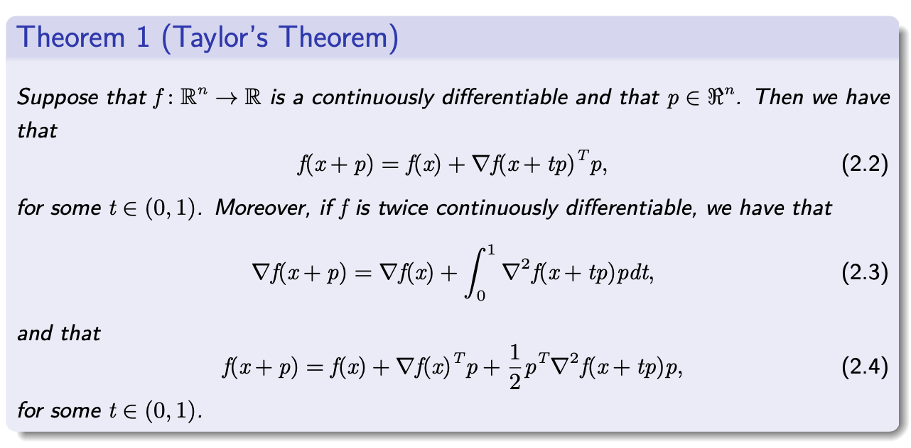
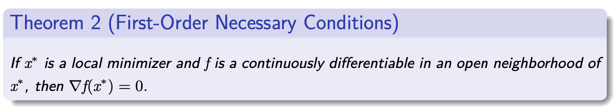

# 无约束优化

## 基础知识

1. 向量和矩阵

- A vector $x \in \mathbb{R}^{n}: x=\left(x_{1}, \ldots, x_{n}\right)^{T}$
- Inner product: given $x, y \in \mathbb{R}^{n}, x^{T} y=\sum_{i=1}^{n} x_{i} y_{i}$
- A matrix $A \in \mathbb{R}^{m \times n}$
- $A \in \mathbb{R}^{n \times n}$ is positive semidefinite, if $x^{T} A x \geq 0$ for any $x \in \mathbb{R}^{n}$
- $Q \in \mathbb{R}^{n \times n}$ is orthogonal, if $Q^{T} Q=Q Q^{T}=I$.
- Eigenvalue $\lambda$, eigenvector $x: A x=\lambda x$

2. 向量范数

- $x \in \mathbb{R}^{n}$
$$
\begin{array}{ll}
l_{1} \text {-norm: } \quad & \|x\|_{1}=\sum_{i=1}^{n}\left|x_{i}\right| \\
l_{2} \text {-norm: } \quad & \|x\|_{2}=\left(\sum_{i=1}^{n} x_{i}^{2}\right)^{1 / 2}=\left(x^{T} x\right)^{1 / 2} \\
l_{\infty} \text {-norm: } \quad & \|x\|_{\infty}=\max _{i=1, \ldots, n}\left|x_{i}\right|
\end{array}
$$
- $\|x\|_{\infty} \leq\|x\|_{2} \leq \sqrt{n}\|x\|_{\infty}$ and $\|x\|_{\infty} \leq\|x\|_{1} \leq n\|x\|_{\infty}$
- Cauchy-Schwarz inequality: $\left|x^{T} y\right| \leq\|x\|_{2}\|y\|_{2}$

3. 矩阵范数

- Given $A \in \mathbb{R}^{m \times n}$, define $\|A\|=\sup _{x \neq 0} \frac{\|A x\|}{\|x\|}$,
$$
\begin{aligned}
\|A\|_{1} &=\max _{j=1, \ldots, n} \sum_{i=1}^{m}\left|A_{i j}\right|, \\
\|A\|_{2} &=\text { largest eigenvalue of }\left(A^{T} A\right)^{1 / 2}, \\
\|A\|_{\infty} &=\max _{i=1, \ldots, m} \sum_{j=1}^{n}\left|A_{i j}\right|
\end{aligned}
$$
- Frobenius norm:
$$
\|A\|_{F}=\left(\sum_{i=1}^{m} \sum_{j=1}^{n} A_{i j}^{2}\right)^{1 / 2}
$$
- Condition number: $\kappa(A)=\|A\|\left\|A^{-1}\right\|$

4. 子空间

- Given $\mathcal{S} \subset \mathbb{R}^{n}$, it is called a subspace if for any $x, y \in \mathcal{S}$,
$$
\alpha x+\beta y \in \mathcal{S}, \text { for all } \alpha, \beta \in \mathbb{R}
$$
- Given $a_{i} \in \mathbb{R}^{n}, i=1, \ldots, m$, are the following sets
$$
\mathcal{S}=\left\{w \in \mathbb{R}^{n} \mid a_{i}^{T} w=0, i=1, \ldots, m\right\}
$$
and
$$
\mathcal{S}=\left\{w \in \mathbb{R}^{n} \mid a_{i}^{T} w \geq 0, i=1, \ldots, m\right\}
$$
subspaces?
- Null space: given $A \in \mathbb{R}^{m \times n}, \operatorname{Null}(A)=\left\{w \in \mathbb{R}^{n} \mid A w=0\right\}$
- Range space: Range $(A)=\left\{w \in \mathbb{R}^{m} \mid w=A v\right.$ for some vector $\left.v \in \mathbb{R}^{n}\right\}$
- $\operatorname{Null}(A) \bigoplus \operatorname{Range}\left(A^{T}\right)=\mathbb{R}^{n}$

5. 连续性

- Let $f: \mathcal{D} \subseteq \mathbb{R}^{n} \rightarrow \mathbb{R}^{m}$. For some $x_{0} \in \mathrm{cl} \mathcal{D}$, we write
$$
\lim _{x \rightarrow x_{0}} f(x)=f_{0},
$$
if for all $\epsilon>0$, there is a value $\delta>0$ such that
$$
\left\|x-x_{0}\right\|<\delta \text { and } x \in \mathcal{D} \Rightarrow\left\|f(x)-f_{0}\right\|<\epsilon
$$
- We say $f$ is continuous at $x_{0}$ if $x_{0} \in \mathcal{D}$ and (1.1) holds with $f_{0}=f\left(x_{0}\right)$. We say $f$ is continuous on $\mathcal{D}$ if it is continuous for all $x_{0} \in \mathcal{D}$.
- We say $f$ is Lipschitz continuous on some set $\mathcal{N} \subset \mathcal{D}$ if there is a constant $L>0$ such that
$$
\left\|f\left(x_{1}\right)-f\left(x_{0}\right)\right\| \leq L\left\|x_{1}-x_{0}\right\|, \quad \text { for all } x_{0}, x_{1} \in \mathcal{N}
$$
( $L$ is called the Lipschitz constant.)

6. 收敛率

- Let $\left\{x_{k}\right\}$ be a sequence in $\mathbb{R}^{n}$ that converges to $x^{*}$.
- The convergence is $Q$-linear if there exists a constant $\gamma \in(0,1)$ such that $\frac{\left\|x_{k+1}-x_{*}\right\|}{\left\|x_{k}-x^{*}\right\|} \leq r, \quad$ for all $k$ sufficiently large.
- The convergence is Q-superlinear if
$$
\lim _{k \rightarrow \infty} \frac{\left\|x_{k+1}-x^{*}\right\|}{\left\|x_{k}-x^{*}\right\|}=0 .
$$
- The convergence is $Q$-quadratic if there exists a constant $M$ such that $\frac{\left\|x_{k+1}-x_{*}\right\|}{\left\|x_{k}-x^{*}\right\|^{2}} \leq M, \quad$ for all $k$ sufficiently large.

- The convergence is $R$-linear if there is sequenc of nonnegative scalars $\left\{\nu_{k}\right\}$ such that
$\left\|x_{k}-x^{*}\right\| \leq \nu_{k}$ for all $k$, and $\left\{\nu_{k}\right\}$ converges $Q$-linearly to zero.
- The sequence $\left\{x_{k}-x^{*}\right\}$ is said to be dominated by $\left\{\nu_{k}\right\}$.
- We say $\left\{x_{k}\right\}$ converges $R$-superlinearly to $x^{*}$ if $\left\{\left\|x_{k}-x^{*}\right\|\right\}$ is dominated by a sequence of scalars converging $Q$-superlinearly to zero.
- We say $\left\{x_{k}\right\}$ converges $R$-quadratically to $x^{*}$ if $\left\{\left\|x_{k}-x^{*}\right\|\right\}$ is dominated by a sequence of scalars converging $Q$-quadratically to zero.

## 优化方法的数学基础

1. 什么叫最优化？最优化的一般模型、无约束优化、约束优化

最优化是应用数学的一个分支，主要指在一定条件限制下，选取某种研究方案使目标达到最优的一种方法。最优化问题在当今的军事、工程、管理等领域有着极其广泛的应用。随着科学技术的日益发展， 许多学科的核心问题最终都归结为优化问题。因此，最优化已经成为学科研究和技术人员必不可少的计算工具。

**定义**：从若干可能的安排或方案中寻求某种意义下的最优安排或方案，数学上称为之为最优化 (Optimization) 。

决策变量，目标函数和约束是最优化问题的三个基本元素。没有约束的优化问题称为无约束优化问题，而其他情形称为约束优化问题。没有目标函数的问题称为可行性问题。有的问题可以有多个目标函数，这样的问题常常是把它们处理成单目标优化问题或一系列这样的问题来讨论。

如果在优化问题中决策变量限制为整数，或者是可能性的离散集合，我们称为组合优化问题或者离散优化问题。如果对变量没有这样的限制，则是连续优化问题。当然，一些问题可能既有离散变量也有连续变量。

2. 基本概念：可行解、整体最优解、局部最优解

我们从优化问题的一个通常描述开始。给定一个函数 $f(x):R^n \rightarrow R$ 和一个集合 $S \subset R^n$，求一个 $x^*$ 的解
$$
\begin{array}{r}
\min f(x) \\
x \in R^{n}
\end{array}
$$
称为一个最优化问题。称 $f$ 是目标函数，$S$ 是可行域。如果 $S$​ 是空的，问题称为不可行的。如果能够找到点列 $x^k \in S$ 使得当 $k \rightarrow \infty$ 时， $f (x^k ) \rightarrow - \infty$ ，那么问题是无界的。

如果问题既不是不可行的也不是无界的，那么常常可以找到 $x^*\in S$ 满足
$$
f\left(x^{*}\right) \leq f(x), \forall x \in S
$$
这样的 $x^*$ 称为全局最小点。如果
$$
f\left(x^{*}\right)<f(x), \forall x \in S, x \neq x^{*},
$$
这样的 $x^*$ 称为严格的全局最小点。

在其他情形，我们可能只找到 $x^*\in S$ 满足
$$
f\left(x^{*}\right) \leq f(x), \forall x \in S \bigcap B_{x^{*}}(\varepsilon)
$$
其中 $B_{x^{*}}(\varepsilon)=\{x:\|x-x *\|<\varepsilon\}$.

这样的 $x^*$ 称为问题的局部最小点。类似地，可以定义严格局部最小点。在大多数情形，可行集 $S$ 是用函数约束(等式和不等式)显示的。

其中 $E$ 和 $I$ 是等式和不等式约束的指标集。那么通常的优化问题取下面的形式：
$$
\begin{array}{l}
\min f(x) \\
\text { s.t. } g_{i}(x) \leq 0, i \in I=\{1,2, \cdots, m\} \\
h_{j}(x)=0, j \in E=\{1,2, \cdots, p\} \\
x \in D \subset R^{n}
\end{array}
$$
有很多因素影响优化问题是否可以有效求解。例如，决策变量的个数n，约束总数通常是判断求解一个优化问题的困难程度的好的预示条件。其他的因素与定义问题的函数有关。具有线性目标函数和线性约束的问题比较容易求解。具有凸的目标函数和凸的可行集的问题同样容易求解。 由于这个原因，研究人员对具有特殊特征的问题研发了不同的算法。

## 最优化问题的最优性条件(我们暂时先考虑等式约束)

### 1. 一阶必要条件和二阶必要条件

**等式约束问题**的形式
$$
\begin{array}{l}\text { minimize } f(x) \\ \text { subject to } h_{i}(x)=0, \quad i=1, \ldots, m\end{array}
$$
其中 $f: \Re^{n} \mapsto \Re, h_{i}: \Re^{n} \mapsto \Re, i=1, \ldots, m$，这些函数连续可微（当这些函数仅仅在一个局部最小点的邻域内连续可微，理论也成立）

**拉格朗日乘子定理 - 必要条件**

regular point 即 LICQ（$\nabla h_i(x^*)$ 线性独立）

令 $x^*$ 是一个局部最小值和一个 regular 点，那么存在唯一的一列数 $\lambda_1^*,\cdots,\lambda_m^*$ 满足：
$$
\nabla f\left(x^{*}\right)+\sum_{i=1}^{m} \lambda_{i}^{*} \nabla h_{i}\left(x^{*}\right)=0
$$
 当f和g是二阶连续可微的时候，有：
$$
y^{\prime}\left(\nabla^{2} f\left(x^{*}\right)+\sum_{i=1}^{m} \lambda_{i}^{*} \nabla^{2} h_{i}\left(x^{*}\right)\right) y \geq 0, \forall y \text { s.t. } \nabla h\left(x^{*}\right)^{\prime} y=0
$$
#### 1.1 消去法

**证明方法1**：（消去法 Elimination Approach）

考虑线性约束的情况（10）
$$
\begin{array}{l}\text { minimize } f(x) \\ \text { subject to } A x=b\end{array}
$$
其中 $A$ 是一个 $m \times n$ 的矩阵，它的行线性独立， $b \in \Re^m$ 是一个给定的向量，我们不妨假设 A 的前 m 列线性独立（必要时可以重排）。

因此可以将矩阵分块 $A = (B \quad R)$ ，其中 $B$ 是一个 $m \times m$ 可逆矩阵， $R$ 是一个 $m \times (n-m)$ 矩阵，我们可以把对应的 x 分块 $x = (x_B \quad x_R)^{\prime}$. 可以得到（11）
$$
\begin{array}{l}\text { minimize } f(x_B,x_R) \\ \text { subject to } Bx_B + Rx_R=b \end{array}
$$
由于约束方程可以得到 $x_B = B^{-1}(B-Rx_R)$. 代入上面的优化问题中得到一个无约束优化问题
$$
\begin{array}{l}\text { minimize } \quad F\left(x_{R}\right) \equiv f\left(B^{-1}\left(b-R x_{R}\right), x_{R}\right) \\ \text { subject to } x_{R} \in \Re^{n-m}\end{array}
$$
如果 $(x_B^*,x_R^*)$ 是的局部最小值，那么 $x_R^*$ 是 “reduced” cost function F 的局部最小值，我们由无约束的最优性条件可以得到
$$
0=\nabla F\left(x_{R}^{*}\right)=-R^{\prime}\left(B^{\prime}\right)^{-1} \nabla_{B} f\left(x^{*}\right)+\nabla_{R} f\left(x^{*}\right)
$$
我们定义 $\lambda^{*}=-\left(B^{\prime}\right)^{-1} \nabla_{B} f\left(x^{*}\right)$ ，则可以写成 $\nabla_{B} f\left(x^{*}\right)+B^{\prime} \lambda^{*}=0$, 则
$$
\nabla_{R} f\left(x^{*}\right)+R^{\prime} \lambda^{*}=0
$$
合起来就得到：$\nabla f\left(x^{*}\right)+A^{\prime} \lambda^{*}=0$

$\lambda$ 的唯一性由 $A$ 的列的线性独立保证。

下面继续证明二阶必要条件，通过那个等价的无约束优化问题可以得到
$$
0 \leq d^{\prime} \nabla^{2} F\left(x_{R}^{*}\right) d, \quad \forall d \in \Re^{n-m}
$$
我们可以得到
$$
\begin{array}{c}\nabla^{2} F\left(x_{R}\right)=\nabla\left(-R^{\prime}\left(B^{\prime}\right)^{-1} \nabla_{B} f\left(B^{-1}\left(b-R x_{R}\right), x_{R}\right)\right. \\ \left.+\nabla_{R} f\left(B^{-1}\left(b-R x_{R}\right), x_{R}\right)\right)\end{array}
$$
将 $\nabla^2f(x^*)$ 分块，即 $\nabla^{2} f\left(x^{*}\right)=\left(\begin{array}{ll}\nabla_{B B}^{2} f\left(x^{*}\right) & \nabla_{B R}^{2} f\left(x^{*}\right) \\ \nabla_{R B}^{2} f\left(x^{*}\right) & \nabla_{R R}^{2} f\left(x^{*}\right)\end{array}\right)$ 代入得到
$$
\begin{array}{l}\nabla^{2} F\left(x_{R}^{*}\right)=R^{\prime}\left(B^{\prime}\right)^{-1} \nabla_{B B}^{2} f\left(x^{*}\right) B^{-1} R \\ -R^{\prime}\left(B^{\prime}\right)^{-1} \nabla_{B R}^{2} f\left(x^{*}\right)-\nabla_{R B}^{2} f\left(x^{*}\right) B^{-1} R+\nabla_{R R}^{2} f\left(x^{*}\right)\end{array}
$$

$$
\begin{aligned} 0 & \leq d^{\prime} \nabla^{2} F\left(x_{R}^{*}\right) d=y^{\prime} \nabla^{2} f\left(x^{*}\right) y \\ &=y^{\prime}\left(\nabla^{2} f\left(x^{*}\right)+\sum_{i=1}^{m} \lambda_{i}^{*} \nabla^{2} h_{i}\left(x^{*}\right)\right) y \end{aligned}
$$

其中 $y = (y_B \quad y_R)^{\prime} = (-B^{-1}Rd \quad d)^{\prime}$. 

$y$ 有这种形式当且仅当 $0=B y_{B}+R y_{R}=\nabla h\left(x^{*}\right)^{\prime} y$.

#### 1.2 罚函数法

**证明方法2**：（罚函数方法 Penalty Approach）

在这里，我们通过一个无约束优化问题来近似原始约束问题，用了一个违反约束的惩罚。特别是，对于k=1,2...我们引入了cost function
$$
F^{k}(x)=f(x)+\frac{k}{2}\|h(x)\|^{2}+\frac{\alpha}{2}\left\|x-x^{*}\right\|^{2}
$$
其中 $\alpha > 0$ 和 $x^*$ 是局部最小点。

由于 $x^*$ 是局部最小点，我们可以选择一个很小的值 $\epsilon > 0$ 使得所有在封闭球面 $S=\left\{x \mid\left\|x-x^{*}\right\| \leq \epsilon\right\}$ 上的可行点 x，满足 $f\left(x^{*}\right) \leq f(x)$ 

我们令 $x^k$ 是下面问题的最优解
$$
\begin{array}{l}\operatorname{minimize} \quad F^{k}(x) \\ \text { subject to } x \in S\end{array}
$$
[由于Weierstrass定理，存在最优解，因为S是紧的。]我们将证明序列 $x^k$ 收敛到 $x^*$。对于所有的k （7）
$$
F^{k}\left(x^{k}\right)=f\left(x^{k}\right)+\frac{k}{2}\left\|h\left(x^{k}\right)\right\|^{2}+\frac{\alpha}{2}\left\|x^{k}-x^{*}\right\|^{2} \leq F^{k}\left(x^{*}\right)=f\left(x^{*}\right)
$$
因为 $f(x^k)$ 在 $S$ 上有界，我们有 $\lim _{k \rightarrow \infty}\left\|h\left(x^{k}\right)\right\|=0$.

**拉格朗日函数**
$$
L(x, \lambda)=f(x)+\sum_{i=1}^{m} \lambda_{i} h_{i}(x)
$$
如果 $x^*$ 是个局部最小值，且它是 regular 的，拉格朗日乘子条件可以被写成：
$$
\nabla_{x} L\left(x^{*}, \lambda^{*}\right)=0, \quad \nabla_{\lambda} L\left(x^{*}, \lambda^{*}\right)=0
$$
这是一个包含 n+m 个方程的系统，有 n+m 个未知数
$$
y^{\prime} \nabla_{x x}^{2} L\left(x^{*}, \lambda^{*}\right) y \geq 0, \quad \forall y \text { S.t. } \nabla h\left(x^{*}\right)^{\prime} y=0
$$

### 2. 二阶充分条件

等式约束问题
$$
\begin{array}{l}\text { minimize } f(x) \\ \text { subject to } h_{i}(x)=0, \quad i=1, \ldots, m\end{array}
$$
二阶充分性条件：令 $x^* \in \Re^n,\lambda^* \in \Re^m$ 满足
$$
\begin{array}{c}\nabla_{x} L\left(x^{*}, \lambda^{*}\right)=0, \quad \nabla_{\lambda} L\left(x^{*}, \lambda^{*}\right)=0 \\ y^{\prime} \nabla_{x x}^{2} L\left(x^{*}, \lambda^{*}\right) y>0, \quad \forall y \neq 0 \text { with } \nabla h\left(x^{*}\right)^{\prime} y=0\end{array}
$$
那么 $x^*$ 是一个严格的最小点。

（注意这个充分条件不需要 $x^*$ 的regularity）

考虑augmented Lagrangian
$$
L_{c}(x, \lambda)=f(x)+\lambda^{\prime} h(x)+\frac{c}{2}\|h(x)\|^{2}
$$
where c is a scalar.
$$
\begin{array}{c}\nabla_{x} L_{c}(x, \lambda)=\nabla_{x} L(x, \tilde{\lambda}) \\ \nabla_{x x}^{2} L_{c}(x, \lambda)=\nabla_{x x}^{2} L(x, \tilde{\lambda})+c \nabla h(x) \nabla h(x)^{\prime}\end{array}
$$
下面是无约束优化的充分优化条件：

