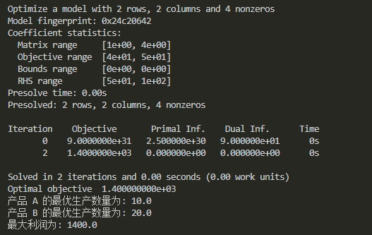
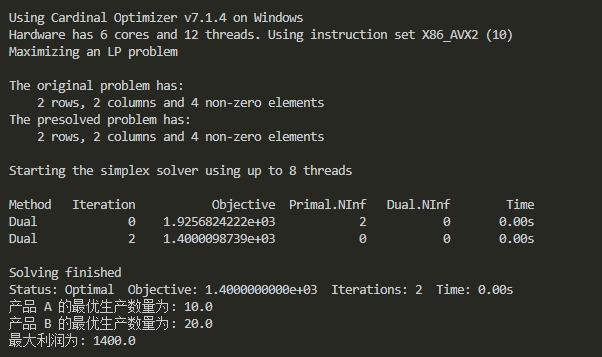

# 第二章 线性规划问题

这一章我们先回顾一下线性规划问题，然后通过一个简单的问题示例来学习如何用求解器求解优化问题。

本节目录如下: 
[TOC]

## 1. 线性规划问题简介

线性规划（Linear Programming, LP）是优化理论中的一个经典问题，其目标是在线性约束条件下，最大化或最小化一个线性目标函数。线性规划问题的一大特点在于它的**决策变量都是连续变量**，无整数变量。线性规划广泛应用于工程、经济、军事、物流等领域。

### 1.1 数学模型

线性规划问题的标准形式可以表示为：

$$ \text{Maximize (or Minimize)} \quad \mathbf{c}^\top \mathbf{x} $$

$$ \text{subject to} \quad \mathbf{A} \mathbf{x} \leq \mathbf{b} $$

$$ \mathbf{x} \geq 0 $$

其中：
- \(\mathbf{x}\) 是决策变量向量。
- \(\mathbf{c}\) 是目标函数的系数向量。
- \(\mathbf{A}\) 是约束条件的系数矩阵。
- \(\mathbf{b}\) 是约束条件的右端项向量。

### 1.2 例子

假设我们有一个简单的线性规划问题：

$$ \text{Maximize} \quad 3x_1 + 5x_2 $$

$$ \text{subject to} \quad 2x_1 + 3x_2 \leq 12 $$

$$ \quad 4x_1 + x_2 \leq 8 $$

$$ \quad x_1, x_2 \geq 0 $$

在这个例子中，目标是最大化 \(3x_1 + 5x_2\)，并且有两个线性约束 \(2x_1 + 3x_2 \leq 12\) 和 \(4x_1 + x_2 \leq 8\)。

### 1.3 求解方法

求解线性规划问题的主要方法包括单纯形法、内点法和现代的混合整数线性规划（MILP）求解器等。

#### 1.3.1 单纯形法（Simplex Method）

单纯形法是由乔治·丹齐格（George Dantzig）提出的一种基于顶点搜索的算法。单纯形法的基本思想是**从一个可行解（通常是基本可行解，即顶点）开始，通过迭代移动到相邻的顶点，逐步改善目标函数值，直到找到最优解或证明问题无界**。

##### 主要步骤：

1. **初始化**：找到一个初始的基本可行解（顶点）。
2. **选择进基变量**：根据一定的规则（如最大减少量规则）选择一个非基本变量进入基。
3. **选择出基变量**：通过最小比率测试选择一个基本变量离开基。
4. **转轴操作**：通过行变换更新单纯形表，得到新的基本可行解。
5. **检查最优性**：如果当前解是最优的，则停止；否则，返回步骤2继续迭代。

单纯形法的优点是直观易懂，计算过程中每一步都能保证目标函数值的改善。

然而，它的缺点是在某些情况下可能会遇到循环问题，即算法在几个顶点之间无限循环而无法找到最优解。

此外，对于大规模问题，单纯形法的计算效率可能不如内点法。

#### 1.3.2  内点法（Interior-Point Method）

内点法，也称为障碍方法或路径跟踪方法，由John von Neumann发明，后被Narendra Karmarkar于1984年推广应用到线性规划，即Karmarkar算法。与单纯形法不同，**内点法不是在可行域的边界上移动，而是在可行域的内部寻找最优解**。

##### 主要步骤：

1. **初始化**：找到一个初始的内点（通常是通过某种启发式方法）。
2. **定义障碍函数**：引入一个障碍函数，使得在接近边界时函数值趋向无穷大，从而避免越过边界。
3. **求解修正方程**：通过求解一系列修正方程（通常是牛顿法）来更新解。
4. **更新解**：根据修正方程的解更新当前解，并逐步接近最优解。
5. **检查终止条件**：如果满足一定的终止条件（如目标函数值的变化很小），则停止；否则，返回步骤3继续迭代。

内点法的优点是对于大规模问题具有较高的计算效率，且不易陷入循环。

它的缺点是算法较为复杂，需要较好的初始内点，且在某些情况下可能不如单纯形法稳定。


## 2. 代码实战

这一节我们来看一个简单的线性规划问题：工厂生产问题，并试着编写代码进行求解。

### 2.1 问题描述

假设我们有一个工厂，生产两种产品：产品 A 和产品 B。我们希望确定每种产品的生产数量，以最大化总利润。生产每种产品需要消耗一定的资源，且资源是有限的。

下表总结了产品 A 和产品 B 的相关信息：

| 产品     | 利润（元） | 生产时间（小时） | 原材料（单位） |
|----------|-: |-: |-: |
| 产品 A   | 40                | 2                    | 3                  |
| 产品 B   | 50                | 4                    | 1                  |

- 可用的生产时间总共为 100 小时
- 可用的原材料总共为 50 单位

#### 数学模型

##### 决策变量
- $x$: 生产的产品 A 的数量
- $y$: 生产的产品 B 的数量

##### 目标函数
最大化总利润：
$$\text{Maximize } Z = 40x + 50y$$

##### 约束条件
1. 生产时间约束：
$$2x + 4y \leq 100$$
2. 原材料约束：
$$3x + y \leq 50$$
3. 非负约束：
$$x \geq 0$$
$$y \geq 0$$

非负约束可以在变量定义时直接定义变量下界为0，以减少约束数量，加快模型求解。

### 2.2 Gurobi 求解

下面是用 Gurobi 求解这个线性规划问题的代码：

```python
import gurobipy as gp
from gurobipy import GRB

# 创建一个模型
model = gp.Model("Maximize_Profit")

# 创建变量
# name: 变量名；vtype: 变量类型；lb: 下界；ub: 上界
x = model.addVar(name="A", vtype=GRB.CONTINUOUS, lb=0)
y = model.addVar(name="B", vtype=GRB.CONTINUOUS, lb=0)

# 设置目标函数
model.setObjective(40 * x + 50 * y, GRB.MAXIMIZE)

# 添加约束条件
## 变量范围约束可直接在创建变量时指定，更加高效简洁
model.addConstr(2 * x + 4 * y <= 100, "Production_Time") # 生产时间约束
model.addConstr(3 * x + y <= 50, "Raw_Material")  # 原材料约束

# 求解模型
model.optimize()

# 输出结果
if model.status == GRB.OPTIMAL:
    print(f"产品 A 的最优生产数量为: {x.X}")
    print(f"产品 B 的最优生产数量为: {y.X}")
    print(f"最大利润为: {model.objVal}")
else: 
    print("未找到最优解。")
```

**注意**，模型和约束的名字可以是中文，但出于兼容性考虑，通常不推荐写中文。

求解结果如下：




### 2.3 Copt 求解

下面是用 Gurobi 求解这个线性规划问题的代码：

```python
import coptpy as cp
from coptpy import COPT

# 创建 COPT 环境
env = cp.Envr()

# 创建模型
model = env.createModel("Maximize_Profit")

# 创建变量
# name: 变量名；vtype: 变量类型；lb: 下界；ub: 上界
x = model.addVar(lb=0, name="A", vtype=COPT.CONTINUOUS)
y = model.addVar(lb=0, name="B", vtype=COPT.CONTINUOUS)

# 设置目标函数
model.setObjective(40 * x + 50 * y, COPT.MAXIMIZE)

# 添加约束条件
## 变量范围约束可直接在创建变量时指定，更加高效简洁
model.addConstr(2 * x + 4 * y <= 100, "Production_Time")  # 生产时间约束
model.addConstr(3 * x + y <= 50, "Raw_Material")   # 原材料约束

# 求解模型
model.solve()

# 输出结果
if model.status == COPT.OPTIMAL:
    print(f"产品 A 的最优生产数量为: {x.x}")
    print(f"产品 B 的最优生产数量为: {y.x}")
    print(f"最大利润为: {model.objval}")
else: 
    print("未找到最优解。")
```

求解结果：



### 2.4 Gurobi 和 Copt 语法比较

从上面的例子我们可以看到 Copt 和 Gurobi 的语法是非常相似的，但也存在一些差异。

下表为两个求解器的语法对比：


| 功能          | Gurobi 语法                           | COPT 语法                            |
|---------------|--------------------------------------|--------------------------------------|
| 导入库        | `import gurobipy as gp` <br> `from gurobipy import GRB`            | `import coptpy as cp` <br> `from coptpy import COPT`    |
|创建环境| - | `env = cp.Envr()` |
| 创建模型      | `model = gp.Model("model_name")`     | `model = env.createModel("model_name")`     |
| 添加变量      | `x = model.addVar(name="x")`         | `x = model.addVar(name="x")`         |
| 设置变量类型  | `x = model.addVar(vtype=GRB.INTEGER)`| `x = model.addVar(vtype=COPT.INTEGER)` |
| 添加多个变量  | `vars = model.addVars(10, name='x')`           | `vars = model.addVars(10, nameprefix='x')`           |
| 设置目标函数  | `model.setObjective(expr, GRB.MAXIMIZE)` | `model.setObjective(expr, sense=COPT.MAXIMIZE)` |
| 添加约束      | `model.addConstr(x + y <= 10, name='')`       | `model.addConstr(x + y <= 10, name='')`       |
| 添加多个约束  | `model.addConstrs((x[i] + y[i] <= 10 for i in range(10)), name='row1')` | `model.addConstrs((x[i] + y[i] <= 10 for i in range(10)), nameprefix='row1')` |
| 模型求解      | `model.optimize()`                   | `model.solve()`                      |
| 获取变量名    | `x.varName()`                        | `x.getName()`                        |
| 获取变量值    | `x.X`                                | `x.X`                                |
| 获取目标值    | `model.objVal`                       | `model.objVal`                       |
| 读取模型文件  | `model = gp.read("model_file.mps")`  | `model = cp.read("model_file.mps")`  |
| 写出模型文件  | `model.write("model_file.mps")`      | `model.write("model_file.mps")`      |


#### 主要区别

- **创建模型**：Gurobi 是直接通过`gp.Model("model_name")`创建模型；而 Copt 是先通过 `env = cp.Envr()`创建环境，然后通过`env.createModel("model_name")` 创建模型，当然也可以直接用`model = cp.Envr().createModel("model_name")`创建模型。
- **变量和约束命名**：Gurobi 中的变量类型和目标函数常量使用 `GRB`，而 COPT 使用 `COPT`。在批量添加变量`addVars`和约束`addConstrs`时，Gurobi 使用`name=`给变量批量命名，COPT 使用`nameprefix=`批量给变量命名。
- **模型求解**：Gurobi 使用 `model.optimize()`，COPT 使用 `model.solve()`。
- **变量名获取**：Gurobi 使用`x.varName()`获取变量名，而 COPT 使用`x.getName()`。

更多差异请参阅求解器官网文档：
- [Gurobi 求解器官网文档](https://www.gurobi.com/documentation/11.0/)
- [Copt 求解器官网文档](https://www.shanshu.ai/copt-document)

## 参考资料
[1] [【维基百科：单纯形法】](https://zh.wikipedia.org/wiki/%E5%8D%95%E7%BA%AF%E5%BD%A2%E6%B3%95) <br>
[2] [【百度百科：内点法】](https://baike.baidu.com/item/%E5%86%85%E7%82%B9%E6%B3%95/115627)
